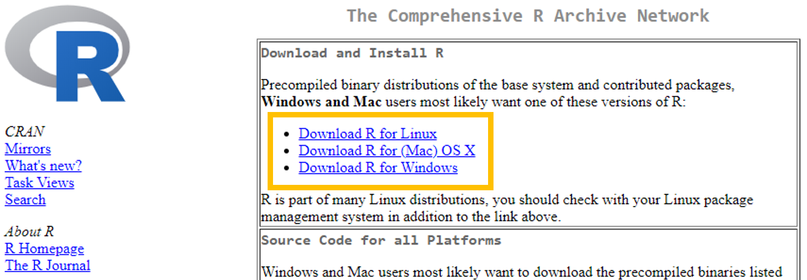
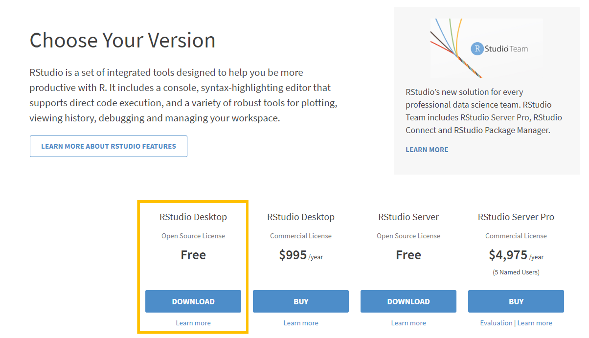
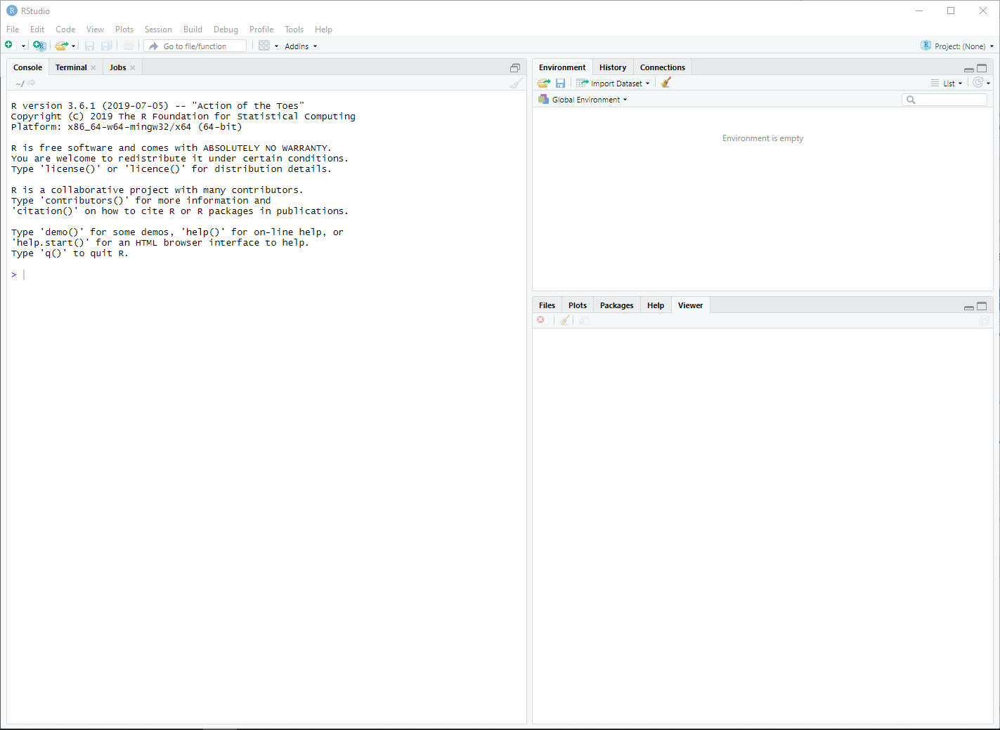

This assignment is due Jun 23 at 11:59 PM.

## Installing R

### What is R?

R is a statistical programming language used for computation, data analysis, and graphics generation. It is widely used by statisticians, data scientists, and applied researchers in many fields.

### Benefits of R

- flexible and freely available to the public, who have in turn written many user-contributed **packages** which provide additional functionality.

- RStudio is a convenient interface for R that adds convenient features, such as exporting output in nice formats.

- In this class, we'll be doing all of our computation in RStudio.

Let's begin by installing R and RStudio. R is like the "engine" and RStudio is like the "dashboard", so we need both.

First, we need to install R, which can be [downloaded here](https://cran.r-project.org/) (see screenshot below).



Next, install RStudio Desktop, which can be [downloaded here](https://posit.co/download/rstudio-desktop/) (see screenshot below).



## First Steps in RStudio

### Ensure you have an updated version

For this course, we'll be using Quarto to type up HW/Labs. Quarto is a (relatively new) publishing system which may be accessed through RStudio. Some of you may already have R/RStudio installed on your computer. To ensure you have a version of RStudio which can run Quarto, follow these instructions:

- For Windows: Go to Help \> About RStudio.

- For Mac: Go to RStudio \> About RStudio.

- The dialogue box will display the RStudio version. **You should have version 2022.07 or later**.

### What if I have an earlier version of RStudio?

You'll need to update. To update RStudio, first check if an update is available by going to Help \> Check for Updates within RStudio (there should be one available). If an update is found (it should be), you'll be directed to the RStudio website to download the latest version. After downloading, run the installer and follow the prompts to install the new version.

## Exploring RStudio

With R and RStudio installed, we'll begin by exploring RStudio: the interface, reading in data, and basic commands. Upon opening RStudio, you should see something similar to the window below:



The **console** is the panel on the left side, and is where users can type commands and see immediate output. Let's try it out! Type the following code into the console:

```{r echo = T, eval = F}
3 + 5
```

You should get output that looks like

```{r echo = F}
3 + 5
```

(For now, ignore the `[1]`). By typing in `3+5`, we got the expected answer, `8`. We can see that R can be used as a calculator directly in the console. Try some other commands that use R as a calculator. For instance, `3*25`, `exp(2)`, or `(10+5^2)/sqrt(40)`. Of course, R is not simply a calculator; other commands may also be entered here.

To illustrate, let's load a dataset. Enter the following command into the console (you can directly copy/paste it, but make sure everything is exactly as below):

```{r echo = T}
cdc <- read.csv("https://aggreenbean.github.io/Bios600/labs/data/cdc_cleaned.csv")
```

We've just loaded a dataset named `cdc`. These data come primarily from the Sortable Risk Factors and Health Indicators dataset from the CDC, which comprises demographic and health indices compiled from various federal sources. This dataset is now part of our **environment**, which is displayed on the top half and right side of the RStudio window.

- The **environment** contains all objects in the current working space. These objects could be variables, lists of variables, or even entire datasets.

- In the same location as the environment tab, the **history** tab displays all commands used during the current session (don't worry about the connections tab for now).

- Finally, the bottom half of the right-hand panel shows information regarding files on your hard drive, installed packages, output such as plots, and help files or other documents.

Coming back to the dataset we loaded in, we can see that it is named `cdc`. We can take a look at this dataset in a spreadsheet-like window by clicking on `cdc` in the Environment tab to the right, or by running the following code in the console:

```{r echo = T}
View(cdc)
```

Note that other objects may be added to the environment, either from external data sources from the internet as in today’s example, datasets downloaded to your computer, or even as created as manipulations of existing datasets.

## Setting up a project in RStudio

In this class, you’ll use RStudio Projects to stay organized. A project keeps all of your work (scripts, data, and results) together in one place. This is good practice for reproducible research.

**1. What is a working directory?**

- The working directory is the folder where R looks for files and saves results.

- Think of it as R’s “current location” on your computer.

- If you try to load a dataset, R will look in your working directory first.

Check your current working directory by running the following in your **Console**:

```{r}
#| echo: true
#| eval: false
getwd()
```

**2. Creating a project**

We’ll create a new project for this course so everything stays in one place. In RStudio, go to the top menu. Click on File → New Project → New Directory → New Project. Name your project something sensible & concise, like: `bios600`. Choose where on your computer you want this folder saved (e.g., “Documents” or “Desktop”).

Now RStudio will automatically set your project folder as the working directory whenever you open it.

**3. Creating a “data” folder**

Inside your new project folder, we're going to create a folder called `data`.This is where you’ll put all datasets for the course. You can make the folder by doing the following: In your computer’s file explorer (right click → New Folder → name it `data`). Alternatively, click the little folder with a green plus on your lower right pane within RStudio to create the folder.

## Quarto and reproducible research

Quarto is a system that may be used to create easy-to-write, attractive reports, presentations, or webpages that also serve as reproducible records of the data analysis. These reports have the desirable property of being able to not only display written narratives and figures, but also include any R code and the outputs from these code snippets.

One of the biggest strengths of Quarto is that everything is in one place, and that other users should be able to reproduce your results exactly, if they have your Quarto document and datasets - the analysis is run from the beginning each time you render the document. As well, formatting is easy! Luckily, RStudio already comes with Quarto support, so there is nothing additional to install. (Again, you need \>= version 2022.07 to run Quarto within RStudio!)

Every homework assignment and lab in this class will be written in Quarto, with a template provided for you to use for the first few assignments. This lab's template can be downloaded by typing in the following code in the Console:

```{r}
download.file("https://aggreenbean.github.io/Bios600/labs/lab-1-template_AGH.qmd",
              destfile="lab-01.qmd")
```

You should now see the new file `lab-01.qmd` under the Files tab in the bottom-right hand side of your RStudio window. Click on `lab-01.qmd` in this window in order to open it up – it is the template for use in this lab!

First, put your name in the space at the top where it says "YOUR NAME GOES HERE".

Fill in answers in the spaces provided: text narrative should be typed directly in the document and any included R code should be typed inside “chunks,” or sections defined by three backticks (the little mark on the same key as the tilde). See the template for more instructions, or ask your TA.

An important thing to note is that the workspace of the Quarto document is separate from the console – this means that you must load any packages inside of R chunks if you want to use functions contained in them. In the template for this lab, this has been done already, but in the future you may have to do it yourself.

In order to turn this template into a shareable document, **Render** the quarto template into an HTML document by pressing the Render button at the top of the document (it is a large blue arrow facing the right). You should see the template rendered as an .html file! To turn it in, print to PDF from your browser. (I recommend Google Chrome.)

## At the end, here's how you'll turn this in:

- "Render" the .qmd file to an html file, by clicking on the blue right arrow button at the top of this window. (Demo)

- Open the .html document in any browser, and print to pdf. You'll turn in the .pdf file to Gradescope under Lab 1 Assignments.

# On your own

## Exercise 1

R has various useful datasets built-in. One of these datasets is the `mtcars` dataset, extracted from the 1974 *Motor Trend* US magazine. One way we can ask for help in R, and to find out information about the data, is by typing the `?` in the console. Type `?mtcars` in the Console to view the help page for the `mtcars` dataset.

List three variables from this dataset, along with their units.

## Exercise 2

In the space provided, explain what you think \### in front of text (not code) does.

## Exercise 3

Write a quick one paragraph intro about yourself. Be creative!

## Exercise 4

In the R chunk, pick your two favorite numbers and add them together using R’s built-in calculator function. The answer should be knit directly in the document.

## From .html to .pdf

Important: You must turn in a .pdf file corresponding to the Quarto template to Gradescope in order to receive credit for the assignment.
