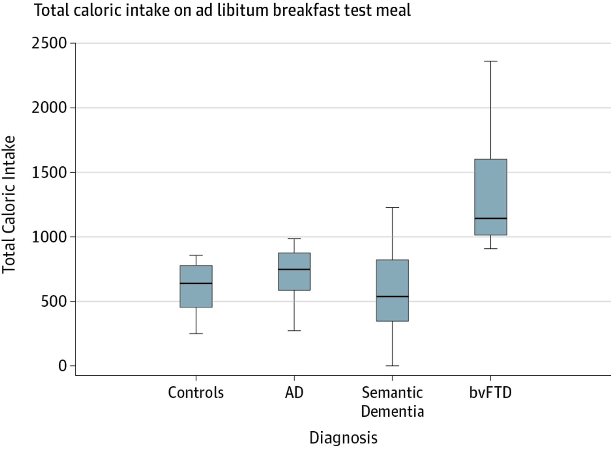

Due: Wednesday, June 24 at 11:59pm


## Starting a new Quarto file

For this assignment (and all future assignments) you will begin a new Quarto file. To do this, open RStudio and make sure you are inside your course project folder with File > Open Project > .... To create a new Quarto file, go to the top menu and click File > New File > Quarto Document. A pop-up will appear asking for a title, author, and format. You may leave these as the default options for now. Click OK and a new file will open. 

In the document, Quarto automatically adds some starter text and code chunks. You may delete everything below the YAML header (everything under the second set of `---`). You should be left with just a YAML section at the very top, which looks something like this:

```{r}
#| eval: false

---
title: "Document Title"
author: "Your Name"
date: "2026-06-24"
format: html
---

```

Now, Edit the YAML header. Change

- title -> the assignment name (e.g. `HW 1`)

- author -> your name

- date -> today's date

Now, save your file. Go to File > Save as, and name it something clear like `hw1.qmd`. Keep it in your project folder. You're ready to begin!

## Dementia and eating behaviors

Use the following study to answer Exercises 1-4.

Ahmed et al. (*JAMA Neurology*, 2016) conducted a study examining disturbances in eating behaviors among patients with dementia. Patients without dementia, with Alzheimer disease (AD), with semantic dementia, and with behavioral-variant frontal temporal dementia (bvFTD) were offered a breakfast buffet and left alone for 30 minutes to eat. After completion, the total caloric intake of each patient was measured. Boxplots summarizing the distributions of calories consumed across the patient types are displayed below.



## Exercise 1

a. Was this an observational study or an experimental study? Explain.

b. Do you expect the distribution of caloric intake among bvFTD patients to be left-skewed, right-skewed, or symmetric? Why?

c. Describe what it means for **this specific study** to be reproducible and replicable.

## Exercise 2


What type of data are the following variables in the study? Be specific, e.g., "categorical ordinal" or "numeric discrete", etc.

-   Type of dementia (AD/SD/bvFTD/None)
-   Total caloric intake
-   \% of calories from sugar
-   Disease duration
-   Frontal Rating Scale (mild/moderate/severe)


## Exercise 3


a. Describe an appropriate visualization that summarizes the % of calories from sugar at the breakfast buffet to the Frontal Rating Scale of the study participants.

b. Describe an appropriate visualization that summarizes the total caloric intake at the breakfast buffet, disease duration in years, and type of dementia among these study participants.

## Exercise 4

a. The authors state that they uncovered “*elevated total caloric intake…in patients with bvFTD, supporting its diagnostic value for this disease….*” Is this is a reasonable statement to make from the data visualization? Explain why or why not.

b. Suppose the authors wanted to “tell a story” with the title to their visualization. Suggest a more effective title than the one presented.

## Submission

As you’ve seen previously, we can **Render** into an .html file that can be opened by any web browser. To export it as a .pdf, open the file in your web browser and then print to or save as a .pdf document. Contact your TAs in Ed Discussion if you need help! 

You will submit the PDF documents for labs and homework to Gradescope as part of your final submission.

To submit your assignment:

- Access Gradescope through the menu on the BIOS 600 Canvas site.

- Click on the assignment, and you’ll be prompted to submit it.

- Mark the pages associated with each exercise. All of the pages of your lab should be associated with at least one question (i.e., should be “checked”).

- Select the first page of your .PDF submission to be associated with the "Formatting" section.


## Grading

| Component | Points |
|----------|--------|
| Ex 1 | 3 |
| Ex 2 | 3 |
| Ex 3 | 2 |
| Ex 4 | 2 |
| Formatting | 3 |

The “Formatting” grade is to assess the document format. This includes having a neatly organized document (no excessive output, warnings/messages when loading packages and/or data) with readable code and your name and the date updated in the YAML.
