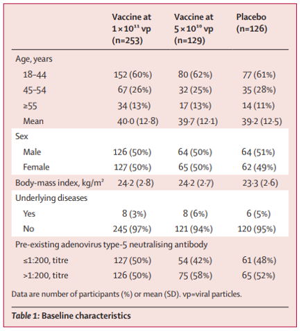
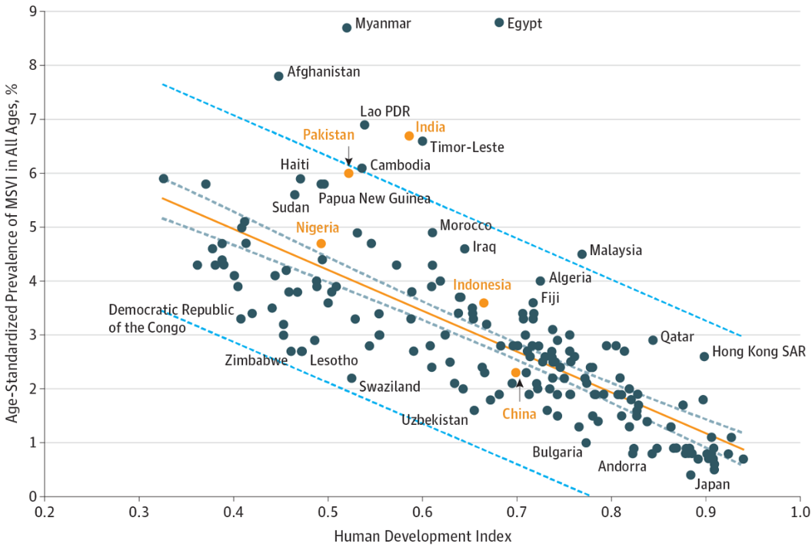

Due: Thursday, June 25 at 11:59pm

## Covid-19 vaccine dataset

Use the following paper/table to answer Exercise 1.

Zhu et al. (*The Lancet*, 2020) conducted the first randomized trial of a recombinant adenovirus COVID-19 vaccine in healthy adults, with the aim of determining an appropriate dose for a larger efficacy study. They had three treatment arms: placebo, low dose (5 × 1010 virus particles), and high dose (1 × 1011 virus particles). The following table depicts the baseline characteristics of their study population:

## Exercise 1

Calculate the following probabilities. It’s ok to express answers as unsimplified fractions). If the probabilities cannot be determined, please state so and what additional information is needed to calculate the quantity of interest. Provide a 1 sentence explanation about how you calculated each value based on the table.

What is the probability that a randomly selected patient in the trial …

a. ... was assigned to placebo?

b.  ... was assigned to placebo or was male?

c.  ... was assigned to placebo and was male?

d.  ... was not assigned to high dose vaccine and had no underlying diseases?

e. ... was female or had underlying diseases?

f. ... was female or was not assigned to either vaccine dose?

g. ... was aged 18 - 44, given that they were assigned to high dose vaccine?

h. ... was not assigned placebo, given that they were aged 45-54?

## Socioeconomic factors and visual impairment

Use the following paper and figure to answer Exercises 2 and 3.

Wang et al. (*JAMA Opthamology*, 2017) examined the association of socioeconomic factors with prevalence of visual impairment and blindness. The following scatterplot depicts the relationship between Human Development Index (HDI) and the age-standardized prevalence of moderate to severe visual impairment (MSVI). The countries highlighted in orange are the 5 countries with the largest number of blind people.

## Exercise 2

a. In general, are higher or lower HDIs associated with higher prevalence of MSVI?

b. Among China, India, Pakistan, Nigeria, and Indonesia, which has the lowest HDI?

## Exercise 3

a. Does India have higher or lower prevalence of MSVI than might be expected given its HDI?

b. In their conclusion, the authors state “Burden of visual impairment and socioeconomic indicators were closely associated and may help to identify countries requiring greater attention to these issues.” Do you think this is a reasonable statement to make from the scatterplot? Why or why not?

## Submission

As you’ve seen previously, we can **Render** into an .html file that can be opened by any web browser. To export it as a .pdf, open the file in your web browser and then print to or save as a .pdf document. Contact your TAs in Ed Discussion if you need help! 

You will submit the PDF documents for labs and homework to Gradescope as part of your final submission.

To submit your assignment:

- Access Gradescope through the menu on the BIOS 600 Canvas site.

- Click on the assignment, and you’ll be prompted to submit it.

- Mark the pages associated with each exercise. All of the pages of your lab should be associated with at least one question (i.e., should be “checked”).

- Select the first page of your .PDF submission to be associated with the "Formatting" section.

## Grading

| Component | Points |
|----------|--------|
| Ex 1 | 4 |
| Ex 2 | 2 |
| Ex 3 | 2 |
| Formatting | 3 |

The “Formatting” grade is to assess the document format. This includes having a neatly organized document (no excessive output, warnings/messages when loading packages and/or data) with readable code and your name and the date updated in the YAML.
