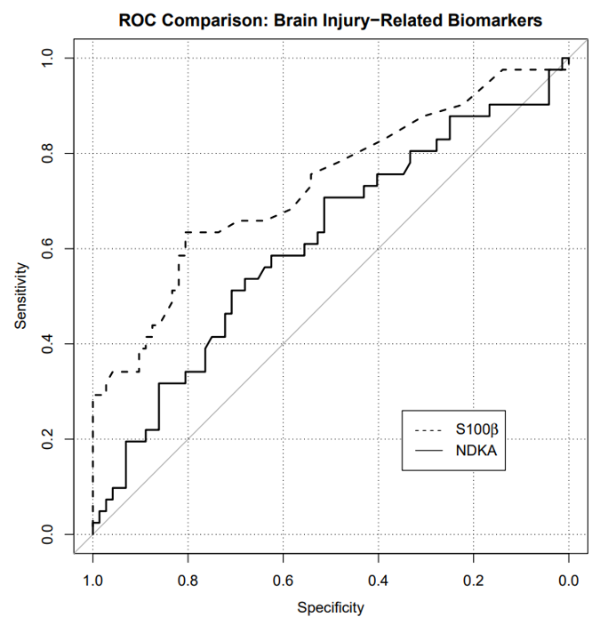

Due: Friday, June 26 at 11:59pm

## Starting a new Quarto file

For this assignment you will begin a new Quarto file. To do this, go to RStudio and click File > New File > Quarto Document. A pop-up will appear asking for a title, author, and format. You may leave these as the default options for now. Click OK and a new file will open. Update the YAML with your title, name, and date.

## Exercise 1: Chicken Pox Data

Suppose a chicken pox outbreak hits a population of unvaccinated children. Researchers collect the following data among randomly sampled households with two unvaccinated children. In 50% of such families, the older sibling has chicken pox, in 50% of families, the younger sibling has chicken pox, and in 35% of families, both children have chicken pox.

In (a)-(d) below, please provide a numerical answer by using R’s calculator capability (i.e., insert new R chunks, show code calculating the numeric answers). Be careful with parentheses!

a. Consider two events, $A$ being that the older sibling has chicken pox, and $B$ being that the younger sibling has chicken pox. Are $A$ and $B$ independent events? Explain using the data provided.

b. Consider a randomly selected household with two unvaccinated children from this population. Given that the older sibling has chicken pox, what is the probability that the younger sibling also has chicken pox?

c. Consider a randomly selected household with two unvaccinated children from this population. Given that the older sibling has chicken pox, what is the probability that the younger sibling does NOT have chicken pox?

d. Consider a randomly selected household with two unvaccinated children from this population. Given that the older sibling does NOT have chicken pox, what is the probability that the younger sibling has chicken pox? Use the **Law of Total Probability** to find your answer, and show your work. 

## Exercise 2: Neurology Example

Aneurysmal subarachnoid hemorrhage (aSAH) is a neurologic emergency that often leads to permanent disability or death. Researchers are interested in accurately predicting the development of irreversible brain damage of death (a “bad outcome”) due to aSAH based on clinical characteristics during the acute phase of the hemorrhage. One diagnostic tool is the WFNS grade scale, which ranges from 1 through 5. Investigators classify a WFNS score \> 2 as being “severe” and a score of ≤2 as being "not severe".

The following data were collected for one-year outcomes of 100 patients. Among patients with a non-severe WFNS score, 50 experienced a good outcome and 10 experienced a bad outcome. Among patients with a severe WFNS score, 10 experienced a good outcome and 30 experienced a bad outcome.

Let $S$ be the event of a severe WFNS score (“testing positive”), and $B$ be the event of experiencing a bad outcome at the one-year mark.

For (a) - (c) below, show your work using code. 

a. What is the prevalence of bad outcomes among these patients? Include a 1-sentence explanation for your calculation.  

b. What is the sensitivity of having a severe WFNS score? Show your work **using Bayes' Rule**. 

c. What is the specificity of having a severe WFNS score? Provide your answer as a fraction. Show your work **using Bayes' Rule**. 

## Exercise 3: Brain damage biomarker

The same investigators from the study in the previous question also examined values of NDKA, a biomarker for brain damage, and classified levels as being “high” or “low.” The specificity and sensitivity of using high NDKA as a diagnostic for bad outcomes at one year are 90% and 20%, respectively.

What is the negative predictive value (NPV) of “high NDKA” as a diagnostic for bad outcomes? Explain your reasoning and show your work. The negative predictive value is the probability that a patient does NOT have a bad outcome at the one year mark, given that their test was negative (i.e., they did NOT have a severe WFNS score). Please provide a numerical answer by using R’s calculator capability (i.e., insert an R chunk and show your work in code to calculate the answer). Be careful with parentheses!

## Exercise 4: ROC Curve

An **ROC curve** is a graphical plot that illustrates the sensitivity and specificity of a dichotomous diagnostic test as its discrimination threshold varies. The plot below shows the ROC curve for two different brain injury-related biomarkers, NDKA and S100β, in determining whether a patient develops bad outcomes at the one-year mark.

{width="400"}

Based on the ROC curve, answer (a)-(b) below. 

a. Suppose we are willing to accept a false positive rate of at most 10%. What true positive rates can we attain for NDKA with that stipulation? Justify your answer by referencing the plot.

b. Which biomarker, NDKA or S100β, would you rather use to predict bad outcomes? Why? (For this question, do NOT use the phrase “area under the curve”)

## Submission

As you’ve seen previously, we can **Render** into an .html file that can be opened by any web browser. To export it as a .pdf, open the file in your web browser and then print to or save as a .pdf document. Contact your TAs in Ed Discussion if you need help! 

You will submit the PDF documents for labs and homework to Gradescope as part of your final submission.

To submit your assignment:

- Access Gradescope through the menu on the BIOS 600 Canvas site.

- Click on the assignment, and you’ll be prompted to submit it.

- Mark the pages associated with each exercise. All of the pages of your lab should be associated with at least one question (i.e., should be “checked”).

- Select the first page of your .PDF submission to be associated with the "Formatting" section.

## Grading

| Component | Points |
|----------|--------|
| Ex 1 | 4 |
| Ex 2 | 3 |
| Ex 3 | 3 |
| Ex 4 | 3 |
| Formatting | 3 |

The “Formatting” grade is to assess the document format. This includes having a neatly organized document (no excessive output, warnings/messages when loading packages and/or data) with readable code and your name and the date updated in the YAML.

