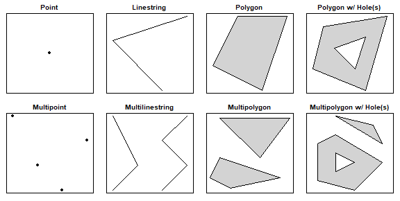

Due Friday, February 27th at 11:59pm

## Set up

1. **Open your RStudio project** by going to File > Open Project. Select your BIOS 600 folder. (If you see a blue cube with your project name at the top right of your RStudio window, you're good to go - you are already in your project folder.)

2. To begin, start a new Quarto file. Change the title to Lab 5. Keep the output as html. 

3. "Save As" into your class project folder with a new name: "`lab-05.qmd`".

4. Update your name and date in the YAML. 

5. Render your document to make sure your YAML is rendering correctly.

::: callout-tip

## Tip for the Lab

Write all code and narrative in your Quarto file. Write all narrative in complete sentences. Throughout the assignment, you should periodically render your Quarto document to produce the updated html file.

:::

## This week's lab

This week’s lab does not pertain specifically to lecture material. Rather, it's here to show some of the “cool things” you can do in RStudio. You might find them useful in the future!


## Computational setup

You'll need an additional package today, useful for mapping spatial data. Run the following in your Console to install the package:

```{r}
#| echo: true
#| eval: false
install.packages("sf")
```

Then, create an R chunk in your Quarto document to load today's packages for the lab. Remember to suppress warnings and messages using the Quarto options (i.e. `#| warning: false`).

```{r}
#| echo: true
#| warning: false
library(tidyverse)
library(sf)
```


::: callout-tip

Render your document to ensure the warnings/messages are suppressed.

:::

We will use the `sf` package, which stands for simple features. Simple features are a commonly-used spatial data standard that specify storage and access for map geometrics used by geographic information systems (GIS). The `sf` package in `R` represents simple features in a tidy way, in which each row stands for a simple feature, and each column corresponds to a variable.

Simple features use 2D geometries which “connect the dots” between defined points in space:



## Read in data

To read simple features from a file or database, use the `st_read()` function. There are already some objects included in the `sf` package. We will load a file that corresponds to the counties in North Carolina:

```{r}
#| echo: true
# read in the data
nc <- st_read(system.file("shape/nc.shp", package = "sf"), 
              quiet = TRUE)
nc
```

When calling the `nc` object, you should see some metadata associated with these data:

- `geometry` type: this specifies what geometry is used to plot the simple feature (here, a MULTIPOLYGON)

- `dimension`: this specifies the spatial dimensions used in plotting (here, the X and Y plane)

- `bbox`: a bounding box: the bounds corresponding to each dimension (here, the latitudes and longitudes on the X-Y plane)

- `epsg` (SRID): a unique spatial reference identifier associated with a specific coordinate system; [more info here](https://spatialreference.org/ref/epsg/nad27/) (don’t worry about it)

- `proj4string`: another way of defining a coordinate system (don’t worry about it)


Other than these metadata, we have a tidy dataset as we’re used to, except the last column is a geometry.

## SIDS

The dataset from today examines Sudden Infant Death Syndrome (SIDS) in each county in North Carolina. SIDS is an unexplained death of an apparently healthy infant, often occurring during sleep that was a big cause for concern in the 1970s and 1980s (before people figured out a better way to lay infants down in the crib). We will create a basic visualization that maps the number of SIDS cases to each county. A few of the variables in the dataset are as follows:

-   `NAME`: The county name

-   `FIPS`/`FIPSNO`: The FIPS code of the county (a five digit Federal Information Processing Standards code that uniquely identifies US counties)

-   `BIR74`: The number of births in 1974

-   `SID74`: The number of SIDS cases in 1974

-   `NWBIR74`: The number of non-white births in 1974

-   `BIR79`, `SID79`, `NWBIR79`: similarly for 1979

## Creating plots

Now let’s create a basic plot using the `nc` object! `sf` objects work well with the `tidyverse`. For instance, try the following code, noting that we did not specify any aesthetic mapping:

```{r}
#| echo: true
ggplot(data = nc) + 
  geom_sf()
```

We can also add some global plot options:

```{r}
#| echo: true
ggplot(data = nc) +
  geom_sf(color = "purple", fill = "lightblue") +
  theme_bw()
```

Remember that in our dataset, we had some data that corresponded to each county. How might we incorporate them into our plot? We need to set an aesthetic mapping. Importantly: for sf geometries, the aesthetic mapping is done in the `geom_sf()` layer.

Let’s create a choropleth map that displays the number of births in 1974 for each county. Note how the following code is different from the earlier code:

```{r }
#| echo: true
ggplot(data = nc) +
  geom_sf(aes(fill = BIR74)) +
  theme_bw()
```

We can also manually set the color scheme by adding a `scale_fill_gradient()` layer. Here, we’ll specify hex values for our color extremes. We will also add an informative title and legend title:

```{r }
#| echo: true
ggplot(nc) +
  geom_sf(aes(fill = BIR74)) +
  scale_fill_gradient(low = "#fee8c8", high ="#7f0000") +
  theme_bw() +
  labs(title = "Births by NC County in 1974", 
       fill = "Births")
```

## Exercise 1

a. Read in the `nc` dataset using the code above. (Do not print out the `nc` object. Simply read it in.)

b. Recreate the NC chloropleth map of births from 1974. Choose a different `low` and `high` color than the example above, but ensure the colors make sense. (i.e. you should have a "lighter" color for the `low` and a darker tone of the same color for the `high`.) You may browse [this list of colors](https://r-charts.com/colors/) for various choices. Update the title and legend title.

::: callout-tip

Note that in the example above, the colors were listed as HEX codes (# followed by 6 digits). In R, you may refer to colors **either by their HEX code or by their recognized name in R**. The provided [list of colors](https://r-charts.com/colors/) gives both HEX codes and character names. Ensure that whatever you choose, you enclose your color with quotation marks.

:::

## dplyr() with simple features

As said previously, simple features work well with the tidyverse. For instance, we can use `dplyr()` functions to manipulate data. 

Let’s filter for observations with over 10,000 births in 1979, and select only the county name and number of birth variables:

```{r}
nc |> 
  filter(BIR74 > 10000) |> 
  select(NAME, BIR74)
```

Notice that the geometry is “**sticky**”: the geoemtry and metadata associated with it are still carried with the dataset, even though we didn’t select for it. In order to remove the geometry, include the function `st_drop_geometry()` in your pipeline:

```{r}
nc |>
  filter(BIR74 > 10000) |>
  select(NAME, BIR74) |> 
  st_drop_geometry() # drop the metadata
```


## On your own!

We will continue using the `nc` dataset for the exercises below.

## Exercise 2

Create a chloropleth map that plots the number of SIDS cases by NC county in 1979. (Use the code in Exercise 1, but change the `fill` variable to SIDS cases in 1979). Use the **same color gradient** you used in Exercise 1. Update the title.

## Exercise 3

Suppose you'd like to create a map that plots the **difference** in SIDS cases by NC county from 1974 to 1979. To do this, utilize the code you used in Exercise 2, but change the `fill` variable to `SID79 - SID74`. (In doing so, we skip the step of needing to use the mutate function to create a new variable. Rather, we can just do this step within the ggplot function itself.) Use the same color gradient as Exercise 1. Update the title and legend title.


## Exercise 4

Create a chloropleth map that plots the SIDS rate per 1,000 births by NC county in 1979. To do so, use the same code as in Exercise 2, but change the `fill` variable to be: SIDS rate in 1979 divided by births in 1979, all multiplied by 1000. Use the same color gradient as Exercise 1.

## Exercise 5

a. Using your code from Exercise 4, create a map that plots the difference in SIDS rate per 1,000 births by NC county from 1974 to 1979. Use the same color gradient as Exercise 1.

b. Based on your plot in part (a), do there seem to be any counties which have had a decrease in SIDS rate per 1,000 births between 1974-1979? If so, where are they generally geographically located in NC (i.e. Northwest, Northeast, Central etc.)

## Exercise 6

In this question, we will create three different tables, summarizing various aspects of the SIDS data in NC. When creating the tables, be sure to **drop the geometries from all three tables.**

a. Create a table that lists the top five worst counties in terms of absolute numbers of SIDS cases in 1979 and their associated case counts. (Hint: Start off with the `nc` dataset, then arrange in descending order by SIDS cases in 1979. Then, select only the county name and the SIDS cases in 1979 variable. Then, display the first five rows. Finally, drop the geometry.),

b. Create a table that gives the top five worst counties in terms of SIDS rate per 1,000 in 1979 and their associated rates per 1,000 births. (Hint: Start off with the `nc` dataset, then use the `mutate()` function to create a new variable, `rate_79`, defined as we did in Exercise 4. Then, arrange in descending order by your newly created variable, select only the county and new rate variables, display the first five observations, and finally drop the geometry.)

c. Create a table that lists the top five “most regressed” counties in terms of the **difference** in SIDS cases from 1974 to 1979 and their associated differences. (Hint: Use a similar process to part (b), but using the differences in SIDS cases as your new variable.)


## Exercise 7

If you were a biometrician (this is the term they used to use) working for the state of NC in 1980, which counties would you focus on regarding SIDS, knowing that public health funds are limited? Do the counties listed in your tables correspond to any counties that stood out in your maps? (Look it up in google maps!) Explain, using your existing graphs/tables. There is no single correct answer. (2-4 sentences here is sufficient.)


## Submission

As you’ve seen previously, we can **Render** the template into an .html file that can be opened by any web browser. To export it as a .pdf, open the file in your web browser and then print to or save as a .pdf document. Your TAs will show you how if you need help! (There is a way to directly knit to a .pdf file, but it’s quite a bit more involved.)

You will submit the PDF documents for labs and homework to Gradescope as part of your final submission.

To submit your assignment:

- Access Gradescope through the menu on the BIOS 600 Canvas site.

- Click on the assignment, and you’ll be prompted to submit it.

- Mark the pages associated with each exercise. All of the pages of your lab should be associated with at least one question (i.e., should be “checked”).

- Select the first page of your .PDF submission to be associated with the “Formatting” section.


## Grading

| Component | Points |
|----------|--------|
| Ex 1 | 3 |
| Ex 2 | 2 |
| Ex 3 | 3 |
| Ex 4 | 3 |
| Ex 5 | 2 |
| Ex 6 | 6 |
| Ex 7 | 1 |
| Formatting | 3 |

The “Formatting” grade is to assess the document format. This includes having a neatly organized document (no excessive output, warnings/messages when loading packages and/or data) with readable code and your name and the date updated in the YAML.


