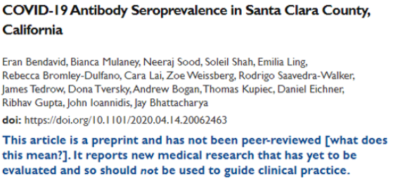
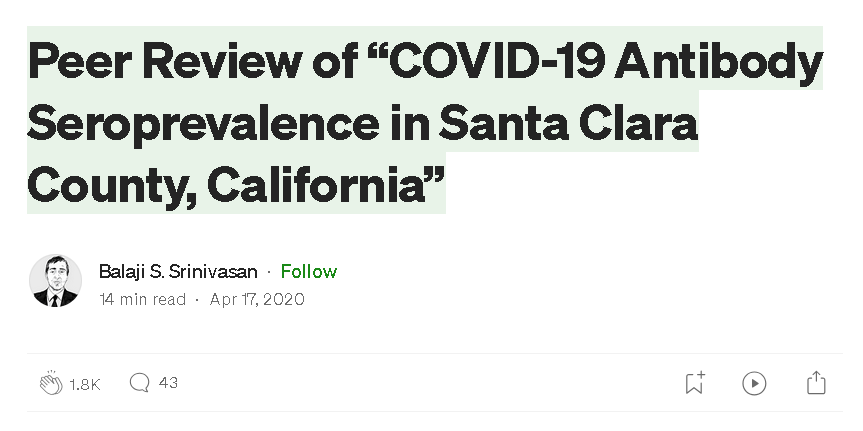
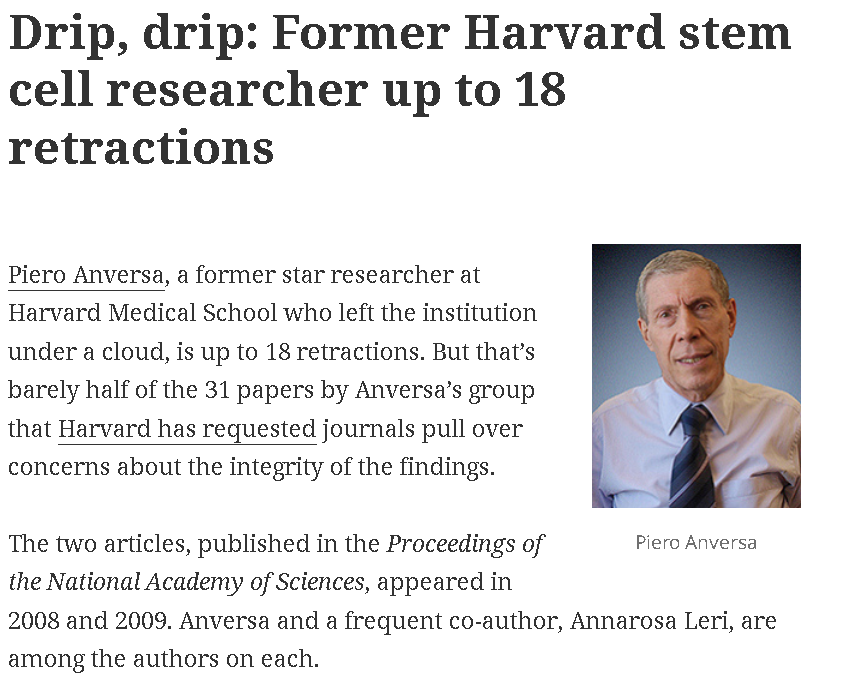
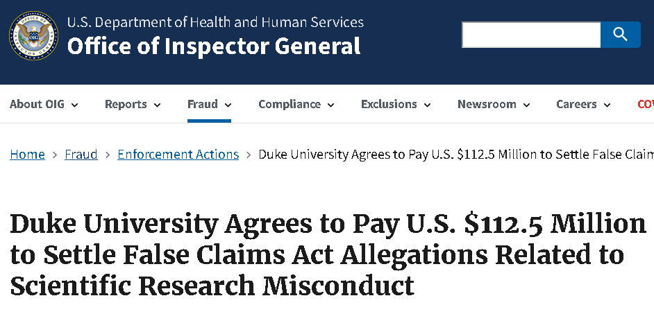
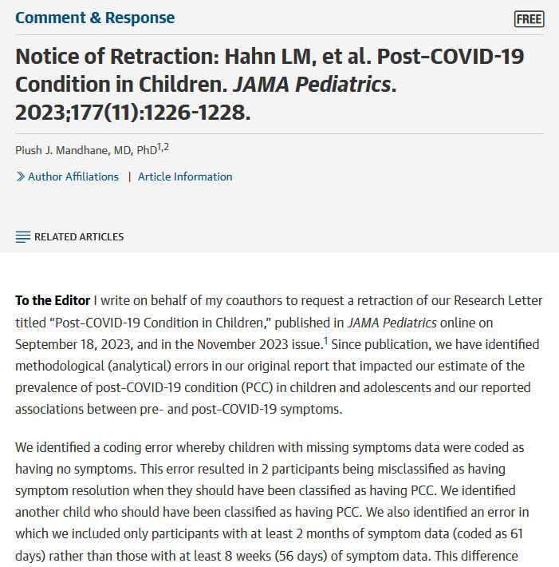
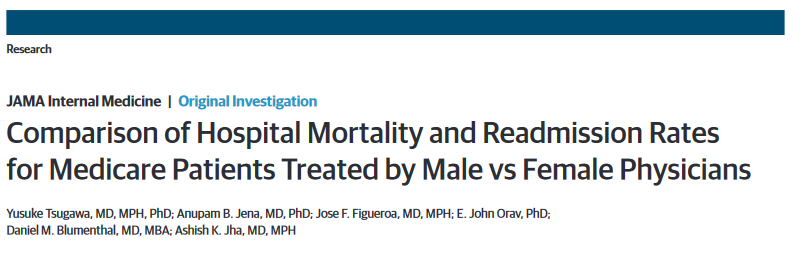
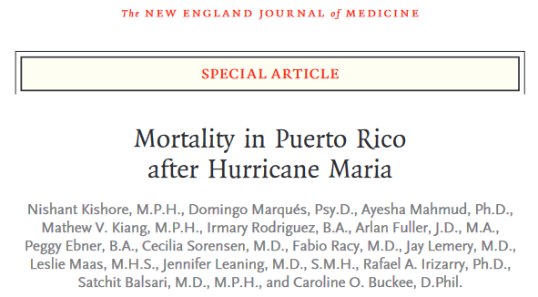
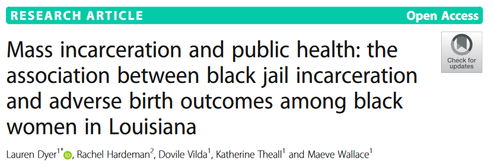

## Welcome! Meet Molly 

-   5th year PhD student, Department of Biostatistics 
-   Originally from Connecticut, but lived in Boston for 8 years before moving here
-   Interests: Spending time outdoors, reading, watching movies
-   Office Hours: Mondays and Wednesdays 1-3pm. 

## Check out Ed Discussion

-   This semester, you can ask questions about the class in our discussion forum, [Ed Discussion](https://edstem.org/us/join/TaE2wk)
- The link to join is also posted on our home page in Canvas.
- Take a moment to introduce yourself in the forum! Name, Year + Program, and a fun fact about yourself. 

## Course overview: Canvas

-   All course materials by day: syllabus, discussion forum link, class slides, lab materials, assignments
-   Let's take a tour!

## Course toolkit

-   RStudio
-   Assignment submission and feedback: Gradescope
-   Discussion forum: [Ed Discussion](https://edstem.org/us/join/TaE2wk)

## What have I gotten myself into?

-   BIOS 600 is an introduction to "principles of statistical inference" in biostatistics that:
    -   provides a tour of basic statistical methods commonly encountered in public health and biomedical research,
    -   emphasizes understanding of methods, using them to arrive at data-driven decisions, and effective communication of such results.
    -   Utilizes modern software such as RStudio to reproducibly examine and manipulate data to make sound scientific conclusions

## My goals in the course

- Introduce you to basic biostatistics toolkit so that you can apply it to your own projects in the future, if you choose!

- Build community!

## Activities: Participate, Practice, Perform {.smaller}

-   **Participate:** Attend and actively participate in lectures and labs, office hours
-   **Practice:** Practice applying statistical concepts and computing with lab exercises 
    -   Review course topics with occasional participation exercises, typically a few questions administered via Canvas. Annotated notes will be uploaded after class.
-   **Perform:** Put together what you've learned to analyze real-world data
    -   Homework assignments 
    -   Three in-class exams

## Cadence

-   **Lecture:** Monday-Thursday 9:30-11:00am. Approx. 1 hour 10 min of lecture, 20 minutes of homework time/open office hours.
-   **Labs:** Fridays 9:30-11:00am. Tutorial video and assignment will be posted Wednesday around 5:00 PM. Lab time will be used to answer clarification questions and work on assignment; assignments due following Monday by 11:59pm.
-   **HWs:** Posted daily, typically due by 11:59pm the next day.
-   **Exams:** 3 in-class exams, more info as semester progresses.

## What to expect in lab

- Lab session will be Fridays from 9:30-11:00, same room as lecture

- Instructions and tutorial video will be posted on Canvas on Wednesday by 5 PM.

## Tips

-   You do not have to finish the lab during the lab session, they will always be due the following **Monday at 11:59 pm**.

-   One work strategy is to get through portions that you think will be most challenging (which initially might be the coding component) during lab when I can help you on the spot and leave the narrative writing until later.

-   Use the time wisely to really learn the material and produce a quality report.

## Grading {.smaller}

| Category | Percentage |
|----------|------------|
| Homework | 40%        |
| Labs     | 15%        |
| Exams    | 40%        |
| Participation   | 5%         |

See the course syllabus (available on Canvas) for how the final letter grade will be determined.

## Textbooks

Recommended: (free online)

-   [OpenIntro Statistics](https://www.openintro.org/book/os/), Diez, Barr, Çetinkaya-Rundel, CreateSpace, 4th Ed. (2019)

-   [R for Data Science](https://r4ds.had.co.nz/), Wickham and Grolemund, O’Reilly Media, 1st Ed. (2017)

Optional:

-   Principles of Biostatistics, Pagano and Gavreau, CRC Press, 2nd Ed. (2018)
    
## Support

-   Attend office hours
-   Ask and answer questions on the discussion forum, Ed Discussion
-   Reserve email for questions on personal matters and/or grades
-   Additional support resources in the syllabus

## Announcements

-   Posted on Canvas (Announcements tool) and sent via email, be sure to check both regularly
-   I'll assume that you've read an announcement by the next "business" day

## Diversity + inclusion {.smaller}

It is my intent that students from all diverse backgrounds and perspectives be well-served by this course, that students' learning needs be addressed both in and out of class, and that the diversity that the students bring to this class be viewed as a resource, strength and benefit.

-   If you have a name that differs from those that appear in your official UNC records, please let me know!
-   Please let me know your preferred pronouns. You'll also be able to note this in the Getting to know you survey.
-   If you feel like your performance in the class is being impacted by your experiences outside of class, please don't hesitate to come and talk with me. I want to be a resource for you.
-   If you prefer to speak with someone outside of the course, your advisers and deans are excellent resources.

## Diversity + Inclusion

I (like many people) am still in the process of learning about diverse perspectives and identities. If something was said in class (by anyone) that made you feel uncomfortable, please talk to me about it.

## Course policies: Late work

-   HW & Labs: Deadlines are there to help you stay on track. However, I know that life happens! You have a 12-hour grace period to turn in homework and labs with a 5% penalty. **No HW/Labs will be accepted after the 24-hour grace period**, except in extenuating circumstances.

- Lowest HW will be dropped.

-   No late work will be accepted for exams.

## Collaboration policy

-   Only work that is **clearly assigned as team work** should be completed collaboratively.

-   Homeworks must be completed **individually**. You may **not** directly share answers / code with others, however you are welcome to discuss the problems in general and ask for advice.

## AI policy

- Use of artificial intelligence (AI): You should treat AI tools, such as ChatGPT, the same as other online resources. 

- There are two guiding principles that govern how you can use AI in this course: 

  (1) Cognitive dimension: Working with AI should not reduce your ability to think clearly. We will practice using AI to facilitate—rather than hinder—learning. 
  
  (2) Ethical dimension: Students using AI should be transparent about their use and make sure it aligns with academic integrity.
  
## AI for code

- AI tools for code: You may make use of the technology for coding examples on assignments; if you do so, you must explicitly cite where you obtained the code, and share the AI prompt(s) you used. 

- Any recycled code that is discovered and is not explicitly cited will be treated as plagiarism. 

## No AI for narrative

- **No AI tools for narrative**: Unless instructed otherwise, AI is not permitted for writing narrative on assignments. In general, you may use AI as a resource as you complete assignments but not to answer the exercises for you. You are ultimately responsible for the work you turn in; it should reflect your understanding of the course content.

## Sharing / reusing code policy {.smaller}

-   Unless explicitly stated otherwise, this course's policy is that you may make use of any online resources (e.g. RStudio Community, StackOverflow, ChatGPT, etc.) but you must **explicitly cite** where you obtained any code you directly use or use as inspiration in your solution(s).

- **I know that you will have access to the internet and AI in the real world**. However, you are required to understand (& be able to explain) every line of code you're turning in.
- Exams will be held in person and completed without laptops or AI tools. It is therefore to your benefit that you are able to understand and solve problems independently.

-   Any recycled code that is discovered and is not explicitly cited will be treated as plagiarism, regardless of source.

::: callout-tip
## Most importantly...

Ask if you're not sure if something violates a policy!
:::

## Three tips for success

I am here to help you succeed! :-)

1.  Ask questions.
2.  Do the homework and labs.
3.  Be proactive, even with the small questions!

## Cultivating a supportive learning environment

I want to make sure that you learn everything you were hoping to learn from this class. If this requires flexibility, please don't hesitate to ask.

-   You never owe me personal information about your health (mental or physical) but you're always welcome to talk to me. If I can't help, I likely know someone who can.
-   I want you to learn lots of things from this class, but I primarily want you to stay healthy, balanced, and grounded.

## Questions

What questions do you have?

## What is statistical inference (in a biostatistics context)?

A process that converts data into useful information, whereby practitioners

1.  form a question of interest
2.  collect and summarize data
3.  interpret the results

## Identifying the population and question of interest  {.smaller}

The **population** is the group we'd like to learn something about:

-   What is the prevalence of diabetes among **U.S. adults**, and has it changed over time?

-   Is there a relationship between tumor type and five-year mortality in **breast cancer patients**?

-   Does the average amount of caffeine vary by vendor in **12 oz cups of coffee at UNC coffee shops**?

If we had data from every unit in the population, we could just calculate what we wanted and be done!

## Sampling from the population

Unfortunately, we (usually) have to settle with a **sample** from the population.

-   Ideally, the sample is **representative**, allowing us to use **probability and statistical inference** to make conclusions that are **generalizable** to the broader population of interest.

## Sampling methods  {.smaller}

**Probability sampling** (e.g., simple random sampling, stratified, cluster, or multi-stage sampling)

-   All units have a known chance of being selected

-   More likely to be generalizable

-   Can be more expensive and time-consuming

**Non-probability sampling** (e.g. quota, convenience, or snowball sampling)

-   Some units unable to be selected, with no way of knowing size or effect of sampling errors

-   Less generalizable to population of interest

-   More convenient and less costly

## Study design

**Experimental** studies (e.g. randomized control trials (RCTs))

-   Researchers directly control exposures or treatment groups. 

-   Ability to make causal statements

-   Less real-world applicability and generalizability

**Observational** studies (e.g. surveys)

-   Researchers do not assign exposures or treatments

-   Real-world setting with lower burden on participants

-   Inability to prove causality

## Example  {.smaller}

- Study: The effect of a new diet on weight loss in adults

- Objective: To determine whether a new low-carbohydrate diet leads to significant weight loss compared to a standard diet in adults. 

- Study Design: 
  - Participants: 100 adults aged 25-45 with a BMI between 25 and 30
  - Randomization: Participants are randomly assigned to one of two groups: 
    - Group A: 50 participants following the new low-carb diet
    - Group B: 50 participants following a standard diet.
  - Intervention: Group A follows the new diet for 12 weeks, while Group B follows their usual diet (standard diet)
  - Outcome measurement: Weight of participants is measured before the study begins and after 12 weeks. 

## Example

::: {.callout-tip}
## In small groups, discuss the following:

- Is this study an observational or experimental study? Why?

:::

## What can go wrong?  {.smaller}

- Depending on the study design and sampling methods, different types of bias occur (again, we don't have the full population, only a sample). 

- Examples include: 
  - Selection bias: sample does not accurately reflect target population
  - Reporting bias: tendency to under-report all information available
  - Many more: non-response bias, attrition bias, confounding, detection bias, lack of blinding, straight-up falsified data (this happens)...[and more!](https://catalogofbias.org/biases/)

{style="width:80%; height:auto;" fig-alt="Website heading with dark blue background and Catalogue of Bias written in white, with logos for CEBM and the University of Oxford"}

## A few years ago...{.smaller}

{width=60% fig-alt="Headline reading COVID-19 Antibody Seroprevalence in Santa Clara County, California with author list and warning that reads This article is a preprint and has not been peer-reviewed [what does this mean?]. It reports new medical research that has yet to be evaluated and so should not be used to guide clinical practice."}

[link to article](https://pubmed.ncbi.nlm.nih.gov/33615345/)

- seroprevalence = level of pathogen in a population

- From Conclusion: "The estimated prevalence of SARS-CoV-2 antibodies in Santa Clara County implies that COVID-19 was likely more widespread than indicated by the number of cases in late March, 2020". 

## However...

{width="300" fig-alt="Article with headline Peer Review of COVID-19 Antibody Seroprevalence in Santa Clara County, California by Balaji S. Srinivasan"}

[What do some other people have to say about this study...?](https://medium.com/@balajis/peer-review-of-covid-19-antibody-seroprevalence-in-santa-clara-county-california-1f6382258c25)

## Three main issues brought up in blog  {.smaller}

1. Sampling bias

- Study recruited participants through Facebook ads, may have attracted people more concerned about COVID-19 or those who thought they were already exposed $\rightarrow$ overestimation of seroprevalence (level of pathogen in a population)

  - Symptomatic/exposed individuals may have signed up to get tested, especially when testing was limited. 
  
  - Participants may have recruited others in their network

- Without a truly random sample, findings are less generalizable and reproducible

## The issues, continued  {.smaller}

2. Statistical adjustments: High false positive rate could drive results

- Study had high false positive rate (2 FP out of 401 known negative samples, about 0.5%), but with a wide confidence interval! (FP Rate could be above 1.2%)

- Study reported only 50 positives out of ~3300 participants, so such a high FP rate could account for a significant portion - if not all - of the positive results. ($\frac{2}{401}\cdot 3300 = 17$) Yikes!

- It could even be more! (re-calibrate the assay on a different set of 401 known negative samples, you may get 0/401 FP or even 6/401). 

## The issues, continued

3. Transparency

- Study does not make its raw data, code, and full methodology publicly available

- Without access to these, other researchers cannot replicate the study or verify its findings, undermining the reproducibility of the research

- Transparency essential for the scientific process (particularly in high-stakes studies!)

## Reproducibility and replicability {.smaller}

-   **Reproducibility**: being able to take original data and code to reproduce all numerical findings.

-   **Replicability**: being able to independently repeat an entire study without use of the original data (generally with the same methods)

Best practices from the American Statistical Association:

-   End-to-end scripting of research

  - From the moment you "read in" your raw data, document the code you used for data cleaning, visualization, and analysis
-   Use of version control and documentation (we will not use this in our class)
-   Publication of code along with data

## The current replication crisis {.smaller}

::: columns
::: {.column width="50%"}
{fig-alt="Article with headline Drip, drip: Former Harvard stem cell researcher up to 18 retractions and first two paragraphs reading Piero Anversa, a former star researcher at Harvard Medical School who left the institution under a cloud, is up to 18 retractions. But that's barely half of the 31 papers by Anversa's group that Harvard has requested journals pull over concerns about the integrity of the findings. The two articles, published in the Proceedings of the National Academy of Sciences, appeared in 2008 and 2009. Anversa and a frequent co-author, Annarosa Leri, are among the authors on each." fig-align="center" width="400"}

- misconduct, including image manipulation

:::

::: {.column width="50%"}
{fig-alt="Screenshot of HHS Department Office of Inspector General website article with headline reading Duke University Agrees to pay U.S. $112.5 Million to Settle False Claims Act Allegations Related to Scientific Research Misconduct" fig-align="center" width="400"}

- submitting falsified data to secure federal research grants
:::
:::

Fraudulent data can lead to unreliable research findings, waste resources, and erode trust in scientific integrity!

## Replication and Transparency as a Path to Self-Correction

::: columns
::: {.column width="40%"}

Sharing code and data can help identify even accidental mistakes

:::

::: {.column width="60%"}

{fig-alt="Article in JAMA Pediatrics by Piush J. Mandhane, MD, PhD titled Notice of Retraction with first two paragraphs reading To the Editor I write on behalf of my coauthors to request a retraction of our Research Letter titled Post-COVID-19 Condition in Children, published in JAMA Pediatrics online on September 18, 2023, and in the November 2023 issue. Since publication, we have identified methodological (Analytical) errors in our original report that impacted our estimate of the prevalence of post-COVID-19 condition (PCC) in children and adolescents and our reported associations between pre- and post-COVID-19 symptoms. We identified a coding error whereby children with missing symptoms data were coded as having no symptoms. This error results in 2 participants being misclassified as having symptom resolution when they should have been classified as having PCC. We identified another child who should have been classified as having PCC. We also identified an error in which we included only participants with at least 2 months of symptom data (coded as 61 days) rather than those with at least 8 weeks (56 days) of symptom data." fig-align="center" width="400"}
:::
:::
## What is biostatistics good for? {.smaller}

- **Turning Data Into Insight**  
  Biostatistics helps us move beyond raw numbers to identify meaningful patterns in health and disease.  

- 🧪 **Evaluating Interventions**  
  From vaccines to health policies, biostatistics allows us to rigorously test what *really works*.  

- **Promoting Health Equity**  
  Careful analysis helps uncover disparities in health outcomes and guide solutions for underserved communities.  

- **Forecasting & Prevention**  
  Models help us anticipate outbreaks, chronic disease trends, and the impact of prevention strategies.  

- **Improving Patient Care**  
  Biostatistics drives evidence-based medicine by connecting research to better clinical decisions.  

## What is biostatistics good for?

- When we appropriately apply statistical inference methods, they can do a lot of good!

{width="300" fig-alt="Article from JAMA Internal Medicine with title Comparison of Hospital Mortality and Readmission Rates for Medicare Patients Treated by Male vs Female Physicians"}

[Link to Study](https://pmc.ncbi.nlm.nih.gov/articles/PMC5558155/)

## What is biostatistics good for?

{width="300" fig-alt="Article from the New England Journal of Medicine with headline Mortality in Puerto Rico after Hurricane Maria"}

[Link to Study](https://www.nejm.org/doi/full/10.1056/NEJMsa1803972)

## What is biostatistics good for?

{width="300" fig-alt="Article with title Mass incarceration and public health: the association between black jail incarceration and adverse birth outcomes among black women in Louisiana"}

[Link to Study](https://pmc.ncbi.nlm.nih.gov/articles/PMC6935062/)

## In this course, we will...

-   Apply descriptive techniques commonly used to summarize public health data.
-   Learn methods to analyze real-world data to answer research questions in a biomedical setting.
-   Use [Quarto](https://quarto.org/) within RStudio (now Posit) to write reproducible reports.
    - Reading in data, cleaning data, visualization, analysis, interpretation
-   Communicate results from statistical analyses to a general audience.

## Recap

- What is (bio)statistical inference?

- Identifying the population of interest

- Sampling types and biases

- Reproducibility crisis: falsifying data

- Biostatistics for public good!

## Next class

- Probability Basics

