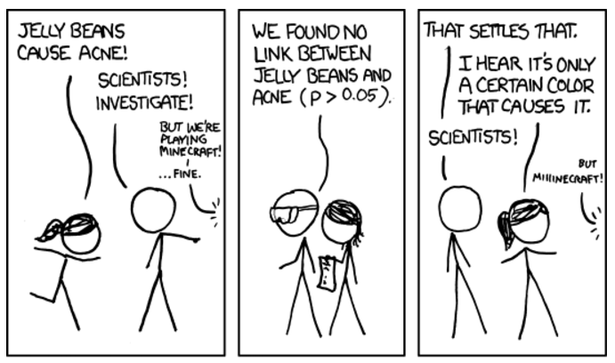
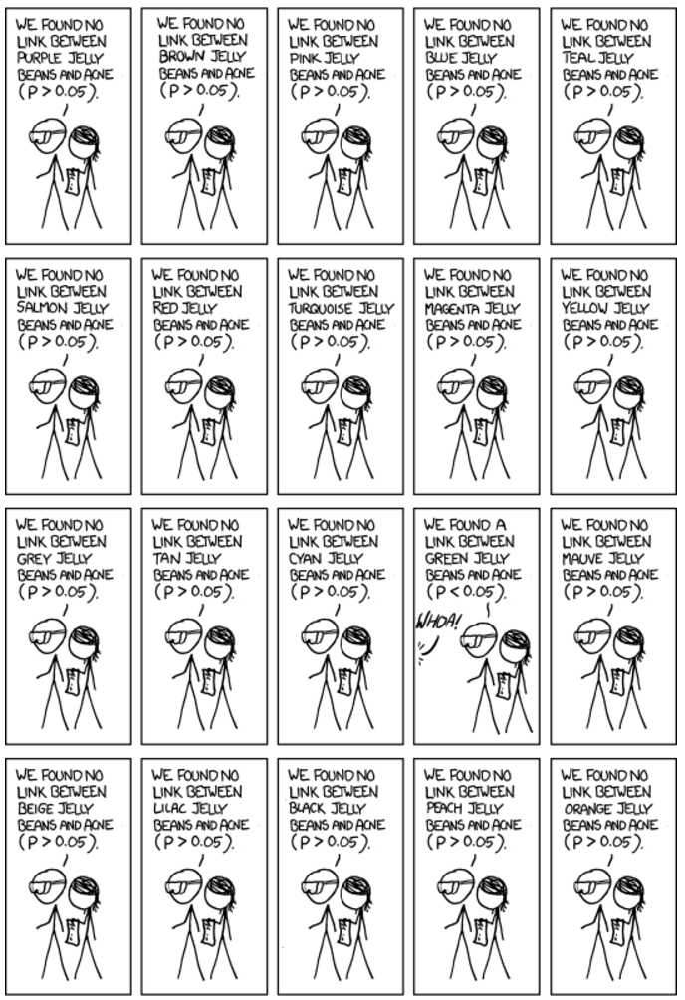

## Announcements

- HW 9 due **today** at 11:59 pm. 

- HW 10 due **tomorrow** at 11:59 pm.

- Lab 2 assignment and tutorial have been posted and due on **July 13th** at 11:59 pm


<!-- # ```{r echo = F} -->
<!-- # library(tidyverse) -->
<!-- # licorice <- read.csv("data/licorice.csv") -->
<!-- #  -->
<!-- # #Now reading in difference -->
<!-- # subject <- 1:10 -->
<!-- # before <- c(12.9, 13.5, 12.8, 15.6, 17.2, 19.2, 12.6, 15.3, 14.4, 11.3) -->
<!-- # after <- c(12, 12.2, 11.2, 13.0, 15, 15.8, 12.2, 13.4, 12.9, 11) -->
<!-- # training <- data.frame(subject, before, after) -->
<!-- #  -->
<!-- # training_diff <- training |>  -->
<!-- #   mutate(diff = after - before) -->
<!-- # ``` -->
<!-- #  -->
<!-- # ## Two independent sample t-test -->
<!-- #  -->
<!-- # From the dataset **licorice** (data = licorice), I am interested in comparing the average value of **pacu30min_throatPain** among those with different values of the variable **trt** (which defines my two samples) -->
<!-- #  -->
<!-- # ```{r echo = TRUE} -->
<!-- # #| eval: FALSE -->
<!-- # t.test(pacu30min_throatPain ~ treat, -->
<!-- #        data = licorice, -->
<!-- #        mu = 0, -->
<!-- #        alternative = "two.sided", -->
<!-- #        var.equal = FALSE, -->
<!-- #        conf.level = 0.95) -->
<!-- # ``` -->
<!-- #  -->
<!-- #  -->
<!-- # ## Paired two-sample t-test -->
<!-- #  -->
<!-- # From the dataset **training_diff**, I want to know if the average of the variable **diff** in that dataset is 0.  -->
<!-- #  -->
<!-- # ```{r echo = TRUE} -->
<!-- # #| eval: FALSE -->
<!-- # t.test(training_diff$diff, -->
<!-- #        mu = 0, -->
<!-- #        alternative = "two.sided", -->
<!-- #        conf.level = 0.80) -->
<!-- # ``` -->
<!-- #  -->
<!-- # ## Questions from last week  -->
<!-- #  -->
<!-- # ```{r echo = TRUE} -->
<!-- # training_diff -->
<!-- # ``` -->
<!-- #  -->
<!-- # ## Questions from last week  -->
<!-- #  -->
<!-- # ```{r echo = TRUE} -->
<!-- # training_diff$diff -->
<!-- # ``` -->

## Overview

- Comparing more than two means

- ANOVA test and how it relates to a t-test

- Multiple comparisons issue and Inflated type I error rates

- Pulse example: ANOVA

- Bonferroni Correction


## Very optional reading

-   P&G: Chapter 12, 14, 15

-   OI: 5.2, 5.3, 6.1, 6.2, 6.4, 7.5

## Puppies

{width="300" fig-alt="Two puppies sleeping in each other's arms; one is light brown and the other is black"} 

## Experiment: Pets and Stress Level {.smaller}

- For today's topic, we will consider an experiment where heart rates were measured (as a proxy for stress level) for a group of $n=90$ students after 10 minutes of being under certain conditions. 

- **The 3 Conditions/Groups**: Of the 90 total students, 30 students spent time holding puppies, 30 students sat alone, and 30 students chatted with a friend. 

- After 10 minutes, each student's **heart rate** was measured. 

- **Research Question**: Is there a group (puppies, friend, alone/neither) associated with lower heart rate compared to the others?

- Let's take a look at the data on the next slide. 

## Distribution of heart rate data

```{r}
#|fig-alt: "A boxplot with three boxes titled Heart Rate by Group, where the x-axis is labelled Group with three categories: Friend, Neither, and Puppies. The y-axis is labelled Heart Rate and ranges from 72 to 97. The box above Friend goes from 82.5 to 87.5, with its mean at 85; the lines go from 79 to 91 and there are two outliers at about 91 and 74. The box above Neither goes from 80 to 86, with its mean at 82; the lines go from 74 to 93 and there are no outliers. THe box above Puppies goes from 74 to 81 with its mean at 78; the lines go from 66 to 91 and there are no outliers."

library(tidyverse)
library(ggplot2)

# Set seed for reproducibility
set.seed(123)

# Simulate data: 30 people per group
puppies <- rnorm(30, mean=78, sd=7)  # lower pulse for those with puppies
neither <- rnorm(30, mean=82, sd=5)    # pulse for those alone
friends <- rnorm(30, mean=85, sd=5)  # pulse for those chatting with a friend

# Combine into a data frame
pulse_data <- data.frame(
  pulse = c(friends, neither, puppies),
  group = factor(rep(c("Friend", "Neither", "Puppies"), each=30))
)

ggplot(data = pulse_data, mapping = aes(x = group, y = pulse)) +
  geom_boxplot() + 
  scale_colour_brewer(palette = "Set1") +
  labs(
   y="Heart Rate",
   x="Group",
   title="Heart Rate by Group"
  )
```

How do we compare across three groups? Which groups are different?

## Example: pets and stress

We are interested in testing

$$H_0: \mu_P = \mu_F = \mu_N$$

against the alternative that at least one mean is different from the others.

-   One way to do this would be to use t-tests on all possible pairs of tests (here there are just three - how many pairs of tests would this be?). However, if we have more groups, this becomes quite complicated.

-   For example, with 10 groups we need to do $10\choose {2}$ = 45 tests!

## Review: Error rates 

::: callout-tip

In groups, fill in the blanks:

-   Suppose we test the null hypothesis $H_0$:$\mu = \mu_0$. We could potentially make two types of errors:

| Truth                | $\mu = \mu_0$    | $\mu \neq \mu_0$ |
|----------------------|------------------|------------------|
| Fail to reject $H_0$ | correct decision | ____________     |
| Reject $H_0$         | ___________      | correct decision |


How would you explain the following in words?

-   **Type I Error**: ____________
<br>
-   **Type II Error**: ____________


:::


## Multiple comparisons

- Now that we've reviewed Type I and Type II errors, we need to discuss **multiple comparisons** - an important concept in statistics. 

-   Back to our pet example. What if we had 10 groups? 

- In addition to being time-consuming, carrying out multiple tests can lead to **inflated Type I error rates** which puts into question the validity of a given study if these **multiple comparisons** are not accounted for.

## Multiple comparisons in action: overall test

{width="400" fig-alt="A cartoon strip with three panels. The first panel shows a stick figure with a ponytail running in saying Jelly Beans cause acne! and another stick figure saying Scientists! Investigate! A speech bubble from someone not visible says But we're playing minecraft ... fine. The second panel shows two stick figures, one with lab goggles and the other holding a piece of paper, saying We found no link between jelly beans and acne (p > 0.05). The third panel has the two stick figures from the first panel. The one without a ponytail says That settles that; the one with a ponytail says I hear it's only a certain color that causes it. The other goes Scientists! The speech bubble from someone not in the panel says But Minecraft!"}

## Extra tests...whoa!

{width="600" fig-alt="A cartoon with 20 panels, all of which have two stick figures, one with lab goggles and the other holding a piece of paper. In the first 13 panels, the stick figures are saying they did not find a link between a variety of color jelly beans and acne. In the fourteenth panel, they say they found a link between green jelly beans and acne and a speech bubble from someone not in the panel says Whoa! In the fifteenth through twentieth panels, they say they did not find a link between a variety of color jelly beans and acne."}

## Green jelly beans!

{width="200" fig-alt="A cartoon of a newspaper with the headline Green Jelly Beans Linked to Acne! 95% Confidence Only 5% chance of coincidence! and a picture of three green jelly beans."}

## So what went wrong?

{width="300" fig-alt="An intersection being painted; the word Stop is misspelled Sotp. In front of the image is Captain Picard from Star Trek with his head in his hand in frustration."}

## Multiple comparisons {.smaller}

Consider our pets / stress example, where we had three pairwise comparisons.

-   Suppose all means are truly equal and we conduct all three pairwise tests

1. $H_0$: $\mu_P = \mu_F$ vs. $H_A$: $\mu_P \neq \mu_F$

2. $H_0$: $\mu_P = \mu_N$ vs. $H_A$: $\mu_P \neq \mu_N$

3. $H_0$: $\mu_N = \mu_F$ vs. $H_A$: $\mu_N \neq \mu_F$

-   Suppose also the tests are independent and done at a 0.05 significance level

-   Then the probability we fail to reject **all three tests if the null hypothesis were true** (i.e. the **correct decision**), assuming the tests are independent, is:

$P(\text{fail to reject Test 1} | H_0 \text{ true})\cdot P(\text{fail to reject Test 2} | H_0 \text{ true}) \cdot P(\text{fail to reject Test 3} | H_0 \text{ true})$

## Multiple comparisons (continued)

- Assuming the tests are independent, this probability is $(1−0.05)^3=0.95^3=0.857$ , and so the probability of rejecting at least one of the three null hypotheses, called the **family-wise error rate**, is $1−0.857=0.143>0.05$

-   If we had 10 groups instead, we would need 45 pairwise tests. With 45 tests, the probability of rejecting at least 1 of them (incorrectly!) is over 90%!

## Intuitive Takeaway: Why Multiple Comparisons Matter {.smaller}

- Each hypothesis test carries a small chance (e.g., 5%) of being a **false positive**.  
  - Like flipping a coin: occasionally, you'll get “heads” just by chance.

- When we run **many tests**, those small chances add up.  
  - With only 3 tests, there’s already a 14% chance of at least one false alarm.  With 45 tests, that chance exceeds 90%!

- In practice:  Even if nothing real is going on, we’re **almost guaranteed** to find something “statistically significant.”  This can lead to **misleading conclusions** — especially in large studies testing many variables.

- **Takeaway:** The more tests we do, the more we must **adjust for multiple comparisons** (e.g., Bonferroni correction, FDR (false discovery) control) to avoid fooling ourselves.


## Multiple comparisons

-   **ANOVA** extends the t-test and is one way to control the overall Type I error rate at a fixed level $\alpha$, if we only test pairwise differences when the overall ANOVA test is rejected

-   ANOVA stands for **analysis of variance**. We use ANOVA when we want to compare more than two groups.

## ANOVA null hypothesis

In ANOVA, we typically follow this testing procedure:

1.  First, we conduct an **overall** test of the null hypothesis that the means of all of the groups are equal.

2.  If this is rejected, then we **step down** to see which means are different from each other. A **multiple comparisons** correction is sometimes used for these pairwise comparisons of means.

3.  If we fail to reject the null hypothesis, then no further testing should be done.

## ANOVA alternative hypothesis

For ANOVA with three groups, our null hypothesis is $H_0: \mu_P = \mu_F = \mu_N$. What could happen under the alternative?

-   $μ_P≠μ_F≠μ_N$

-   $μ_P=μ_F$, but $μ_N$ is different

-   $μ_P=μ_N$, but $μ_F$ is different

-   $μ_F=μ_N$, but $μ_P$ is different

The alternative hypothesis for ANOVA is that at least one of the means is different from the others.

## Assumptions of ANOVA

1.  Outcomes within groups are normally distributed

2.  Homoscedastic variance (the within-group variance is the same for all groups)

3.  Samples are independent

If these assumptions are violated, then results from ANOVA may not be valid. We will discuss some alternatives later in the course.

## Validity of ANOVA for pet data

```{r echo = T}
#| echo: true
#| eval: false
#| fig-alt: "Three histograms, all with pulse on the x-axis. The leftmost is titled Friend and seems normally distributed; the center is titled Neither and seems normally distributed; the rightmost is titled Puppies and seems like it might not be normally distributed." 
pulse_data |>
  ggplot(mapping = aes(x = pulse)) + 
  geom_histogram(bins=10) +
  facet_wrap(~group) + 
  labs(
   x="Heart Rate",
   y="Count",
   title="Heart Rate by Group"
  )
```

## Validity of ANOVA for pet data

```{r echo = T}
#| echo: true
#| eval: false
ggplot(pulse_data, aes(x = pulse)) +
  geom_histogram(bins = 10) +
  facet_wrap(~group)
```

## Validity of ANOVA for pet data

```{r echo = T}
#| echo: false
#| eval: true
pulse_data |>
  ggplot(mapping = aes(x = pulse)) + 
  geom_histogram(bins=10) +
  facet_wrap(~group)
```

Variances appear to be similar, but normality may be slightly questionable. For now, let's proceed despite this.

## Why analyze variance when we want means?

-   Remember, ANOVA stands for analysis of variance.

-   What does variance have to do with our null hypothesis, which is about equality of means (say, $H_0:μ_1=μ_2=⋯=μ_K$)?

## Why analyze variance when we want means?

**F-test**: If the **group-specific means** vary around the **overall grand mean** more than the individual observations vary around their group-specific sample means, then we have evidence that the corresponding population means are in fact different. 

## F-test

How do we formally compare these variances? Consider the F statistic given by

$$F = \frac{s^2_{between}}{s^2_{within}}$$

which if $H_0$ is true, has an F distribution with K−1 **numerator** degrees of freedom and $n−K$ **denominator** degrees of freedom, where K is the number of groups and $n$ is the total number of observations.

## Components of the F Statistic {.smaller}

Between-group variance -  $s^2_{between}$

  - Measures **how much the group means differ from the grand mean**
  - Captures **variation between the groups**

Within-group variance - $s^2_{within}$

  - Measures **how much individual observations vary around their group mean**
  - Captures **variation within the groups**
  
ANOVA asks: **Is the variation between groups larger than the variation within groups?**

## F-test

-   The F-test for ANOVA is inherently one-tailed, rejecting $H_0$ only if F is considerably larger than one.

-   Importantly, this does not mean we have a one-sided alternative; we just look at one tail of the F distribution to get the p-value.

-   If there are only two groups, then the F-test gives the same result as the independent-samples t-test.


## Output

```{r echo = T}
# anova in R:
summary(aov(pulse ~ group, data = pulse_data))
```

::: {.callout-tip appearance="simple"}
Which rows correspond to the between-group and within-group variances here, respectively?
:::

## Output


## F-test for pet data

- Note that $F = s^2_B / s^2_W = \frac{(877.7/2)}{(2421.7/87)} = 15.77$, with ndf = $3-1 = 2$ and ddf $90-3=87$. 

- This corresponds to a p-value \<.0001. 

- **Conclusion**: At $\alpha = 0.05$, we reject the null hypothesis. There is sufficient evidence that at least one of the three groups comes from a population with a different mean than the others.

-   Which groups might be different?

## F-test for pet data

```{r}
#|fig-alt: "A boxplot with three boxes titled Heart Rate by Group, where the x-axis is labelled Group with three categories: Friend, Neither, and Puppies. The y-axis is labelled Heart Rate and ranges from 72 to 97. The box above Friend goes from 82.5 to 87.5, with its mean at 85; the lines go from 79 to 91 and there are two outliers at about 91 and 74. The box above Neither goes from 80 to 86, with its mean at 82; the lines go from 74 to 93 and there are no outliers. THe box above Puppies goes from 74 to 81 with its mean at 78; the lines go from 66 to 91 and there are no outliers. There is a red dashed line at y=82."

# calculate grand mean
grand_mean <- mean(pulse_data$pulse)

ggplot(data = pulse_data, mapping = aes(x = group, y = pulse)) +
  geom_boxplot() + 
  geom_hline(yintercept = grand_mean, linetype = "dashed", color = "red", size = 1) +
  scale_colour_brewer(palette = "Set1") +
  labs(
   y="Heart Rate",
   x="Group",
   title="Heart Rate by Group"
  )
```

## Different Example Data

```{r}
#| echo: false
#|fig-alt: "A boxplot with three boxes titled Heart Rate by Group, where the x-axis is labelled Group with three categories: Friend, Neither, and Puppies. The y-axis is labelled Heart Rate and ranges from 16 to 24. The box above Friend goes from 18 to 21, with its mean at 19.5; the lines go from 17 to 22 and there are two no outliers. The box above Neither goes from 19 to 21, with its mean at 20; the lines go from 18 to 24 and there are no outliers. THe box above Puppies goes from 19 to 21 with its mean at 20; the lines go from 17 to 23 and there is an outlier at 16. There is a red dashed line at y=19.5."
set.seed(343)

n <- 25

dog  <- rnorm(n, mean = 20.05, sd = 2)
cat  <- rnorm(n, mean = 19.75, sd = 2)
none <- rnorm(n, mean = 20, sd = 2)

pulse_data_v2 <- data.frame(
  pulse = c(dog, cat, none),
  group = factor(rep(c("Friend","Neither","Puppies"), each = n))
)

# calculate grand mean
grand_mean <- mean(pulse_data_v2$pulse)

ggplot(pulse_data_v2, aes(x = group, y = pulse)) +
  geom_boxplot() +
  geom_hline(yintercept = grand_mean, linetype = "dashed", color = "red", size = 1) +
  labs(
   y="Heart Rate",
   x="Group",
   title="Heart Rate by Group"
  )
```

## 

```{r}
#| echo: true
anova_model <- aov(pulse ~ group, data = pulse_data_v2)
summary(anova_model)
```

## Application Exercise

- On Canvas, download today's Application Exercise template. 

- The application Exercise will be due **tomorrow at 11:59pm**.


## Bonferroni correction

-   As we showed earlier, conducting multiple tests on a data set increases the **family-wise error rate** - the probability of making at least one Type I error (false positive) when performing multiple, simultaneous hypothesis tests

-   One very conservative way to ensure this is not the case is to simply divide $\alpha$ by the number of tests to be done and to use that as the significance level.

-   This procedure is called the **Bonferroni correction**.

## Bonferroni correction

-   For example: for two tests, to preserve an overall 0.05 type I error rate, the Bonferroni correction would use $\alpha/2=0.025$ as the significance level for each individual test instead of 0.05.

-   Bonferroni is a conservative correction, making it harder to reject the null hypothesis, but it is a safe bet in controlling the Type I error rate.

## Pets and stress: group differences

-   We can compare the groups using a Bonferroni correction (here we have three tests, so the significance level for each test is $\alpha/3$).

-   The raw (uncorrected) p-values for the t-test comparing friend vs. pet was $<0.0001$; for friend vs. neither was 0.021, and for pet vs. neither was 0.009.

::: {.callout-tip appearance="simple"}
In your small groups: What might we conclude?
:::

## What if the outcome is categorical? {.smaller}

So far, we’ve focused on comparing **means** of **continuous** outcomes between groups

**Examples**: mean heart rate, mean BMI

But sometimes the outcome we want to compare is **categorical** (yes/no or categories)

**Examples**: smoker vs. non-smoker, disease vs. no disease


Instead of comparing **means**, we compare **proportions** (or **counts**) across groups.

::: {.callout-tip title="Think"}
Does the distribution of categories differ across groups?
:::

## Example association questions

- Is the **# of cigarettes smoked a day** associated with **lung cancer**?

- Is **smoking status** associated with **lung cancer**?

- Is **hrs of exercise per week** associated with **heart disease**?  

- Is **exercise category (low / moderate / high)** associated with **heart disease**?


## Motivation: Comparisons of Interest

| Predictor Type      | Outcome Type           | Common Tests / Topics                             | 
|----------------------|------------------------|---------------------------------------------------|
| Categorical          | Categorical            | Fisher’s exact test, $\chi^2$ test                      |
| Categorical          | Continuous             | t-tests, ANOVA    |

::: {.callout-note}
Same big question, different summary:

- Continuous outcome → compare **means**
- Categorical outcome → compare **proportions** (or **counts**)
:::


## Pneumococcal disease

The World Health Organization estimates that in developing countries 814,000 children under the age of five die annually from invasive pneumococcal disease (IPD), with an estimated 1.6 million deaths affecting all ages globally.

Several recent studies have identified associations between pneumococcal serotypes (species variations) and patient outcomes from IPD. We consider data from a study of pneumococcal serotypes and mortality (Inverarity et al. (2011)).

## Pneumococcal disease

```{r}
# Load necessary packages
library(knitr)
library(kableExtra)

# Example data
data <- data.frame(
  Serotype = c("Serotype 10", "Serotype 31", "Total"),
  Alive = c(37, 24, 61),
  Dead = c(7, 10, 17),
  Total = c(44, 34, 78)
)

```

| Serotype     | Alive | Dead | Total |
|--------------|--------|------|--------|
| Serotype 10  | 37     | 7    | 44     |
| Serotype 31  | 24     | 10   | 34     |
| Total        | 61     | 17   | 78     |


Is there an association between serotype and mortality?

## Chi-square tests {.smaller}

$H_0$: There is no association between serotype and mortality

$H_1$: There is an association between serotype and mortality

Under $H_0$, we have independence between serotype and mortality, implying that joint probabilities should be equal to products of marginal distributions:

```{r}
# Example data
data <- data.frame(
  Serotype = c("Serotype 10", "Serotype 31", "Total"),
  Alive = c("?", "?", 61),
  Dead = c("?", "?", 17),
  Total = c(44, 34, 78)
)


```

| Serotype     | Alive | Dead | Total |
|---------------|--------|------|--------|
| Serotype 10   | ?      | ?    | 44     |
| Serotype 31   | ?      | ?    | 34     |
| Total         | 61     | 17   | 78     |


What counts might we expect under $H_0$?


## Intuition: Joint and Marginal Probabilities {.smaller}

- Suppose we look at two variables: **Serotype** and **Mortality** (Alive or Dead).

- The **joint probability** describes the probability of being in *both* categories (e.g., “Serotype 10 **and** Alive”).

- The **marginal probabilities** describe totals across one variable:
  - P(Serotype 10) = proportion of all patients with Serotype 10  
  - P(Alive) = proportion of all patients who survived

::: columns
::: column
#### Marginal totals
| Serotype | Total |
|-----------|--------|
| 10 | 44 |
| 31 | 34 |
| **Total** | **78** |
:::

::: column
#### Marginal totals
| Outcome | Total |
|----------|--------|
| Alive | 61 |
| Dead | 17 |
| **Total** | **78** |
:::
:::

## What would happen if these two variables were independent? {.smaller}

- Under the **null hypothesis of independence**, the chance of being both “Serotype 10” **and** “Alive” should just be:

$$
P(\text{Serotype 10 and Alive}) = P(\text{Serotype 10}) \times P(\text{Alive})
$$

- We can multiply these probabilities by the total number of observations to find the **expected counts**.


## What would happen if these two variables were independent? {.smaller}

For example:

$$
E_{10,Alive} = P(\text{Serotype 10}) \times P(\text{Alive}) \times N
$$

- Using our totals:

$$
P(\text{Serotype 10}) = \frac{44}{78}, \quad P(\text{Alive}) = \frac{61}{78}, \quad N = 78
$$

## Compute expected count under independence {.smaller}

```{r}
#| echo: true
# Compute expected count under independence
expected_10_alive <- (44/78) * (61/78) * 78
expected_10_alive
```

- We can repeat this for each cell to find what we'd expect if serotype and mortality were truly unrelated. 

- The chi-square test then measures how far our observed counts deviate from these expected counts.

$$\chi^2 = \sum\frac{(O-E)^2}{E}$$

## Intuition

- If observed counts are **close** to what we'd expect under independence, $\chi^2$ will be small, then we'd fail to reject $H_0$. 

- If they're **far** from expected, $\chi^2$ will be large, which might lead to evidence of an association. 


## Visualizing Observed vs Expected Counts

Let's visualize how the **observed** counts compare to the **expected** counts under independence. 

```{r}
#| fig-alt: "A figure with two panels, titled Observed vs Expected Counts by Serotype. The y-axis is labelled Count and the x-axis for each panel is labeled Outcome with options Alive and Dead. In the left panel, the subtitle is Serotype 10; above Alive there is a red bar with count 34 and a blue bar with count 37 and above Dead there is a red bar with count 9 and a blue bar with count 7. In the right panel, the subtitle is Serotype 31; above Alive there is a red bar with count 26 and a blue bar with count 24 and above Dead there is a red bar with count 7 and a blue bar with count 10."
#| echo: false


library(dplyr)
library(tidyr)
library(ggplot2)

# Observed data
obs_data <- data.frame(
  Serotype = c("Serotype 10", "Serotype 31"),
  Alive = c(37, 24),
  Dead = c(7, 10)
)

# Reshape to long format
obs_long <- obs_data %>%
  pivot_longer(cols = Alive:Dead, names_to = "Outcome", values_to = "Observed")

# Compute expected counts under independence
total_alive <- sum(obs_data$Alive)
total_dead <- sum(obs_data$Dead)
total_serotype <- rowSums(obs_data[, 2:3])
N <- sum(total_serotype)

expected_alive <- (total_serotype / N) * total_alive
expected_dead <- (total_serotype / N) * total_dead

exp_data <- data.frame(
  Serotype = obs_data$Serotype,
  Alive = expected_alive,
  Dead = expected_dead
) %>%
  pivot_longer(cols = Alive:Dead, names_to = "Outcome", values_to = "Expected")

# Combine observed and expected
plot_data <- obs_long %>%
  left_join(exp_data, by = c("Serotype", "Outcome")) %>%
  pivot_longer(cols = c(Observed, Expected), names_to = "Type", values_to = "Count")

# Plot observed vs expected
ggplot(plot_data, aes(x = Outcome, y = Count, fill = Type)) +
  geom_col(position = "dodge") +
  facet_wrap(~Serotype) +
  scale_fill_manual(values = c("Observed" = "skyblue", "Expected" = "lightcoral")) +
  theme_minimal(base_size = 14) +
  labs(
    title = "Observed vs Expected Counts by Serotype",
    y = "Count",
    x = "Outcome",
    fill = ""
  )
```

## Visualizing Observed vs Expected Counts

What if we do not assume independence?


## Chi-square tests

The **chi-square test** compares the observed frequencies in each cell to the expected count under $H_0$; if the total differences are large enough, we reject $H_0$:

$$\chi^2 = \sum_{i=1}^{r \times c}\frac{(O_i - E_i)^2}{E_i}$$

which has a $\chi^2_{(r - 1) \times (c-1)}$ distribution, with $r$ = Number of rows, $c$ = number of columns, under $H_0$.


## Chi-square tests

```{r echo = T}
data <- matrix(c(37, 7, 24, 10), 
               byrow = T, nrow = 2)
data
chisq.test(data)
```

What might we conclude at $\alpha = .05$?

## Conclusion

-   **Conclusion**: Since the p-value is greater than 0.05, we fail to reject the null hypothesis. There is not enough evidence to conclude that survival differs between Serotype 10 and Serotype 31. 

## An equivalent hypothesis

Under $H_{0}$ There is no association between serotype and mortality, we have independence between serotype and mortality.

If two variables are **independent**:

$$P(A|B) = P(A)$$

Under $H_{0}$, serotype and death are **independent** which means:

$$P(\text{death}|S_{10}) = P(\text{death}|S_{31}) = P(\text{death})$$

## Pneumococcal disease

| Serotype     | Alive | Dead | Total |
|--------------|------|------|------|
| Serotype 10  | 37   | 7    | 44   |
| Serotype 31  | 24   | 10   | 34   |
| Total        | 61   | 17   | 78   |

Is the **proportion who die** different between serotypes?

  - $P(\text{death}|S_{10}) = 7/44 = 0.16$
  - $P(\text{death}|S_{31}) = 10/34 = 0.29$

## Fisher's exact test 

- The chi-square test relies on asymptotic results (i.e. large sample size), which might not be appropriate if we have small cell counts (common rules of thumb are \>5 or \>10 observed in each cell). 


## Fisher's exact test {.smaller}

- **Fisher's exact test** tests the same hypotheses at Chi-squared tests **but** calculates an exact p-value under a specific distributional assumption.


| Serotype     | Alive | Dead | Total |
|--------------|--------|------|--------|
| Serotype 10  | 37     | 7    | 44     |
| Serotype 31  | 24     | 10   | 34     |
| Total        | 61     | 17   | 78     |


## Fisher's exact test

Fisher's exact test relies on the **hypergeometric distribution** (don't worry about this, seriously).

| Serotype     | Alive | Dead | Total       |
|---------------|--------|------|-------------|
| Serotype 10   | a      | c    | a + c       |
| Serotype 31   | b      | d    | b + d       |
| Total         | a + b  | c + d| a + b + c + d |


Conditionally on the margins (assumed fixed), then each of the individual cells is distributed according to the hypergeometric distribution. We can thus calculate the exact probabilities of obtaining specific *tables*.

## Fisher's exact test

Observed data:

| Serotype     | Alive | Dead | Total |
|--------------|--------|------|--------|
| Serotype 10  | 37     | 7    | 44     |
| Serotype 31  | 24     | 10   | 34     |
| Total        | 61     | 17   | 78     |


We could use the hypergeometric distribution to calculate the probability of seeing this table, assuming 61 total alive patients, 17 dead, and 44 and 34 infections of serotypes 10 and 31, respectively (lots of factorials, so you could imagine it wasn't fun before modern computers).

## Fisher's exact test

Another "possible" table:

| Serotype     | Alive | Dead | Total |
|--------------|--------|------|--------|
| Serotype 10  | 36     | 8    | 44     |
| Serotype 31  | 25     | 9    | 34     |
| Total        | 61     | 17   | 78     |


- Here we've displayed another table with the **same margins**, but with some slightly different potential cell counts. 

- Again we could use the hypergeometric distribution to calculate the probability of observing the cell counts conditionally on fixed margins.

## Fisher's exact test

Fisher's exact test relies on constructing *all possible* contingency tables with the same margins, and then summing up probabilities of all tables as extreme or more extreme than the observed data.

::: {.callout-tip appearance="simple"}
## Question

What might "more extreme" mean in the context of contingency tables?
:::

## Fisher's exact test

$H_0$: The proportion of deaths is the same for Serotype 10 and Serotype 31 (no association between serotype and outcome). 

$H_A$: The proportion of deaths differs between serotypes (there *is* an association)

```{r echo = T}
data <- matrix(c(37, 7, 24, 10), byrow = T, nrow = 2)
data
```

## Conducting the Fisher's Exact test

```{r}
#| echo: true
fisher.test(data)
```


- What might we conclude at $\alpha = 0.05$?

## Conclusion

- The Fisher’s Exact Test yielded a p-value of 0.17, which is greater than the conventional significance level of 0.05. Therefore, we fail to reject the null hypothesis.

- There is no statistically significant evidence of an association between serotype and survival status in this sample.

## Odds ratios 

-   If the probability of an event happening is $p$

-   The odds of an event happening are $\frac{p}{1-p}$

-   For a fair coin flip
    - $P(heads)=0.5$ 
    - Odds of heads = $\frac{0.5}{1-0.5}$ = 1
    - Heads is equally likely as not-heads (tails)

## Odds ratios 

-   For a scenario where 20 people have a disease and 80 people do not
    - $P(disease)=\frac{20}{100}=0.2$ 
    - Odds of having disease = $\frac{.2}{1-0.2}=\frac{0.2}{0.8}=\frac{1}{4}$ = 0.25
    - Disease occurs 1 time for every 4 times it does not occur
    
## Odds ratios 

| Serotype     | Alive | Dead | Total |
|--------------|--------|------|--------|
| Serotype 10  | 37     | 7    | 44     |
| Serotype 31  | 24     | 10   | 34     |
| Total        | 61     | 17   | 78     |

-   Odds of death among serotype 10 patient = $\frac{P(death | S_{10})}{P(alive | S_{10})}$

-   Odds of death among serotype 10 patients = $\frac{7/44}{37/44} = 7/37$

## Odds ratios 

| Serotype     | Alive | Dead | Total |
|--------------|--------|------|--------|
| Serotype 10  | 37     | 7    | 44     |
| Serotype 31  | 24     | 10   | 34     |
| Total        | 61     | 17   | 78     |

-   Odds of death among serotype 31 patient = $\frac{P(death | S_{31})}{P(alive | S_{31})}$

-   Odds of death among serotype 31 patients = $\frac{10/34}{24/34} = 10/24$


## Odds ratios 

-   Odds of death among serotype 10 patients = $\frac{7/44}{37/44} = 7/37$

-   Odds of death among serotype 31 patients = $\frac{10/34}{24/34} = 10/24$

-   **Odds ratio** of death comparing 31 to 10 is thus $\frac{10/24}{7/37} \approx 2.2$

-   The odds of death in the serotype 31 group are about 2.2 times the odds of death in the serotype 10 group

## r by c tables

| Serotype     | Alive | Dead | Total |
|---------------|-------|------|-------|
| Serotype 10   | 37    | 7    | 44    |
| Serotype 15   | 60    | 12   | 72    |
| Serotype 20   | 97    | 9    | 106   |
| Serotype 31   | 24    | 10   | 34    |
| **Total**     | **218** | **38** | **256** |


We can also extend the chi-square test and Fisher's exact test to more general contingency tables (although the notion of an odds ratio no longer makes sense here).

## Winter Olympics training

Suppose we were interested in whether a particular training regimen was associated with "success" as measured by whether an athlete qualified for being on the US Winter Olympic Team for giant slalom.

## Winter Olympics training

|                 | Qualified | Did Not Qualify |
|-----------------|-----------|-----------------|
| **New Regimen** | 129       | 97              |
| **Old Regimen** | 112       | 114             |


```{r}
#| echo: false
data <- matrix(c(129, 97, 112, 114), byrow = T, nrow = 2)
chisq.test(data)
```

::: callout-tip

## Practice

Write out the code to 1) construct the data matrix and 2) to conduct a chi square test in R. What might we conclude using alpha = .05? 

:::

## Overview

- ANOVA testing

- Bonferroni correction

- Chi-square test and example

- Fisher exact test and example (use if sample sizes aren't large enough)

## Next Class

- Tuesday's class: Non-Parametric Methods

