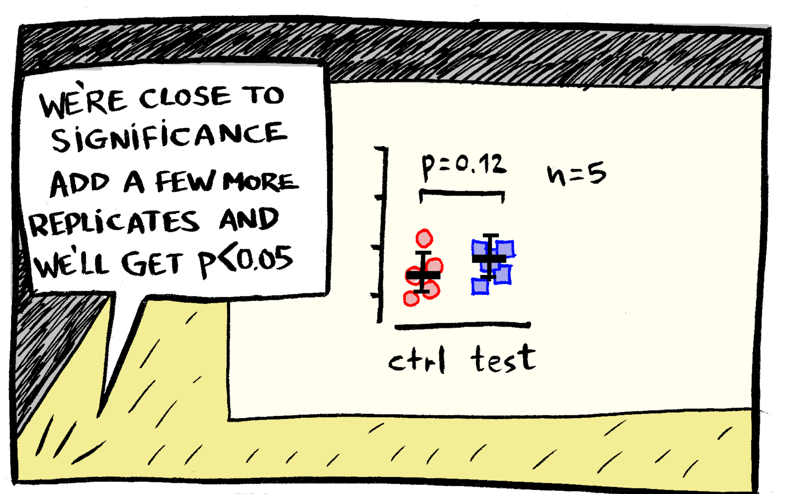
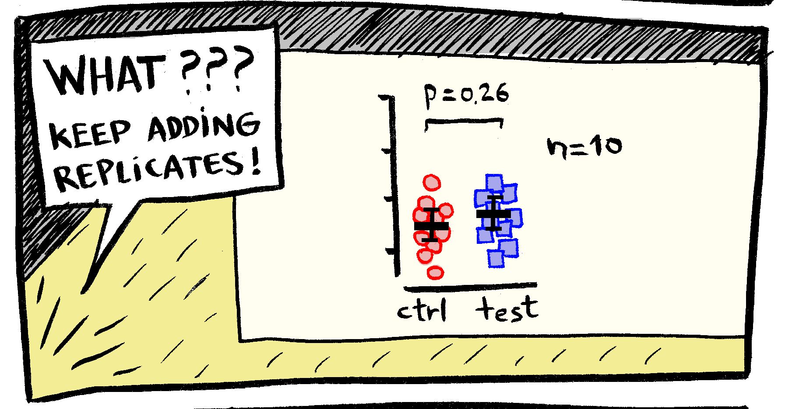
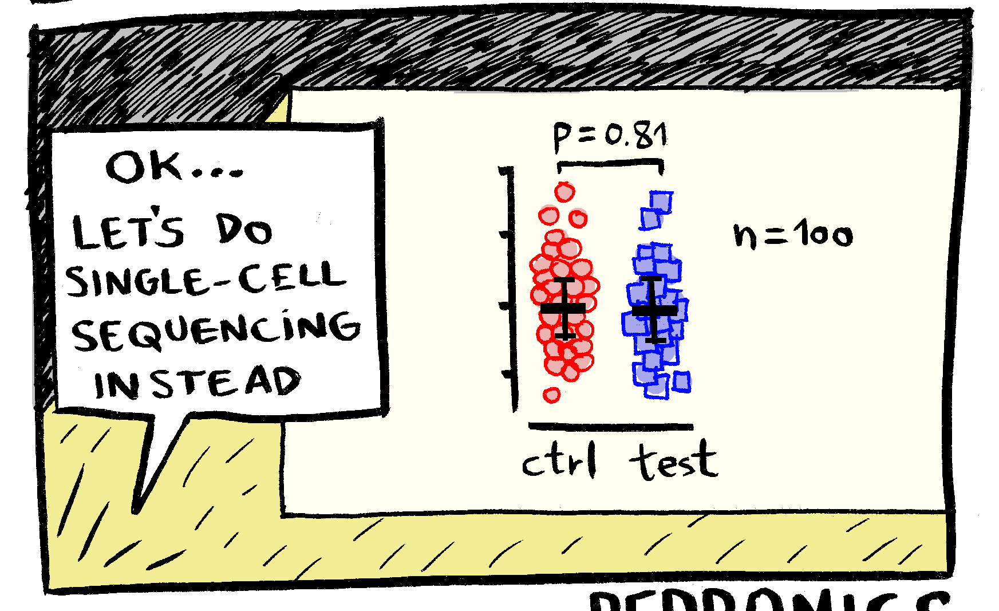
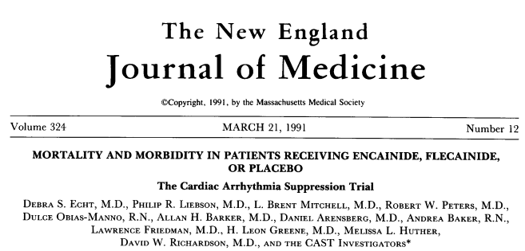

## Announcements

- Exam scores are posted on Canvas. 

- Feel free to reach out to me if you'd like to schedule an appointment to discuss your exam.

- There will be an opportunity to earn back up to half of the points you missed by reworking those problems

- More specific details to come soon

## Announcements

- HW 4 due **Thursday at 11:59pm**

- Lab 5 has been posted and due **Friday at 11:59pm**

## Overview

- `qt()` function

- Hypothesis tests: how to conduct them, how to interpret them


## Review from last week 

- When constructing a confidence interval with known $\sigma$ we need $Z \sim N(0,1)$

$$\textrm{Point estimate} \pm \underbrace{\textrm{confidence multiplier} \times \textrm{standard error}}_{\text{Margin of error}}$$

$$(\bar X - z^*_{1-\alpha/2} \frac{\sigma}{\sqrt n}, \bar X + z^*_{1-\alpha/2} \frac{\sigma}{\sqrt n})$$

## Review from last week

- When constructing a confidence interval with **unknown** $\sigma$, we need the **$t^*$ critical value**.

$$(\bar X - t^*_{n-1; 1-\alpha/2} \frac{s}{\sqrt n}, \bar X + t^*_{n-1; 1-\alpha/2} \frac{s}{\sqrt n})$$

## Helpful code for HW 4

- For the **$t^*$ distribution**

- R provides two functions:
  - `pt()` → cumulative probability (area to the left)
  - `qt()` → quantile function (finds cutoff given probability)

## Example code

Suppose we want a 95% confidence interval with $n = 20$ observations:

```{r}
#| echo: true
alpha <- 0.05
n <- 20

# degrees of freedom
df <- n - 1  

# t critical value
t_crit <- qt(1 - alpha/2, df = df)
t_crit
```

- This is the cutoff value such that 95% of the $t_{19}$ distribution lies between $-t$ and $+t$.

## $t$ critical values {.smaller}

```{r}
#| fig-height: 9

# Set up the x-axis values
x <- seq(-4, 4, length = 1000)

# Compute the densities for the t-distributions
y_t1 <- dt(x, df = 1)
y_t19 <- dt(x, df = 19)


# Compute the density for the standard normal distribution
y_norm <- dnorm(x, mean = 0, sd = 1)

# Plot the density for t-distribution with 1 degree of freedom
plot(x, y_t19, type = "l", col = "red", lwd = 2, ylim = c(0, 0.4),
     main = "T-distribution with 19 df",
     xlab = "x value", ylab = "Density")

# Add the density for t-distribution with 3 degrees of freedom
lines(x, y_t1, col = "blue", lwd = 2)

# Add the density for the standard normal distribution
lines(x, y_norm, col = "black", lwd = 2, lty = 2)

# Add a legend
legend("topright", legend = c("t df=19", "t df=1", "Normal (0,1)"),
       col = c("red", "blue","black"), lwd = 2, lty = c(1, 1, 1, 1, 2))

```

## Reading

-   P & G: 10.1 - 10.4

-   OI: 5.3

```{r}
#| echo: false
#| warning: false
library(tidyverse)
```

## Remember IQ example?

- IQ tests have a distribution with $\mu$ = 100 and **known** $\sigma$ = 15

- For a random sample of $n = 30$, BIOS 600 students, the sample average IQ score is 120 

- The central limit theorem tells us that the distribution of means of samples of size 30 from this population is also normal, with mean $\mu = 100$ and $SE = \sigma/ \sqrt{n} = 15 \sqrt{30} \approx 2.7$

## Remember IQ example? {.smaller}

- Remember here I **know** $\sigma$, I can derive 95\% confidence interval for the BIOS 600 students average IQ

```{r}
#| echo: true
alpha <- 0.05
qnorm(1-(alpha/2), mean = 0, sd = 1)
```
$$(120 - 1.96 *\frac{15}{\sqrt 30}, 120 + 1.96 * \frac{15}{\sqrt 30}) = (114.6, 125.4)$$

- I am 95\% confident the true mean IQ for Bios 600 students falls between 114.6 and 125.4

## Let's say I don't know sigma 

- Let's say for a random sample of $n = 30$, BIOS 600 students, the sample average IQ score is 120 with **sample** standard deviation of 15. I can still derive 95\% confidence interval for the BIOS 600 students average IQ using the t-distribution

```{r}
#| echo: true
alpha <- 0.05
n <- 30

# degrees of freedom
df <- n - 1  

# t critical value
t_crit <- qt(1 - alpha/2, df = df)
t_crit
```

## Remember IQ example?

- I have 95% confidence that the true mean IQ for BIOS 600 students is between 114.4 and 125.6

$$(120 - 2.045 *\frac{15}{\sqrt 30}, 120 + 2.045 * \frac{15}{\sqrt 30}) = (114.4, 125.6)$$


## Remember IQ example?

- Let's go back to knowing $\sigma$, what if I want to test whether BIOS 600 students are smarter than average?

- $Z = \frac{\bar{X} - \mu}{SE}$ is a standard normal random variable

- $Z \approx 7.3$

## How can we answer research questions using statistics?

-   **Statistical hypothesis testing** is the procedure that assesses evidence provided by the data in favor of or against some claim about the population (often about a population parameter or potential associations).

## The hypothesis testing framework

1.  Start with two hypotheses about the population: the **null hypothesis** and the **alternative hypothesis**

2.  Choose a sample, collect data, and analyze the data

3.  Figure out how likely it is to see data like what we got/observed, IF the null hypothesis were true

4.  If our data would have been extremely unlikely if the null claim were true, then we reject it and deem the alternative claim worthy of further study. Otherwise, we **cannot reject the null** claim

## Example: Ultra-low dose contraception {.smaller}


-   Oral contraceptive pills work well, but must have a precise dose of estrogen.

-   If a pill has too high a dose, then people may risk side effects such as headaches, nausea, and rare but potentially fatal blood clots

-   If a pill has too low a dose, pregnancy may occur


## Ultra-low dose contraception

-   A certain contraceptive pill is supposed to contain precisely 0.020 $\mu g$ of estrogen. 

- During quality control, 50 randomly selected pills are tested, with a sample mean dose 0.017 $\mu g$ and **sample SD** 0.0008 $\mu g$.

::: {.callout-caution appearance="simple"}
## Question

Do you think this is cause for concern? Why or why not?
:::

## Two competing hypotheses

-   The **null hypothesis** ($H_0$) states that "nothing unusual is happening" / there is no change from status quo / there is no relationship / etc.

-   The **alternative hypothesis** ($H_A$ or $H_1$) states the opposite: that there is some sort of relationship (usually this is what we want to check or really think is happening)

Remember, in statistical hypothesis testing we *always first assume the null hypothesis is true*, and see whether we reject or fail to reject this claim.

## Defining the null and alternative hypotheses {.smaller}

Stated in words:

-   $H_0$: The pills are consistent with a population that has a mean of 0.020 $\mu$g estrogen

-   $H_1$: The pills are not consistent with a population that has a mean of 0.020 $\mu$g estrogen

Stated in symbols (using LaTeX):

`$H_0$: $\mu = 0.020$` renders to ---> $H_0$: $\mu$ = 0.020

`$H_1$: $\mu \neq 0.020$` renders to ---> $H_1$: $\mu \neq$ 0.020

where $\mu$ is the mean estrogen level of the manufactured pills, in $\mu$g.

## Collecting and summarizing the data

With these two hypotheses, we now take a sample and summarize the data

-   The choice of **summary statistic** calculated depends on the type of data as well as its distribution.

-   In our example, quality control technicians randomly selected a sample of 50 pills and calculated the sample mean $\bar{x}$ = 0.017 $\mu$g and **sample standard deviation** $s$ = 0.008 $\mu$g.

## Collecting the data in R

- (For purposes of this example, we've simulated the data with the desired sample size, mean, and sd)


```{r}
#| echo: false
# Sample size, mean, and standard deviation
n <- 50
xbar <- 0.017
s <- 0.008

# Create a pseudo-sample consistent with the summary statistics
set.seed(123) 
sample_data <- rnorm(n, mean = xbar, sd = s)
df <- as.data.frame(sample_data)
```

```{r}
#| echo: true
df |>
  slice(1:5)
```


## Assessing the evidence observed

-   Next, we calculate the probability of getting data like ours, or more extreme, if $H_0$ were actually true.

-   This is a conditional probability: "if $H_0$ were true (i.e., if $\mu$ were truly 0.020), what would be the probability of observing $\bar{x}$ = 0.017 and $s$ = 0.008?

-   This probability is the **p-value**.

-   P(observing $\bar{x}$ = 0.017 and $s$ = 0.008 | $H_0$ were true)

## Perform one-sample t-test against mu = 0.020

```{r}
#| echo: true
t.test(df$sample_data, mu = 0.020)
```

- Where does -2.6012 come from?
 
## Two-sided tests of hypotheses {.smaller}

-   To conduct the hypothesis test, we use what we learned about the sampling distribution of the sample mean $\bar{X}$. If the underlying population is normally distributed (or $n$ is pretty large), then the random variable

::: poll
$$t = \frac{\bar{X}-\mu_0}{s/\sqrt{n}}$$
:::

has a $t_{n-1}$ distribution.

## Breaking down the test statistic

::: poll
$$t = \frac{\bar{X}-\mu_0}{s/\sqrt{n}}$$
:::

-   $\bar{X} - \mu_0$ tells us how far our sample mean is from the hypothesized population mean

Thus, the test statistic $t$ is an estimate of how many SDs apart $\mu_0$ and $\bar{X}$ are from each other

- Let's calculate our test statistic using the above formula: 

## Breaking down the test statistic


## Example: Conclusion {.smaller}

- If the true average estrogen level really were 0.020 $\mu$g, the chance of seeing data this far off just by random luck is about 1 in 100. (P-value = .01225)

- Since that’s very unlikely, we have good evidence the pills’ average estrogen level is not actually 0.020 $\mu$g.

- **Conclusion**: At an alpha level of 0.05, we calculated a p-value of 0.012, which is less than 0.05. There is statistically significant evidence that the mean estrogen level of the manufactured pills is different than 0.020 $\mu$g.

- In other words: the pills are probably being made with a slightly different average amount of estrogen than intended.

## Getting the p-value graphically (drawing)


## Breaking down the test statistic

- The **pt** function is similar to **pnorm**

- Probability our observation is the left of 2.6012 is: 

```{r, echo=TRUE}
pt(2.6012, df=49)
```

- Probability we observe something as high as 2.6012 or something more extreme

```{r, echo=TRUE}
p_high <- 1-pt(2.6012, df=49)
p_high

2*p_high
```

## Reflection



## Reflection




## Reflection



## But wait...

-   What if $p \geq \alpha$?

-   We **never** “accept” the null hypothesis – we assumed that $H_0$ was true to begin with and assessed the probability of obtaining our test statistic (or more extreme) under this assumption

-   When we fail to reject the null hypothesis, we are stating that there is *insufficient evidence* to assert that it is false

## Back to IQ example

- Here a sample of 30 students with IQs on average of 120 points. Can we test if the average IQ score for BIOS 600 students is the same as that in the larger population?

- $H_0$ = 

```{r}
#| echo: false
#| # Create a pseudo-sample consistent with the summary statistics
set.seed(123) 
# Simulated BIOS 600 IQ data
bios600 <- rnorm(30, mean = 120, sd = 15)
```


```{r}
# One-sample t-test (greater than 100)
t.test(bios600, mu = 100)
```

## Back to IQ example

- Here I've generated a sample of 30 students with IQs on average ~ 105 points

```{r}
#| echo: false
#| # Create a pseudo-sample consistent with the summary statistics
set.seed(123) 
# Simulated BIOS 600 IQ data
bios600 <- rnorm(30, mean = 105, sd = 15)
```


```{r}
# One-sample t-test (greater than 100)
t.test(bios600, mu = 100)
```


## Some philosophical details

-   The obtained p-value relates to the specific test itself, so use of the same data can result in different p-values or confidence intervals depending on which test is used.

-   Importantly, we have assumed from the start that the null hypothesis is true, and the p-value calculated conditioned on that event.

::: callout-caution
-   p-values do NOT provide information on the probability that the null hypothesis is true given our observed data.

:::

## Making a conclusion {.smaller}

-   We reject the null hypothesis if the conditional probability of obtaining our test statistic, or more extreme, given it is true, is very small

-   What is “very small”? We often consider a cutpoint (the **significance level** or $\alpha$ level) defined prior to conducting the analysis

-   Many analyses use $\alpha = 0.05$: if $H_0$ were in fact true, we would expect to make the wrong decision only 5% of the time (why?)

-   If the p-value is less than $\alpha$, we say the results are **statistically significant** and we reject the null hypothesis. On the other hand, if the p−value is $\alpha$ or greater, we say the results are **not statistically significant** and fail to reject $H_0$.


## What could go wrong?

-   Suppose we test the null hypothesis $H_0$:$\mu = \mu_0$. We could potentially make two types of errors:

| Truth                | $\mu = \mu_0$    | $\mu \neq \mu_0$ |
|----------------------|------------------|------------------|
| Fail to reject $H_0$ | correct decision | Type II Error    |
| Reject $H_0$         | Type I Error     | correct decision |


-   **Type I Error**: rejecting $H_0$ when it is actually true (falsely rejecting the null hypothesis)

-   **Type II Error**: not rejecting $H_0$ when it is false (falsely failing to reject the null hypothesis)

## Type I vs. Type II errors

{width="100"} {width="100"}

## Type I vs. Type II errors {.smaller}

Example: HIV Tests

$H_0$: The patient does not have HIV.

- Type 1 error: Test is positive when the person does not have HIV (false positive). 

- consequence: Unnecessary stress, stigma, follow-up testing, but not life-threatening if corrected later. 

- Type II Error: test is negative when person does have HIV (false negative)

- Consequence: very serious, patient does not get life-saving treatment, risk of transmission to others. 

- Therefore, we may design a test to minimize type II error (catch as many true cases as possible), even if that increases false positives?

- How about pregnancy tests?

## Type I vs. Type II errors {.smaller}

Example: Pregnancy Tests

$H_0$: 

- Type I error: 


- Type II erorr: 

## Different sets of hypotheses

We set up the hypotheses to cover all possibilities for $\mu$ and consider three possibilities:

-   Two-sided: $H_0$:$μ=μ_0$; $H_1$:$μ\neq μ_0$

-   $H_0$:$μ≥μ_0$; $H_1$:$μ<μ_0$

-   $H_0$:$μ\leq μ_0$; $H_1$:$μ > μ_0$


## Different types of hypotheses

- Let's go back to the IQ example

- Are BIOS 600 students smarter than average? 
  -   $H_0$ = 
  -   $H_A$ = 


- Are BIOS 600 students IQs different than the average?
  -   $H_0$ = 
  -   $H_A$ = 

## Why not use a one-sided test?

{width="400"}

## Why not use a one-sided test?

-   In this study, researchers tested whether anti-arrhythmic drugs (like encainide and flecainide) reduced mortality and morbidity among patients with arrhythmias following a heart attack.

-   While the initial hypothesis may have been that these drugs would help reduce mortality (a one-sided hypothesis), the study actually found the opposite: the drugs increased mortality rates significantly, leading to the early termination of the trial.

## Why a two-sided test is important {.smaller}

-   Unexpected Adverse Effects: In biomedical research, especially in clinical trials, it’s crucial to remain open to the possibility of unexpected results. If the researchers had used a one-sided test, assuming only that the drugs could be beneficial, they might have missed the possibility that the drugs could cause harm. A two-sided test accounts for both the potential benefit and harm, ensuring a more balanced and rigorous assessment of treatment effects.

-   Ethical considerations: Since the primary concern in clinical trials is patient safety, it's critical to detect any harmful effects early. A one-sided hypothesis test only tests for improvement, which could delay recognizing adverse outcomes—potentially leading to increased patient harm, as seen in the CAST trial.

## Recap

- `qt()` function

- Hypothesis tests: how to conduct them, how to interpret them

- Type 1 and Type 2 error

- Why a two-sided test (vs. one-sided) is important

## Next class

- Comparing two means