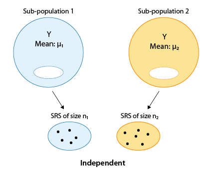
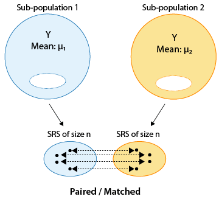

## Announcements

- You can redo/correct questions for Exam 1 for up to half the points back

- For T/F and multiple choice questions this will involve adding one or two sentences explaining the choice

- Upload a scanned copy of **both** your exam and separate sheets of reworked questions to Canvas under **Exam 1 - Corrected Problems**

- If you need additional time past March 6th please reach out

## Announcements

- I have updated weights for grades posted on Canvas

- I have updated syllabus on Canvas
  - Final exam will be **May 5** from 8-11 am

## Announcements

- HW 4 due Tonight at 11:59pm.

- Lab 5 due Tomorrow (Friday) at 11:59pm.

- HW 5 will be released after class. HW 5 is due next **Thursday 3/5 at 11:59pm**.

## Course feedback

On Canvas, fill out the short survey on how lab is going

## Exam question

- Write out all the events contained in the set $(A \cup B)^C$:
  - A: Number one one dice roll is $\lt$ 5
  - B: Roll an even number 

## Overview

- Review hypothesis test framework

- Independent 2-sample t-test vs. paired t-test

- Example: independent 2-sample t-test, licorice treatment

- Example: paired t-test, exercise plan

## Reading

-   P&G: Chapter 11

-   OI: 7.3

## Review: Type I and Type II error rates

-   Suppose we test the null hypothesis $H_0$:$\mu = \mu_0$. We could potentially make two types of errors:

| Truth                | $\mu = \mu_0$    | $\mu \neq \mu_0$ |
|----------------------|------------------|------------------|
| Fail to reject $H_0$ | correct decision | Type II Error    |
| Reject $H_0$         | Type I Error     | correct decision |


-   **Type I Error**: rejecting $H_0$ when it is actually true (falsely rejecting the null hypothesis)

-   **Type II Error**: not rejecting $H_0$ when it is false (falsely failing to reject the null hypothesis)

## Review: Type I and Type II error rates

For $H_{0}$: Patient does not have a disease
  - **Type I Error** is equivalent to saying the test is positive when person does not have disease (false positive)
  - **Type II Error** is equivalent to saying the test is negative when person does have disease (false negative)

## Review: Type I and Type II error rates

- **Remember**:

  -   **Sensitivity**: true positive rate, probability that the test is positive given the condition is present

  -   **Specificity**: 1 minus the false positive rate, probability that the test is negative given the condition is **not** present

- Low sensitivity → more false negatives → higher Type II error
- Low specificity → more false positives → higher Type I error

## Review: Type I and Type II error rates

- If you lower $\alpha$ for example from 0.05 to 0.01
  - Lowers chance of **Type I** error (rejecting $H_0$ when it is actually true) but since its now harder in general to reject $H_0$ I am increasing the chance of a **Type II** error (not rejecting $H_0$ when it is false)

- If you increase $\alpha$ for example from 0.10 to 0.15
  - Increases change of **Type I** error (rejecting $H_0$ when it is actually true) but since its now easier in general to reject $H_0$ I am decreasing the chance of a **Type II** error (not rejecting $H_0$ when it is false)
 
## Review: Hypothesis testing steps

::: callout-tip

## Fill in the blanks

1.  State the null and alternative hypotheses. The null hypothesis states “____________________________” and the alternative challenges it.

2.  Collect relevant data and summarize it

3.  Assess how surprising it would be to see data like that if the _________________________ were really true

4.  Draw conclusions

:::


## Independent samples {.smaller}

-   The type of t-test we use to compare two means depends on how the samples were obtained. One approach would be to obtain **two independent samples** and test the equality of means $\mu_1$ and $\mu_2$

{width="200"}

## Paired or matched samples {.smaller}

-   An alternative would be to obtain **paired** or **matched samples** and test the equality of means $\mu_1$ and $\mu_2$.

-   Matching could be by person (e.g., before and after measures) or could be a pair of individuals who belong together in another way (e.g., same date of birth in same hospital; married couple, twins etc.)

{width="200"}

## Paired samples {.smaller}

Samples are often paired for a variety of reasons

-   Measurements are taken on a single subject at two distinct points in time (e.g., baseline and follow-up)

-   Subjects may be matched so that members of each pair are as much alike as possible with respect to important characteristics like age and sex (e.g., matched case-control study)

Pairing can **control for unwanted sources of variation** that might otherwise influence the results of a comparison. Matching within subject (e.g., baseline and follow-up) is a powerful way to eliminate subject-specific factors.

## Paired or matched samples {.smaller}

- Comparing BMI among twins raised apart
  - $H_{0}$: There is no difference in BMI between twins raised apart 
  - $H_{0}$: There is a difference in BMI between twins raised apart

- Compare hippocampal volume (continuous, mm³) measured by MRI between individuals with Alzheimer’s disease and individuals (matched based on age, sex and education level) without Alzheimer’s disease
  - $H_{0}$: There is no difference in hippocampal volume between individuals with Alzheimer’s disease and the matched controls 
  - $H_{A}$: There is a difference in hippocampal volume between individuals with Alzheimer’s disease and the matched controls 

## Designing a study: impaired driving

The Department of Motor Vehicles wishes to compare impairment of drivers while texting to impairment after being sleep deprived for 24 hours.

::: {.callout-tip appearance="simple"}
In small groups, describe an independent samples design and a matched pairs design for this question of interest.
:::

## Case study: licorice and surgery {.smaller}

-   Reutzler et al. (2013) performed an experiment among patients having surgery who required intubation.

-   Prior to anesthesia, patients were randomly assigned to gargle either a licorice-based solution or sugar water (as placebo). 

- Sore throat was evaluated 30 minutes, 90 minutes, and 4 hours after conclusion of the surgery on a pain scale from 0 to 10 (0 = no pain; 10 = worst).

-   Let's evaluate whether **gargling licorice before surgery** led to **different mean pain scores** when swallowing, at 30 minutes after arrival in the PACU (post-anesthesia care unit).

## Case study: hypothesis testing step 1

- The null hypothesis is that patients receiving licorice gargle (`treat` = 1) and sugar solution (`treat` = 0) placebo have the same mean pain scores relating to swallowing 30 minutes after arrival in the PACU, `pacu30min_swallowPain`, (treatment is unrelated to mean pain), while the alternative is that they do not.

::: {.callout-tip appearance="simple"}
What are the null and alternative hypotheses written out in symbols?
:::

## Setup

- First, we can load tidyverse and read in our data.

```{r}
#| echo: true
library(tidyverse)
licorice <- read.csv("data/licorice.csv")
```

Variables of interest:

- `treat`: Treatment given (0 = Sugar placebo; 1 = Licorice solution)

- `pacu30min_swallowPain`: Swallow pain score 4 hours after surgery (11-point scale:
0 = No pain; 10 = worst pain)

## Looking at some data

```{r echo = T}
licorice |>
  select(pacu30min_swallowPain, treat) |>
  slice(1:5)
```

```{r echo = T}
licorice |>
  count(treat)
```


## Step 2 continued {.smaller}

```{r echo = T}
licorice |>
  group_by(treat) |> 
  summarize(mean = mean(pacu30min_swallowPain), 
            sd = sd(pacu30min_swallowPain))
```

Analyzing the data, we obtained

-   $\bar{x}_L$=0.308

-   $\bar{x}_S$=1.38

-   $s_L$=0.825

-   $s_S$=2.29

## Visualizing the means: code

```{r}
#| echo: true
#| warning: false
#| eval: false
ggplot(licorice, aes(x = as.factor(treat), 
                     y = pacu30min_swallowPain)) +
  geom_boxplot() +
  labs(x = "Treat", y = "Swallow Pain 30 min Post") +
  theme_minimal()
```

## Visualizing the means: plot

```{r}
#| echo: false
#| warning: false
#| eval: true
ggplot(licorice, aes(x = as.factor(treat), 
                     y = pacu30min_swallowPain)) +
  geom_boxplot() +
  labs(x = "Treat", y = "Swallow Pain 30 min Post") +
  theme_minimal() 
```

## Two-sample t-test, independent samples

The two-sample t-test for independent samples is given by

::: poll
$$t = \frac{(\bar{x}_1 - \bar{x}_2) - (\mu_1 - \mu_2)}{\sqrt{\frac{s_1^2}{n_1} + \frac{s_2^2}{n_2}}}$$
:::

The degrees of freedom of the $t$ statistic depend on whether or not $\sigma_1^2 = \sigma_2^2$.

## Equal or unequal variances? {.smaller}

-   The choice of $df$ depends on whether the independent samples have the same or different variances

-   If the variances are equal, then we can use a pooled estimate of $s^2$, and the degrees of freedom are given by $(n_1−1)+(n_2−1)=n_1+n_2−2$.

-   If the variances are unequal, the degrees of freedom are difficult to derive, and something called a **Satterthwaite approximation** is often used (use software).

-   Unequal variances is the default in `t.test()` (and it should be the default choice), as the t-test assuming equal variances can be quite unreliable if the variances differ, especially when the group sizes differ as well. 

## Case study: hypothesis testing step 3

```{r echo = T}
t.test(pacu30min_throatPain ~ treat, 
       data = licorice,
       mu = 0,
       alternative = "two.sided",
       var.equal = FALSE,
       conf.level = 0.95)
```

## Case study: hypothesis testing step 3

Carrying out the two sample t-test for independent samples with unequal variances using software on the previous slide, we get $t=4.80$, $df$≈157.3, with a corresponding p-value \< 0.001.

## Case study: hypothesis testing step 4 {.smaller}

-   **Conclusion**: Based on our observed data, we conclude that there is evidence of a potential difference in mean pain score between the two groups. In particular, we have evidence that those receiving the licorice gargle before their surgery reported a lower mean pain score compared to placebo patients.

{width="400"}


## Case study: athletic training

-   A school athletics department wants to test the effectiveness of the new type of training proposed by comparing the average times of 10 runners in the 100 meters in seconds before and after the new training is implemented.

::: {.callout-tip appearance="simple"}
-   What are $H_0$ and $H_1$?

-   Which test should we use?
:::

## In R

-   Our dataset in R is called `training`:

```{r echo = F}
subject <- 1:10
before <- c(12.9, 13.5, 12.8, 15.6, 17.2, 19.2, 12.6, 15.3, 14.4, 11.3)
after <- c(12, 12.2, 11.2, 13.0, 15, 15.8, 12.2, 13.4, 12.9, 11)
training <- data.frame(subject, before, after)

```

```{r}
#| echo: true
training
```


## Paired t-test

```{r echo = T}
t.test(training$before, 
       training$after, 
       mu = 0,
       paired = T,
       alternative = "two.sided",
       var.equal = FALSE,
       conf.level = 0.95)
```


## Conclusion

::: callout-tip

What is your conclusion?

:::

## But wait...


```{r}
#| echo: true
training_diff <- training |> 
  mutate(diff = after - before)
training_diff
```

## But wait..

```{r, echo=TRUE}
t.test(training_diff$diff, 
       mu = 0,
       alternative = "two.sided",
       conf.level = 0.95)
```

## But wait..

## Takeaway

- A paired t-test is the same as a one-sample t-test on the differences. 

## What happens when we change conf.level?

```{r, echo=TRUE}
t.test(training_diff$diff, 
       mu = 0,
       alternative = "two.sided",
       conf.level = 0.80)
```

## Recap

- Review hypothesis test framework

- Independent 2-sample t-test vs. paired t-test

- Example: independent 2-sample t-test, licorice treatment

- Example: paired t-test, exercise plan


## Next class

- ANOVA