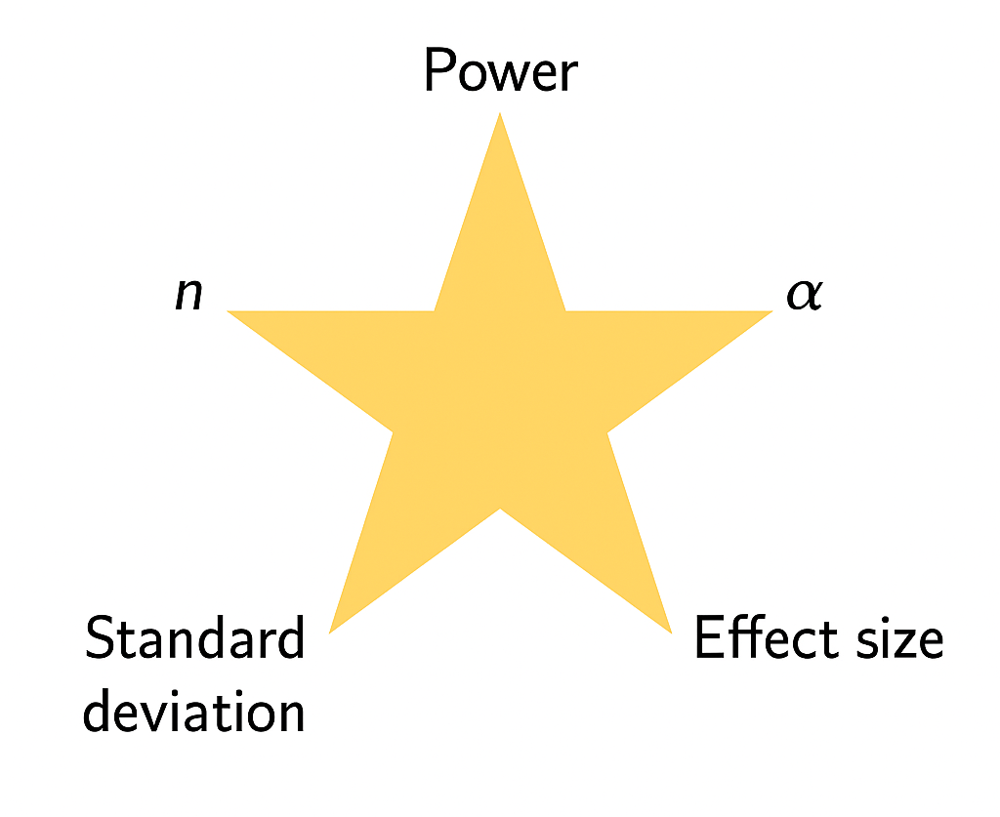
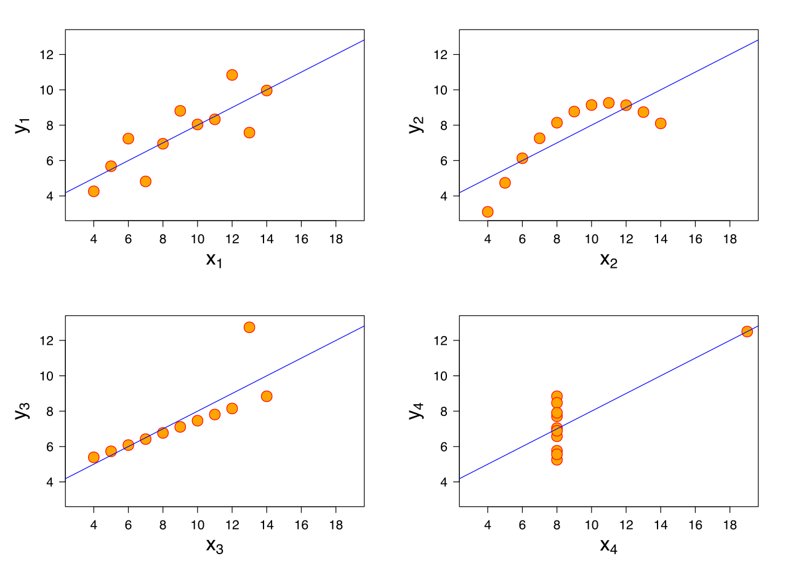

## Announcements

- HW11 due **tonight** by 11:59 PM

- HW12 due **tomorrow** by 11:59 PM

- Exam 2 on Thursday! Tomorrow's class will be for review


## Overview

- Why calculate sample size and power?

- How to calculate sample size and power in R

- Comparing two continuous variables


## Very optional reading

-   P&G Sections 10.4 and 10.6, 17

-   OI: Section 8.1

## T-tests in R {.smaller}

- The one-sample, two-sample, and paired t-tests all are run in R using the function `t.test()`, but with slightly different syntax for each.

- For the one-sample t-test:

```{r}
#| eval: FALSE
#| echo: TRUE

# one-sample t-test

t.test(dataset$outcome,           # variable whose mean we are testing
       mu = 0)                    # mean under the null (defaults to 0)

```

- We can also specify the alternative hypothesis (the default is a two-sided test) and the confidence level (the default is 0.95).

- We do not need to specify `paired` or `var.equal`, because we only have one sample.

## T-tests in R {.smaller}

- For the two-sample t-test:

```{r}
#| eval: FALSE
#| echo: TRUE

# two-sample t-test

t.test(outcome ~ group,           # variable whose mean we are testing ~
                                  # variable differentiating the two groups
       data = dataset,            # name of the dataset
       mu = 0,                    # difference in means under the null (default 0)
       var.equal = FALSE)         # is the variance the same between two populations

```

- We can also specify the alternative hypothesis (the default is a two-sided test) and the confidence level (the default is 0.95).

- The default for `var.equal` is false and we do not specify `paired`.

## T-tests in R {.smaller}

- For the paired t-test:

```{r}
#| eval: FALSE
#| echo: TRUE

# paired t-test

t.test(dataset$baseline,          # variable with first part of paired data
       dataset$final,             # variable with second part of paired data
       data = dataset,            # name of the dataset
       mu = 0,                    # difference in means under the null (default 0)
       paired = TRUE)             # indicates a paired test

```

- We can also specify the alternative hypothesis (the default is a two-sided test) and the confidence level (the default is 0.95).

- We do not need to specify `var.equal()`.

- The two columns with the data can be in either order; if you flip them, the test statistic will change sign but have the same magnitude.

## T-tests in R 

- For the one-sample t-test and the paired t-test, you have the option to specify `data = dataset` as input to the function.

- If you do this, you shouldn't include `data$` before the column names you are testing.

- The last three slides are good examples of commenting your code; commenting makes it easier for you to understand your thought process while coding, and also will make it easier for anyone else reading your code to understand what it does.

## Mapping Parametric to Non‑Parametric Tests  {.smaller}

| Non‑Parametric Test | Parametric Test | Key Features |
|----------------|------------|--------------|
| **Sign test** | Paired t‑test | Uses only **direction** (+/–) of paired differences; ignores magnitude; requires only independence |
| **Wilcoxon signed‑rank** | Paired t‑test | Uses **magnitude + direction** of paired differences; requires **symmetric distribution** of differences |

## Mapping Parametric to Non‑Parametric Tests {.smaller}

| Non‑Parametric | Parametric Test | Key Features |
|----------------|-----------------|--------------|
| **Mann–Whitney U/** <br> **Wilcoxon rank‑sum** | Two‑sample t‑test | Rank‑based comparison of two independent groups |
| **Kruskal–Wallis** | One‑way ANOVA | Rank‑based comparison of 3+ independent groups 

## Non-parametric alternative for one-sample test {.smaller}

- Much like how the paired t-test and one-sample t-test are equivalent in the parametric case, you can use the sign test or the Wilcoxon signed-rank test for a one-sample test of the median.

- As an example, suppose we have a small sample of systolic blood pressures and want to test if the median blood pressure in this population is equal to 110 mmHg.

|                       | 1  | 2   | 3   | 4   | 5  | 6   | 7  | 8   |
|-----------------------|----|-----|-----|-----|----|-----|----|-----|
| Blood Pressure (mmHg) | 97 | 113 | 100 | 128 | 96 | 105 | 86 | 110 |

- Instead of taking a difference between before/after values, we would conduct the sign test by first subtracting 110 from each of these blood pressures.

## Non-parametric alternative for one-sample test {.smaller}

|          |  1  | 2 |  3  | 4  | 5   | 6  | 7   | 8  |
|----------|-----|---|-----|----|-----|----|-----|----|
| BP - 110 | -13 | 3 | -10 | 18 | -14 | -5 | -24 |  0 |
| Sign     | -   | + | -   | +  | -   | -  | -   | 0  |

We have 7 non-zero differences, and 2 "successes". From here, we follow the same procedure as with the paired case:

```{r}
#| echo: TRUE

p_value <- 2*(pbinom(2, 7, 0.5))
p_value

```

With this p-value, we fail to reject the null hypothesis and do not have statistically significant evidence that the median blood pressure in this population is **not equal** to 110 mmHg.

## Why calculate sample size and power?

-   To show that under certain required conditions, a hypothesis test has a **good chance of showing the anticipated difference**, if it really exists

-   To be more confident that a null result is not simply a sample of excessive variability

-   To show a funding agency that the study has a reasonable chance of reaching a useful result (leading them to **fund your grant**!)

-   To show that necessary resources (human, animal, financial, time, etc.) will be minimized

## Power {.smaller}

-   Showing adequate statistical power is usually necessary in order to **get funding for research**!

-   **Power** is the probability of rejecting the null hypothesis when it is false (i.e., of avoiding a Type II error)

::: poll
$$\text{Power} = P(\text{reject } H_0 | H_0 \text{ is false})$$
:::

and can be also thought of as the likelihood a planned study will detect a deviation from the null hypothesis if one really exists. Power is a function of:

-   Sample size $n$

-   Deviation from the null one hopes to detect

-   Standard deviation $σ$

-   $\alpha$, the Type I error rate

## Power and Error Rates

- Recall: When we conduct a hypothesis test, there are **four possible outcomes** depending on the true state of the null hypothesis and the decision we make.  

| **Decision**                | **Truth: ($H_0$) True** | **Truth: ($H_0$) False** |
|-----------------------------|--------------------------|---------------------------|
| **Reject ($H_0$)**          | Type I Error ($\alpha$)         | Correct Decision → Power ($1−\beta$) |
| **Fail to Reject ($H_0$)**  | Correct Decision         | Type II Error ($\beta$)          |

## n, detectable difference, variance, and $\alpha$

How do these four considerations affect power?

-   When we design a study, it is not enough to know we have a small probability of rejecting $H_0$ when it is in fact true (i.e. setting $\alpha = 0.05$).

-   We want to know we have a large probability of rejecting the null when it is false. Practically speaking, **power less than 80% is typically considered insufficient to warrant a study**.

## Power

- Recall: In our medical diagnostics lecture, we saw that there is a tradeoff between Type 1 and Type 2 error. Lowering $\alpha$ makes it harder to reject the null hypothesis, which usually reduces power—we’re less likely to catch real effects (true positives).

- Increasing power by tolerating more Type I errors is **not acceptable**. Therefore, we can increase power by

-   Considering **larger deviations from the null** (need to think about clinical/practical importance)

-   Increasing $n$ (good, though not always affordable)

## Interactive visualization

<http://rpsychologist.com/d3/NHST/>

Let's check out this interactive visualization to see how this all works for a one-sample z-test.


## Power Depends On... {.smaller}

| Factor | Change | Effect on Power | Intuition |
|:-------|:-------:|:-------------|:-----------------|
| Sample size ($n$) | $\uparrow$ | $\uparrow$ **Increases** | More data → smaller SE → easier to detect true effects |
| Variability ($\sigma^2$) | $\uparrow$ | $\downarrow$ **Decreases** | More noise → harder to detect signal |
| Effect size ($\delta$) | $\uparrow$ | $\uparrow$ **Increases** | Larger true difference → easier to detect |
| Significance level ($\alpha$) | $\uparrow$ | $\uparrow$ **Increases** | More lenient threshold → higher chance to reject $H_0$ |


## Understanding power

- Holding $n$, variance, and $\alpha$ constant, we have **more power** to detect a **larger difference** compared to a smaller one.

- Holding variance, effect size, and $\alpha$ constant, **increasing sample size ($n$)** increases power — with more data, we’re more likely to detect true effects.

## Understanding Power - Your turn!

::: callout-tip

## Circle One

- Holding $n$, effect size, and $\alpha$ constant, **(higher/lower)** variance decreases power because the signal is harder to detect within the noise.

- Holding $n$, variance, and effect size constant, **(increasing/decreasing)** $\alpha$ increases power — we’re more willing to reject the null, so true effects are easier to detect.

:::


## What is this deviation? {.smaller}

When we calculate power, we need to know the minimum difference from the null mean $\mu_0$ that we wish to detect. We may set up our hypotheses as

$$H_0: \mu = \mu_0$$

$$H_1: \mu \neq \mu_0$$

but need to specify a **minimum detectable difference**, often called $\delta=μ_1−μ_0$ such that we reject $H_0$ with a certain power (usually 80% or 90%) when in fact $μ=μ_1$. We will need a bigger sample size when $\delta$ is small, and fewer subjects when $\delta$ is larger.


## Sample size for for two-sided one-sample test of mean {.smaller}

-   Power and sample size are interrelated.

-   Ideally, when we plan a study, we have a prespecified idea of the minimum difference we want to detect, $δ=μ_1−μ_0$, the standard deviation, $\sigma$, and the power, $1-\beta$, we'd like to have to detect it. In that case, it is straightforward to calculate the required sample size (here given for a one-sample test):


$$n = \left[ \frac{\sigma (z^*_{1-\alpha/2} + z^*_{1-\beta})}{\mu_1-\mu_0}\right]^2$$


-   This can be derived from looking at the rejection regions when $H_0$ and $H_1$ are true, though the details are outside the scope of this class.
-   You can easily calculate power and sample size in R.


## Case study: ultra low dose contraception {.smaller}

-   Suppose you want to ensure a new manufacturer of birth control pills provides the correct dosage of 0.02 $\mu$g estrogen.

-   How many pills do you need to sample in a shipment in order to ensure 80% power to detect a difference of 10% at $\alpha$=0.05, assuming $\sigma$=0.008? (10% of 0.02 is 0.002)

$$n = \left[\frac{\sigma(z^*_{1-\alpha/2} + z^*_{1-\beta})}{\mu_1-\mu_0}\right]^2$$

What are $z^*_{1-\alpha/2}$ and $z^*_{1-\beta}$? These are the $1-\alpha$ and $1-\beta$ quantile cutoffs of a Z-distribution.

## Z cutoffs in R

- $\alpha = 0.05$

- Power = 80%, so Type 2 error rate is 1-.80 = .20 = $\beta$. 

```{r}
#| echo: true
alpha <- 0.05 # type 1 error rate
beta <- .20 # type 2 error rate
qnorm(1-alpha/2); qnorm(1-beta)
```

## Plugging in our values {.smaller}

$= \left[\frac{.008(1.96 + 0.84)}{0.002}\right]^2$

$= 125.44$

Using a normal approximation, we would need 126 pills sampled to detect the desired difference of 10%, given $\sigma = 0.008$, at 80% power.

- To be conservative, always **round up for sample size calculations**.

## We use the t-distribution in practice

- In the example above, we used the z-distribution. However, we use the $t$ distribution in practice instead of the $z$. 

- This is because the population standard deviation ($\sigma$) is **rarely known**, so we estimate it from the sample.  

- The *t*-distribution accounts for this extra uncertainty.

- When sample sizes are **small or moderate**, using the *t*-distribution provides more accurate power estimates, since it better reflects the variability from estimating $\sigma$.

## In R

```{r}
#| echo: true
power.t.test(delta = 0.002,
             sd = 0.008,
             sig.level = 0.05,
             power = 0.8,
             type = "one.sample")
```

Using the t-distribution, we need 128 pills sampled to detect the desired difference.


## Example: Power Calculation

- Researchers are testing whether a new low-sodium diet reduces **systolic blood pressure (SBP)** compared to a control diet.  

- Previous studies suggest an average reduction of **8 mmHg** with a standard deviation of **10 mmHg**.  

- They plan to recruit **20 participants per group** and use a **two-sided t-test** at the 0.05 level.

**Question:** What statistical *power* will they have to detect this difference?

## In R {.smaller}


```{r}
#| echo: true

# Power calculation for two-sample t-test
power.t.test(n = 20,                            # sample size of 20 per group
             delta = 8,                         # difference between means
             sd = 10,                           # pop. standard deviation
             sig.level = 0.05,                  # alpha
             type = "two.sample",               # two-sample t test
             alternative = "two.sided")         # two-sided alt. hypothesis
```
## Interpretation

**Interpretation**: With 20 participants per group, the study has about 69% power to detect an 8 mmHg difference.

- In other words, if the true effect exists, there’s roughly a 7-in-10 chance we’ll correctly reject the null hypothesis.

## Example 2: Sample size calculation

- Suppose we want to test whether a new medication lowers LDL cholesterol compared to a placebo. 

- From pilot data, we expect a difference of 15 mg/dL with a standard deviation of 20 mg/dL. 

- We want 90% power at a 0.05 significance level for a two-sided test. 

**Question**: How many participants per group are needed?

## In R

\footnotesize

```{r}
#| echo: true
power.t.test(power = 0.90,
             delta = 15,
             sd = 20,
             sig.level = 0.05,
             type = "two.sample",
             alternative = "two.sided")
```

## Interpretation

39 individuals per group are needed (rounding up) to achieve 90% power to detect a 15 mg/dL difference in LDL cholesterol between treatments. 

## Components of Power Analysis



## Motivation: Comparisons of Interest {.smaller}

| Predictor Type      | Outcome Type           | Common Tests / Topics                             | 
|----------------------|------------------------|---------------------------------------------------|
| Categorical          | Categorical            | Fisher’s exact test, $\chi^2$ test                      |
| Categorical          | Continuous             | t-tests, ANOVA, nonparametric alternatives        |
| Continuous           | Continuous             | Correlation\*, regression \**                          |
| Continuous           | Categorical            | Logistic regression, classification **               | 
| Other / Complex      | Various (e.g. survival, counts) | Advanced or “exotic” methods **                |


\* = covering today

** = covering in upcoming lectures

## Remember this plot?

```{r}
#| fig-alt: "A scatterplot with the x-axis labeled Adequate aerobic activity (%) and the y-axis labeled Obesity (%); the dots follow roughly a downward line"
#| echo: FALSE

library(tidyverse)
cdc <- read.csv("https://karamccor.github.io/b6002/labs/data/cdc_cleaned.csv")

cdc %>%
  ggplot(aes(x = Exercise, y = Obesity)) +
  geom_point() +
  labs(x = "Adequate aerobic activity (%)",
       y = "Obesity (%)") +
  theme_bw()
```

## Some questions of interest may include:

-   Direction of relationship: are variables positively or negatively related?

-   Form: is any relationship linear or more complex?

-   Strength of relationship: how accurately can one variable predict the other?

-   Influential points: are one or a few points driving the relationship we see?

## Correlation

-   The **correlation coefficient** $\rho$ quantifies the *linear relationship* between two random variables.

-   In statistics, a correlation coefficient implies a very specific type of association.

-   A correlation coefficient of zero does NOT imply no relationship between two variables, as we shall see in some further examples.

## Correlation

$\rho$ ranges from -1 to 1

-   $\rho>0$ implies positive correlation

-   $\rho < 0$ implies negative correlation

-   $\rho = 0$ is consistent with no *linear* relationship between variables (again, this does not imply that no relationship exists!)

What does it mean to have a correlation of -1 or 1?

## Visualizing $\rho$

```{r}
#| fig-alt: "Two scatterplots side-by-side. The one on the left is titled Correlation of 0.6 and the dots are not closely grouped, but generally the y value seems to increase when the x value increases. The one on the right is titled Correlation of 1 and the dots perfectly follow the line x = y."
#| echo: FALSE


# Load the required library
library(MASS)

# Set seed for reproducibility
set.seed(123)

# Define parameters
n <- 100  # number of data points
mu <- c(0, 0)  # means of x and y
sigma_06 <- matrix(c(1, 0.6, 0.6, 1), nrow = 2)  # covariance matrix with correlation 0.6

# Generate data with correlation 0.6
data_06 <- mvrnorm(n = n, mu = mu, Sigma = sigma_06)

# Generate data with correlation 1 (perfect linear relationship)
x <- rnorm(n)  # random x values
y <- x  # perfectly correlated y values

# Set up the plotting area for side-by-side plots
par(mfrow = c(1, 2))  # 1 row, 2 columns

# Create scatter plot for rho = 0.6
plot(data_06[,1], data_06[,2], main = "Correlation of 0.6",
     xlab = "X", ylab = "Y", pch = 1)

# Create scatter plot for rho = 1
plot(x, y, main = "Correlation of 1",
     xlab = "X", ylab = "Y", pch = 1)

# Reset the plotting layout
par(mfrow = c(1, 1))

```

## Visualizing $\rho$

```{r}
#| fig-alt: "Two scatterplots side-by-side. The one on the left is titled Correlation of -0.2 and the dots are not closely grouped, but there is a slight downward trend. The one on the right is titled Correlation of -0.8 and the dots are more closely grouped than on the left and show a clear downward trend."
#| echo: FALSE

# Load the required library
library(MASS)

# Set seed for reproducibility
set.seed(123)

# Define parameters for correlation -0.2
sigma_neg02 <- matrix(c(1, -0.2, -0.2, 1), nrow = 2)  # covariance matrix with correlation -0.2

# Define parameters for correlation -0.8
sigma_neg08 <- matrix(c(1, -0.8, -0.8, 1), nrow = 2)  # covariance matrix with correlation -0.8

# Generate data with correlation -0.2
data_neg02 <- mvrnorm(n = 100, mu = c(0, 0), Sigma = sigma_neg02)

# Generate data with correlation -0.8
data_neg08 <- mvrnorm(n = 100, mu = c(0, 0), Sigma = sigma_neg08)

# Set up the plotting area for side-by-side plots
par(mfrow = c(1, 2))  # 1 row, 2 columns

# Create scatter plot for rho = -0.2
plot(data_neg02[,1], data_neg02[,2], main = "Correlation of  -0.2",
     xlab = "X", ylab = "Y", pch = 1)

# Create scatter plot for rho = -0.8
plot(data_neg08[,1], data_neg08[,2], main = "Correlation of -0.8",
     xlab = "X", ylab = "Y", pch = 1)

# Reset the plotting layout
par(mfrow = c(1, 1))

```

## Visualizing $\rho$

```{r}
#| fig-alt: "Two scatterplots side-by-side. The one on the left is titled Correlation of 0 and the dots are randomly scatted. The one on the right is titled Correlation of 0 and the dots follow a parabola."
#| echo: FALSE

# Load required library
library(MASS)

# Set seed for reproducibility
set.seed(123)

# Define parameters for correlation 0 (random noise)
sigma_0 <- matrix(c(1, 0, 0, 1), nrow = 2)  # covariance matrix with correlation 0

# Generate data with correlation 0 (random noise)
data_0 <- mvrnorm(n = 100, mu = c(0, 0), Sigma = sigma_0)

# Simulate parabolic data (correlation is 0, but there's a clear nonlinear relationship)
x_parabolic <- rnorm(100)  # random x values
y_parabolic <- x_parabolic^2  # y is a parabolic function of x

# Set up the plotting area for side-by-side plots
par(mfrow = c(1, 2))  # 1 row, 2 columns

# Scatter plot for correlation 0 (random noise)
plot(data_0[,1], data_0[,2], main = "Correlation of 0",
     xlab = "X", ylab = "Y", pch = 1)

# Scatter plot for parabolic relationship (correlation 0, but nonlinear)
plot(x_parabolic, y_parabolic, main = "Correlation of 0",
     xlab = "X", ylab = "Y", pch = 1)

# Reset the plotting layout
par(mfrow = c(1, 1))

```

## Pearson's correlation coefficient {.smaller}

**Pearson's correlation** $r$ gives and estimate of $\rho$ as follows. Assuming our observed data are the pairs $(x_1, y_1), (x_2, y_2), \ldots, (x_n, y_n)$, we can calculate $r$ as

$$r = \frac{1}{n} \sum_{i=1}^n \left(\frac{x_i - \bar{X}}{S_x}\right)\left(\frac{y_i - \bar{Y}}{S_y}\right)$$

$$= \frac{\sum_{i=1}^n (x_i - \bar{X})(y_i - \bar{Y})}{\sqrt{\sum_{i=1}^n (x_i - \bar{X})^2\sum_{i=1}^n(y_i - \bar{Y})^2}}$$

No need to memorize this!...we'll just use the `cor()` function to calculate it in R.

## Anscombe's quartet

{fig-alt="Four plots, each with 11 dots. The upper left plot has the dots clustered in an upward line; the upper right plot has the dots forming a parabolic shape; the lower left has ten of the dots in a line with slope of about 0.4 and one upwards of the line; and the lower right has ten dots at x=8 ranging from y = 5 to y = 9, and one dot at x=19 and y = 12. All four plots have a blue line that intersects the y-axis at around y = 4 with the same slope."}

## Anscombe's quartet

In each of the datasets the following statistical summaries hold:

-   mean of `x`: 9

-   variance of `x`: 11

-   mean of `y`: 7.5

-   variance of `y`: 4.125

-   correlation between `x` and `y`: 0.816

## Takeaway

::: {.callout-note appearance="simple"}
**Takeaway**: Visualizing your data is important! Summary statistics alone cannot capture the full relationship between `x` and `y`.
:::

Also, [Datasaurus Dozen](https://github.com/jumpingrivers/datasauRus)!

## Correlation does not imply causation

{fig-alt="A graph with the title Solar power generated in Belize correlates with The number of fire inspectors in Fdlorida. The lefthand y-axis is labeled Billion kilowatt hours, the righthand y-axis is labeled Laborers, and the x-axis has the years 2003 to 2021. A black line shows the total solar power generated in belize, which is very low for 2003- 2018, then jumps to 0.01 billion kwh in 2019. A red line shows the number of fire inspectors in Florida, which is relatively constant at about 900 from 2003 to 2018, then jumps to 2400 in 2019. The lines closely overlap."}

Source: Tyler Vigen, [Spurious Correlations](http://www.tylervigen.com/spurious-correlations)

## Confounding

-   Many of these spurious correlations are due to **confounding** - when a third lurking variable is responsible for the observed relationship.

-   Example: A near perfect negative correlation (r = -0.99) was seen between cholera mortality and elevation above sea level during a 19th century epidemic.

-   The observed relationship between cholera and elevation was confounded by a lurking variable, proximity to polluted water.

## ggcorrplot

- `ggcorrplot` is a fantastic function for making correlation plots in R. 
 
- This function is in the `ggcorrplot` package.

```{r}
#| warning: false
#| echo: true
#| message: false
library(ggcorrplot)
```


- Let's check out [some examples](https://cran.r-project.org/web/packages/ggcorrplot/readme/README.html).


## Example

- `mtcars` is a built-in R dataset, taken from the 1974 Motor Trend US magazine. It has fuel consumption and 10 aspects of automobile design/performance for 32 automobiles. 

- `mtcars` is built **into** R, and I can just load the dataset

```{r}
#| echo: true
# Loading the dataset mtcars
data(mtcars)
#Looking at first 5 variables for the first few observations
head(mtcars[, 1:5])
```


## Example

- `mtcars` is a built-in R dataset, taken from the 1974 Motor Trend US magazine. It has fuel consumption and 10 aspects of automobile design/performance for 32 automobiles. 

```{r}
#| echo: true
# Compute a correlation matrix
data(mtcars)
corr <- round(cor(mtcars), 1) # round to 1 decimal
head(corr[, 1:6])
```

## Plotting the correlation: code

```{r}
#| echo: true
#| eval: false
# Visualize the correlation matrix
# --------------------------------
# method = "square" (default)
ggcorrplot(corr)
```

## Plotting the correlation: output


```{r}
#| fig-alt: "An 11 by 11 grid, with the rows and columns of the grid labeled with the eleven variables in the m t cars data set. The squares of the grid are colored on a gradient from -1 to 1, where dark blue corresponds to -1, white corresponds to 0, and red corresponds to 1; this is shown in the legend labeled Correlation. The squares where the row and column have the same label are bright red."
#| echo: false
#| eval: true
# Visualize the correlation matrix
# --------------------------------
# method = "square" (default)
ggcorrplot(corr)
```

## Testing the correlation

- We can also test whether or not each correlation is statistically equal to zero. 

$$H_0: \rho = 0 \quad \text{vs.} \quad H_A: \rho \neq 0$$
```{r}
#| echo: true
# Compute a matrix of correlation p-values
p.mat <- cor_pmat(mtcars)
head(p.mat[, 1:4])
```


## Example: code

```{r}
#| fig-alt: "An 11 by 11 grid as before, but with mostly white squares, with a scattering of light red and medium red squares in the upper righthand corner."
#| echo: true
ggcorrplot(p.mat)
```

## R Graph Gallery

[R Graph Gallery](https://r-graph-gallery.com/) has lots of examples, with code!

- Along with many other types of plots. 


## A Note on Karl Pearson

- Karl Pearson was an English biostatistician who established the field of mathematical statistics as we know it today.

- The correlation coefficient we talked about today is named after him; you may have also noticed that the chi-squared test is sometimes called Pearson's chi-squared test (like it is in R output).

. . .

- Pearson, like Fisher, was a eugenicist (he founded the journal _The Annals of Eugenics_), and many of his beliefs are what is now categorized as scientific racism. 

- In 2020, University College London renamed two buildings previously named in his honor. 

## Next Class

- Review for Exam 2
