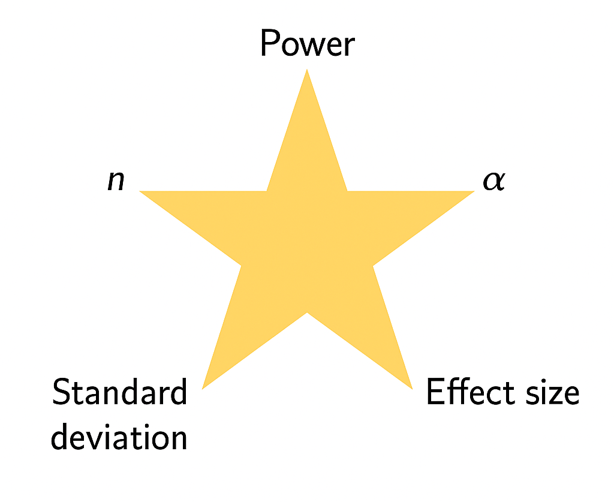
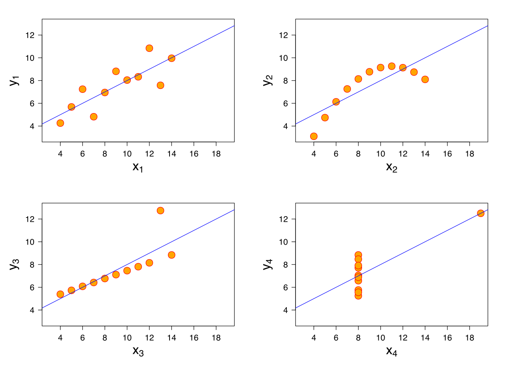

## Announcements

- Hope everyone had a great spring break! 

- No new lab this week, the session at 3:30pm is just TA Office Hours.

- Next new lab is Tuesday, April 7

## Announcements

- HW 6 Due **Thursday at 11:59pm**

- Exam 02 is in-class on Tuesday, March 31

- Thursday's class will be review for exam. 

## Exam 02 Info

- Exam will cover material **before** spring break, this includes non-parametric tests and power and sample size lectures

- Exam 02 Info

- Exam 02 Formula sheet

- Exam 02 Topics

## Reading

-   P&G Chapter 17

-   OI: Section 8.1


## Mapping Parametric to Non‑Parametric Tests  {.smaller}

| Non‑Parametric Test | Parametric Test | Key Features |
|----------------|------------|--------------|
| **Sign test** | Paired t‑test | Uses only **direction** (+/–) of paired differences; ignores magnitude; requires only independence |
| **Wilcoxon signed‑rank** | Paired t‑test | Uses **magnitude + direction** of paired differences; requires **symmetric distribution** of differences |

## Mapping Parametric to Non‑Parametric Tests {.smaller}

| Non‑Parametric | Parametric Test | Key Features |
|----------------|-----------------|--------------|
| **Mann–Whitney U/** <br> **Wilcoxon rank‑sum** | Two‑sample t‑test | Rank‑based comparison of two independent groups |
|  |||
| **Kruskal–Wallis** | One‑way ANOVA | Rank‑based comparison of 3+ independent groups 


## Components of Power Analysis



## Motivation: Comparisons of Interest {.smaller}

| Predictor Type      | Outcome Type           | Common Tests / Topics                             | 
|----------------------|------------------------|---------------------------------------------------|
| Categorical          | Categorical            | Fisher’s exact test, $\chi^2$ test                      |
| Categorical          | Continuous             | t-tests, ANOVA, nonparametric alternatives        |
| Continuous           | Continuous             | Correlation\*, regression \**                          |
| Continuous           | Categorical            | Logistic regression, classification **               | 
| Other / Complex      | Various (e.g. survival, counts) | Advanced or “exotic” methods **                |


\* = covering today

** = covering in upcoming lectures

## Remember this plot?

```{r}
library(tidyverse)
cdc <- read.csv("https://karamccor.github.io/b6002/labs/data/cdc_cleaned.csv")

cdc %>%
  ggplot(aes(x = Exercise, y = Obesity)) +
  geom_point() +
  labs(x = "Adequate aerobic activity (%)",
       y = "Obesity (%)") +
  theme_bw()
```

## Some questions of interest may include:

-   Direction of relationship: are variables positively or negatively related?

-   Form: is any relationship linear or more complex?

-   Strength of relationship: how accurately can one variable predict the other?

-   Influential points: are one or a few points driving the relationship we see?

## Correlation

-   The **correlation coefficient** $\rho$ quantifies the *linear relationship* between two random variables.

-   In statistics, a correlation coefficient implies a very specific type of association.

-   A correlation coefficient of zero does NOT imply no relationship between two variables, as we shall see in some further examples.

## Correlation

$\rho$ ranges from -1 to 1

-   $\rho>0$ implies positive correlation

-   $\rho < 0$ implies negative correlation

-   $\rho = 0$ is consistent with no *linear* relationship between variables (again, this does not imply that no relationship exists!)

What does it mean to have a correlation of -1 or 1?

## Visualizing $\rho$

```{r}
# Load the required library
library(MASS)

# Set seed for reproducibility
set.seed(123)

# Define parameters
n <- 100  # number of data points
mu <- c(0, 0)  # means of x and y
sigma_06 <- matrix(c(1, 0.6, 0.6, 1), nrow = 2)  # covariance matrix with correlation 0.6

# Generate data with correlation 0.6
data_06 <- mvrnorm(n = n, mu = mu, Sigma = sigma_06)

# Generate data with correlation 1 (perfect linear relationship)
x <- rnorm(n)  # random x values
y <- x  # perfectly correlated y values

# Set up the plotting area for side-by-side plots
par(mfrow = c(1, 2))  # 1 row, 2 columns

# Create scatter plot for rho = 0.6
plot(data_06[,1], data_06[,2], main = "Correlation of 0.6",
     xlab = "X", ylab = "Y", pch = 1)

# Create scatter plot for rho = 1
plot(x, y, main = "Correlation of 1",
     xlab = "X", ylab = "Y", pch = 1)

# Reset the plotting layout
par(mfrow = c(1, 1))

```

## Visualizing $\rho$

```{r}
# Load the required library
library(MASS)

# Set seed for reproducibility
set.seed(123)

# Define parameters for correlation -0.2
sigma_neg02 <- matrix(c(1, -0.2, -0.2, 1), nrow = 2)  # covariance matrix with correlation -0.2

# Define parameters for correlation -0.8
sigma_neg08 <- matrix(c(1, -0.8, -0.8, 1), nrow = 2)  # covariance matrix with correlation -0.8

# Generate data with correlation -0.2
data_neg02 <- mvrnorm(n = 100, mu = c(0, 0), Sigma = sigma_neg02)

# Generate data with correlation -0.8
data_neg08 <- mvrnorm(n = 100, mu = c(0, 0), Sigma = sigma_neg08)

# Set up the plotting area for side-by-side plots
par(mfrow = c(1, 2))  # 1 row, 2 columns

# Create scatter plot for rho = -0.2
plot(data_neg02[,1], data_neg02[,2], main = "Correlation of  -0.2",
     xlab = "X", ylab = "Y", pch = 1)

# Create scatter plot for rho = -0.8
plot(data_neg08[,1], data_neg08[,2], main = "Correlation of -0.8",
     xlab = "X", ylab = "Y", pch = 1)

# Reset the plotting layout
par(mfrow = c(1, 1))

```

## Visualizing $\rho$

```{r}
# Load required library
library(MASS)

# Set seed for reproducibility
set.seed(123)

# Define parameters for correlation 0 (random noise)
sigma_0 <- matrix(c(1, 0, 0, 1), nrow = 2)  # covariance matrix with correlation 0

# Generate data with correlation 0 (random noise)
data_0 <- mvrnorm(n = 100, mu = c(0, 0), Sigma = sigma_0)

# Simulate parabolic data (correlation is 0, but there's a clear nonlinear relationship)
x_parabolic <- rnorm(100)  # random x values
y_parabolic <- x_parabolic^2  # y is a parabolic function of x

# Set up the plotting area for side-by-side plots
par(mfrow = c(1, 2))  # 1 row, 2 columns

# Scatter plot for correlation 0 (random noise)
plot(data_0[,1], data_0[,2], main = "Correlation of 0",
     xlab = "X", ylab = "Y", pch = 1)

# Scatter plot for parabolic relationship (correlation 0, but nonlinear)
plot(x_parabolic, y_parabolic, main = "Correlation of 0",
     xlab = "X", ylab = "Y", pch = 1)

# Reset the plotting layout
par(mfrow = c(1, 1))

```

## Pearson's correlation coefficient {.smaller}

**Pearson's correlation** $r$ gives and estimate of $\rho$ as follows. Assuming our observed data are the pairs $(x_1, y_1), (x_2, y_2), \ldots, (x_n, y_n)$, we can calculate $r$ as

$$r = \frac{1}{n} \sum_{i=1}^n \left(\frac{x_i - \bar{X}}{S_x}\right)\left(\frac{y_i - \bar{Y}}{S_y}\right)$$

$$= \frac{\sum_{i=1}^n (x_i - \bar{X})(y_i - \bar{Y})}{\sqrt{\sum_{i=1}^n (x_i - \bar{X})^2\sum_{i=1}^n(y_i - \bar{Y})^2}}$$

No need to memorize this!...we'll just use the `cor()` function to calculate it in R.

## Anscombe's quartet



## Anscombe's quartet

In each of the datasets the following statistical summaries hold:

-   mean of `x`: 9

-   variance of `x`: 11

-   mean of `y`: 7.5

-   variance of `y`: 4.125

-   correlation between `x` and `y`: 0.816

## Takeaway

::: {.callout-note appearance="simple"}
**Takeaway**: Visualizing your data is important! Summary statistics alone cannot capture the full relationship between `x` and `y`.
:::

Also, [Datasaurus Dozen](https://github.com/jumpingrivers/datasauRus)!

## Correlation does not imply causation


Source: Tyler Vigen, [Spurious Correlations](http://www.tylervigen.com/spurious-correlations)

## Confounding

-   Many of these spurious correlations are due to **confounding** - when a third lurking variable is responsible for the observed relationship.

-   Example: A near perfect negative correlation (r = -0.99) was seen between cholera mortality and elevation above sea level during a 19th century epidemic.

-   The observed relationship between cholera and elevation was confounded by a lurking variable, proximity to polluted water.

## ggcorrplot

- `ggcorrplot` is a fantastic function for making correlation plots in R. 
 
- This function is in the `ggcorrplot` package.

```{r}
#| warning: false
#| echo: true
#| message: false
library(ggcorrplot)
```


- Let's check out [some examples](https://cran.r-project.org/web/packages/ggcorrplot/readme/README.html).


## Example

- `mtcars` is a built-in R dataset, taken from the 1974 Motor Trend US magazine. It has fuel consumption and 10 aspects of automobile design/performance for 32 automobiles. 

- `mtcars` is built **into** R, and I can just load the dataset

```{r}
#| echo: true
# Loading the dataset mtcars
data(mtcars)
#Looking at first 5 variables for the first few observations
head(mtcars[, 1:5])
```


## Example

- `mtcars` is a built-in R dataset, taken from the 1974 Motor Trend US magazine. It has fuel consumption and 10 aspects of automobile design/performance for 32 automobiles. 

```{r}
#| echo: true
# Compute a correlation matrix
data(mtcars)
corr <- round(cor(mtcars), 1) # round to 1 decimal
head(corr[, 1:6])
```

## Plotting the correlation: code

```{r}
#| echo: true
#| eval: false
# Visualize the correlation matrix
# --------------------------------
# method = "square" (default)
ggcorrplot(corr)
```

## Plotting the correlation: output


```{r}
#| echo: false
#| eval: true
# Visualize the correlation matrix
# --------------------------------
# method = "square" (default)
ggcorrplot(corr)
```

## Testing the correlation

- We can also test whether or not each correlation is statistically equal to zero. 

$$H_0: \rho = 0 \quad \text{vs.} \quad H_A: \rho \neq 0$$
```{r}
#| echo: true
# Compute a matrix of correlation p-values
p.mat <- cor_pmat(mtcars)
head(p.mat[, 1:4])
```


## Example: code

```{r}
#| echo: true
ggcorrplot(p.mat)
```

## R Graph Gallery

[R Graph Gallery](https://r-graph-gallery.com/) has lots of examples, with code!

- Along with many other types of plots. 

## Your turn

::: callout-tip

## AE 05

Head to Canvas and begin working on Application Exercise (AE) 05: Comparing two continuous variables. 

- AE 05 is due **Friday 4/3 at 11:59pm**. 

- Turn in a PDF on Canvas.

:::

## Next class

- Review for Exam 02
