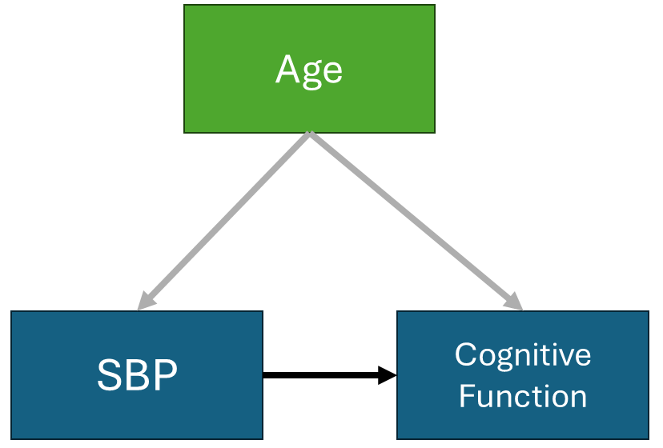

## Announcements

- Lab 7 (new lab) today - due **this** Friday April 10th

## Topics covered in lab today

- In lab today we talk about two additional concepts
  - Partial correlation
  - Spearman's correlation coefficients

## Partial correlation

- Let's say I have a sample of 100 adults and I have: 
  - Age (in years)
  - Cognitive function score - ranging from 0-100
  - Systolic blood pressure (SBP)

- **Is higher SBP is associated with lower cognitive scores?**

- We anticipate
  - Older individuals have lower cognitive function scores
  - Older individuals have higher SBP 
  
## Partial correlation

- Age could be a **confounder** 
  - Age is associated with the exposure (SBP)
  - Age is associated with the outcome (cognitive function)

- If I look at the association between SBP and cognitive function I might get a biased estimate
  - Could look like two things are related when they aren't
  - Could look larger or smaller than it really is

## Partial correlation 

{width="100"}

## Partial correlation

- **Partial correlation** is one approach 

- Isolates the direct association, preventing misleading results caused by confounding variables

- Partial correlation removes age's influence from both variables, then asks what's left

- We'll get into other methods (and a bit more detail on these ideas later)

```{r, echo=FALSE, warning=FALSE, message=FALSE}
library(tidyverse)
library(knitr)
library(ppcor)
# Simulate data
set.seed(7)
n <- 100

age <- round(rnorm(n, mean = 50, sd = 12))
sbp <- round(105 + 0.65 * (age - 50) + rnorm(n, 0, 9))
cog <- round(82 + 0.40 * (age - 50) + 0.05 * (sbp - 130) + rnorm(n, 0, 7))

study <- data.frame(id = 1:n, age, sbp, cog)
```

## Partial correlation

Here's the dataset, with age, sbp and cognitive function

```{r}
head(study)
```

## Partial correlation

Pearson correlation between sbp and cogntive function

```{r}
cor(study$sbp, study$cog)
```

Partial correlation 

```{r}
pcor.test(study$cog,study$sbp,study$age)
```

## Spearman correlation 

- Another way to measure correlation, ranging from -1 to 1
- Both measure the same basic idea — but they do it differently
- **Pearson** uses the actual values — it measures the strength of a *linear* relationship
- **Spearman** converts values to ranks first — it measures the strength of a *monotonic* relationship

## Pearson vs. Spearman

- A linear relationship is always monotonic, but monotonic doesn't have to be linear (e.g., exponential growth)
- Because it uses ranks, Spearman is less sensitive to outliers than Pearson
- Rule of thumb: 
  - Data is linear → use Pearson (more power)
  - Data is skewed, has outliers, or the relationship is curved but consistently increasing/decreasing → use Spearman

```{r}
#| echo: false
#| eval: true
x <- c(1, 2, 3, 4, 5, 6, 7, 8, 9, 60)   # outlier at end
y <- c(2, 4, 5, 4, 5, 7, 8, 9, 10, 11)
```

## Example: Pearson vs. Spearman

```{r}
#| echo: false
#| eval: true
tibble(x, y) |>
  ggplot(aes(x, y)) +
  geom_point(size = 4) +
  labs(x = "X", y = "Y") +
  theme_minimal()
```

## Example: Pearson vs. Spearman 

Pearson Correlation

```{r}
#| echo: true
cor(x, y, method = "pearson")
```

Spearman Correlation

```{r}
#| echo: true
cor(x, y, method = "spearman")
```


## Introduction to linear regression

-   Now let's get back to other methods. . . 

## Reading

-   P&G Chapter 18

-   OI: Chapter 8

## Back to Lab 2...

```{r}
library(tidyverse)
cdc <- read.csv("https://aggreenbean.github.io/Bios600/labs/data/cdc_cleaned.csv")
```

```{r}
cdc %>%
  ggplot(aes(x = Obesity, y = Exercise)) +
  geom_point() +
  theme_bw() +
  labs(x = "Adequate aerobic activity (%)", 
       y = "Obesity (%)")
```

## Correlation and regression {.smaller}

-   Correlation measures the direction and strength of linear relationships

-   Regression can be used to further quantify these relationships

-   Often used to test whether there is an association between two variables

-   A **regression** line summarizes the relationship between explanatory/predictor variables (e.g., Exercise % or $X$) and response/outcome variables (e.g., Obesity % or $Y$)

-   The fitted regression line can be used to **predict the outcome** for a given set of predictor values. Our predictions do have error, called **residuals** (vertical distance between observation and the regression line).

-   The **least-squares regression line** minimizes the sum of the squared errors.

## Regression {.smaller}

-   In regression, we use one variable (or more) to try to predict values of another.

-   In simple linear regression, one variable $Y$ is the **response** or **outcome** or **dependent variable** and the other $X$ is the **predictor** or **explanatory** variable or **independent** variable.

-   **Important:** The regression of $Y$ on $X$ is **not equal** to the regression of $X$ on $Y$

-   The regression of $Y$ on $X$ can be used to predict $Y$ based on fixed values of $X$.

## Back to Lab 2... {.smaller}

```{r}
cdc %>%
  ggplot(aes(x = Obesity, y = Exercise)) +
  geom_point() +
  theme_bw() +
  labs(x = "Adequate aerobic activity (%)", 
       y = "Obesity (%)") +
  geom_smooth(method = "lm", se = F) 
```

\footnotesize

-   We see the regression line relating exercise and obesity %

-   Points represent actual data values; note that the line is not a perfect fit

## Code for previous slide

```{r}
#| echo: true
#| eval: false
cdc |>
  ggplot(aes(x = Obesity, y = Exercise)) +
  geom_point() +
  theme_bw() +
  labs(x = "Adequate aerobic activity (%)", 
       y = "Obesity (%)") +
  geom_smooth(method = "lm", se = F) 
```

## The linear model

The model is given by $y_i=β_0+β_1x_i+ϵ_i$, where

-   $y_i$ is the outcome (dependent variable) of interest

-   $\beta_0$ is the intercept parameter

-   $\beta_1$ is the slope parameter

-   $x_i$ is the predictor variable

-   $\epsilon_i$ is the error (like $\beta_0$ and $\beta_1$, it is **not observed**)

The $i$ is an index of observations. So, each observation of the outcome is related to an observation of that individual's value of the predictor.

## The least squares model {.smaller}

Fitted line equation:

$$\hat y_i = \hat \beta_0 +\hat \beta_1 x_i$$

Residual:

$$\hat \epsilon_i = y_i - (\hat \beta_0 +\hat \beta_1 x_i) = y_i - \hat y_i$$

Least squares selects $\hat β_0$ and $\hat β_1$ such that the **error sum of squares**

$$\sum_{i=1}^n \hat \epsilon_i^2 = \sum_{i=1}^n (y_i - \hat y_i)^2$$

is minimized.

## Review slope-intercept form of a line {.smaller}

Recall the slope-intercept form of a line, $y=mx+b$.

-   $b$ is the y-intercept, or where the line crosses the y-axis

    -   It is the predicted value of $y$ when $x = 0$

-   $m$ is the slope

    -   Which tells us the **predicted increase** in $y$ when $x$ **changes by 1 unit**

## Review: formula of a line

::: callout-tip

## Review

Consider the line $y=3x+1$. 

- What value does $y$ take when $x=0$?

- As $x$ increases by 1 unit, how much do we expect $y$ to increase by?
:::

-   In statistics, we often represent the **slope** with $β_1$ and the **intercept** with $β_0$, and these values are usually not known but must be estimated.

## Model output {.smaller}

```{r echo = T}
fit <- lm(Obesity ~ Exercise, data = cdc)
summary(fit)
```

## A neater way: tidymodels

- **tidymodels:** "tidyverse for modeling" — R packages that brings a consistent, unified workflow to modeling
- Once you learn this workflow, it scales to more complex models down the road without learning a whole new system
- Gives us the `tidy()` function, which converts messy `lm()` output into a clean, organized data frame
- Much easier to read and work with than the default `summary()` output

## A neater way: kableExtra

- **kableExtra** is an R package for turning raw R output into clean, readable tables in your document
- Today we're using it to format regression results so they're easier to read and interpret
- Small amount of code, much more professional-looking and easier to read output

## A neater way

```{r}
#| echo: true
library(tidymodels)
library(kableExtra)

tidy(fit) |>
  kable()
```

- Can we do better?


## Even better

```{r}
#| echo: true
tidy(fit) |>
  kable(digits = 3) # round to 3 digits
```

- Note: p-values are not actually 0. They are just quite small so they get rounded to zero in the table. 

::: callout-tip
- If you include a regression model in your labs and homework, display the output with `tidy()` and `kable()` like this!
:::

## Intercept and slope

-   The **intercept** is the estimated mean outcome when the predictor is zero (does this make sense in context?)

-   The **slope** is the expected change in the outcome corresponding to a **one-unit change** in the predictor


**Slope ($\beta_1$) Interpretation**: For each percentage increase in `Exercise`, we expect the `Obesity` percentage to decrease by .48 on average

::: callout-tip
For all interpretations, remember to **include units**!
:::

## Example

For two states, identical except one has Exercise % = 45.4 and the other has Exercise % = 46.4

- State A: $\hat{y}_{A} = 54.79 + (-0.49 \times 45.4) = 32.54$
- State B: $\hat{y}_{B} = 54.79 + (-0.49 \times 46.4) = 32.05$
- Difference: $32.54 - 32.05 = 0.49$

Increasing Exercise % by one unit changes predicted Obesity % by exactly $\hat{\beta}_1 = -0.49$

## Intercept interpretation

- **The technical intercept interpretation**: When zero percent of the region gets adequate `Exercise`, we would expect the percent of the region that is obese to be 54.79%. 

- Does it make sense to interpret the intercept here?

- Only interpret the intercept in a regression model if:

  - the predictor can **feasibly** take values equal to or near zero, or
  - there are values near zero in the observed data
  
## Let's check

```{r}
#| echo: true
hist(cdc$Exercise)
```

## Let's check

```{r}
#| echo: true
min(cdc$Exercise)
```

- Since the predictor (`Exercise`) does not feasibly take on values equal to zero (and we also checked that the lowest value in the dataset is 37.4%), we should not interpret the intercept. 

## Model assumptions {.smaller}

Assumptions of the model $y_i = \beta_0 + \beta_1 x_1 + \epsilon_i$ include:

-   The outcomes $y_i$ are independent. This is violated if our study contains repeated outcome measures on an individual, if siblings are enrolled, etc.

-   A linear relationship holds (though we can relax this to some extent)

-   For a specified value of $x$, which is measured without error, $y_i∼N(β_0+β_1x_i,σ^2)$. Note that this implies $ϵ_i∼N(0,σ^2)$.

-   The variance $σ^2$ is constant across all values of $x$; this is called **homogeneity of variance**

## Hypothesis testing {.smaller}

-   The primary hypothesis test of interest is usually $H_0:β_1=0$ (There is no association between exercise and obesity percentage) versus $H_1:β_1≠0$ (there is an association between exercise and obesity percentage.)

-   Under the null hypothesis, we can use a t-test to test this
      - Same logic, same mechanics as the t-tests we've already seen — testing how likely is it see an estimate of $\beta_1$ this extreme or more extreme under the $H_{0}: \beta_1=0$

- R automatically tests this with the `lm()` function, and provides the t-statistic and p-value in the output.

```{r}
tidy(fit) |>
  kable(digits = 3) # round to 3 digits
```

::: {.callout-tip appearance="simple"}
Given our t-statistic of -7.7 and p-value of \<0.001, what might we conclude in our data?
:::

## Some additional output {.smaller}

```{r}
#| echo: true
summary(fit)$r.squared
```

- The $R-squared$ value indicates that exercise explains 55% of the variance of obesity. 

- $R^2$ tells us about how much of the variability in obesity is explained by exercise; as it gets close to 1, the points get tighter around the regression line.

- $R^2$ ranges from 0 to 1

## Predicted values 

- The regression equation can be used to get predicted means at any value of $x$. 

- $\hat y_i=\hat β_0+ \hat β_1x_i$, where we call $\hat y$ the predicted value of $y$ at a given value of $x$ (what happened to the error term?). 

## Predicted values {.smaller}

- For the CDC data that predicts a state's obesity percentage by its adequate exercise percentage, we have

$$\hat y_i = \hat β_0 - \hat β_1 x_i = 54.79 - 0.49 x_i$$

So, the predicted mean obesity percentage for a state where 50% of residents get adequate exercise is

$$\hat y_i = 54.79 - 0.49 (50) $$

We would predict an obesity percentage of approximately 30%. Note the importance of getting the units correct.

## Recap

- What is a linear regression model? How do we fit & visualize the model in R?

- Slope, intercept and interpretations

- Understand when it's appropriate to interpret the intercept

- Interpret $R^2$ from regression output

## Next class

- We will learn how to check the regression model assumptions in R

- Multiple regression
