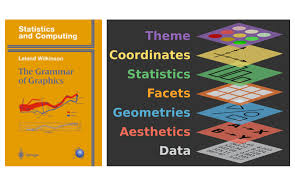
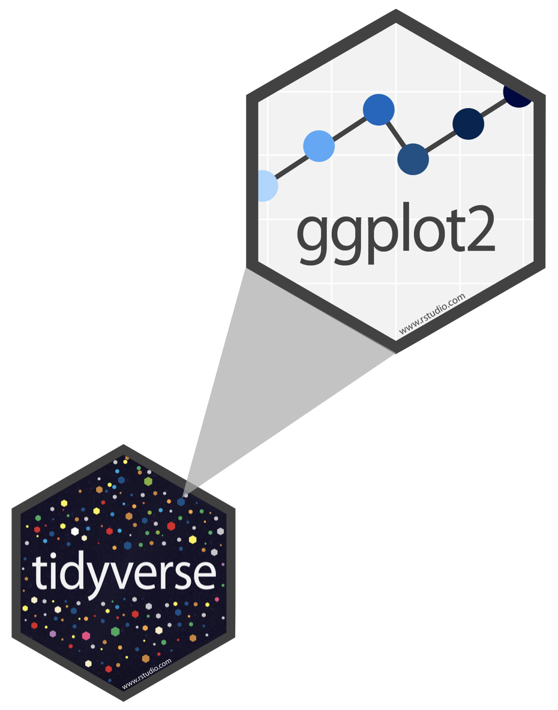
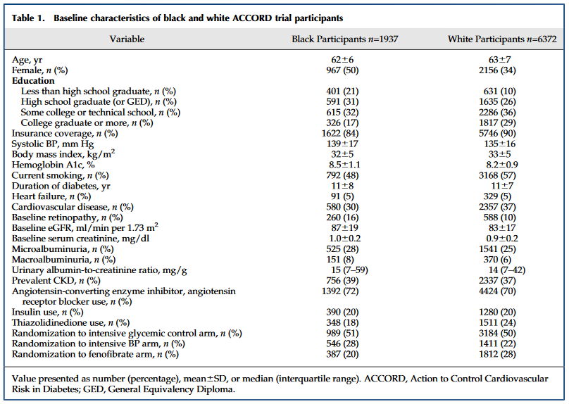
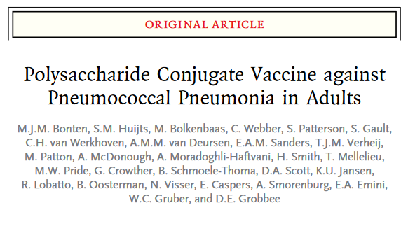
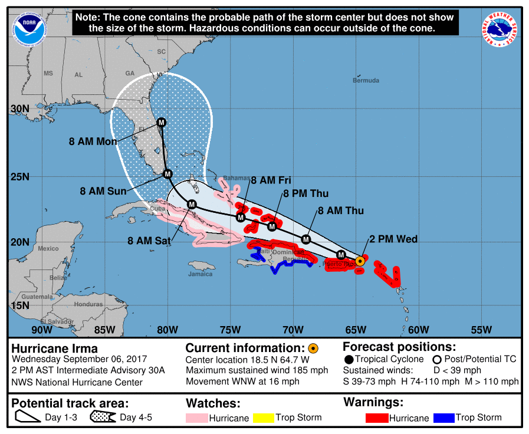

```{r}
library(tidyverse)
```

## Reading

- No reading for today

## Announcements

- **HW #1** due today at 11:59pm.
- Please reach out to me if you need assistance outside of office hours

## Download or print notes to PDF {.smaller}

If you’d like to export this presentation to a PDF, do the following in Chrome or Firefox:

1.  Toggle into Print View using the E key.
2.  Open the in-browser print dialog (CTRL/CMD+P)
3.  Change the Destination to Save as PDF.
4.  Change the Layout to Landscape.
5.  Change the Margins to None.
6.  Enable the Background graphics option.
7.  Click Save.

## Download or print notes to Ipad {.small}

If you’d like to export this presentation to a PDF, do the following:

1.  Open the slides in Safari from Canvas
2.  Tap the Share button
3.  Tap Options and select PDF
4.  Tap Print (this allows you to change the orientation)
5.  In the print preview, tap the Share button again to save the PDF to Files or another app.

## Review from last time

::: callout-tip
## Populations and samples

Consider the following research questions:

1.  What is the average mercury content in swordfish in the Atlantic Ocean?
2.  Over the last five years, what is the average time to complete a degree for UNC undergrads?
3.  Does a new drug reduce the number of deaths in patients with severe heart disease?

In small groups, identify the target population and what represents an individual case for each of the questions above.
:::

## Exploratory data analysis (EDA)

- Initial data analysis approach that summarizes main characteristics of dataset
- Often visual or in the form of basic summary statistics

## Data visualization {.smaller}

- The creation and study of the visual representation of data
- Many tools available (R is popular; many systems within R for data visualization)
- Creating visualizations helps us see patterns and identify potential data quality issues
- We will focus on **ggplot2**, a component of the **tidyverse**

::: {.callout-note appearance="minimal"}
"The simple graph has brought more information to the data analyst's mind than any other device." - John Tukey
:::

## ggplot2 in tidyverse {.smaller}

::::: columns
::: {.column width="50%"}
- The tidyverse is a group of R packages designed for data science
- All tidyverse packages share an underlying design philosophy
- ggplot2 is the data visualization package in the tidyverse
- Inspired by *The Grammar of Graphics* (Wilkinson)

{fig-alt="A picture of a book called The Grammar of Graphics, accompanied by an image with seven stacked rectangles, labeled from top to bottom as Theme Coordinates Statistics Facets Geometries Aesthetics and Data."}
:::

::: {.column width="50%"}
{fig-alt="A black hexagon with multi-colored polka dots and the word tidyverse; a grey triangle extends from the upper-right of the black hexagon to a grey hexagon with the word g g plot 2 and a series of connected blue dots, going from light blue to dark blue."}
:::
:::::

## What is a Grammar of Graphics?

- A system allowing for concise description of graphical components

{width="300" fig-alt="an image with seven stacked rectangles, labeled from top to bottom as Theme Coordinates Statistics Facets Geometries Aesthetics and Data."}

## What is a Grammar of Graphics?

A statistical graphic is

- data (which may be statistically summarized or transformed)
- **mapped** to **aesthetic** attributes (color, size, xy-position, etc.)
- using **geometries** (points, lines, bars, etc.)
- mapped onto a specific **coordinate** and/or **facet** system

## Categorical data {.smaller}

::::: columns
::: {.column width="50%"}
**Nominal data**

- Named categories without numeric meaning
- Ex: Only two categories: binary or dichotomous
- Ex: breast cancer status, blood type, health insurance provider type, etc.
:::

::: {.column width="50%"}
**Ordinal data**

- Ordered categories, but differences between values not easily measured
- Relative comparisons made about differences between levels
- Stage of colon cancer, Likert scale, frequency of smoking (often, sometimes, rarely, never), etc.
:::
:::::

## Numerical data

::::: columns
::: {.column width="50%"}
**Count** or **rank** data

- Discrete counts or ranks.
- Number of alcoholic drinks consumed in the past week, numerical rank of cancers by mortality, etc.
:::

::: {.column width="50%"}
**Continuous data**

- Measurable quantities where difference between possible values can be arbitrarily small
- Data may lie within a range or be unbounded
- Birth weight, BMI, ppm ozone, etc.
:::
:::::

## Identifying data types 


<!-- Here are some sample baseline characteristics of black and white participants from the ACCORD trial. -->

<!-- | Variable | Black Participants n=1937 | White Participants n=6372 | -->
<!-- |----|----|----| -->
<!-- | Age, yr | 62 $\pm$ 6 | 63 $\pm$ 7 | -->
<!-- | Female, n (%) | 967 (50) | 2156 (34) | -->
<!-- | Education |  |  | -->
<!-- | Less than high school graduate, n (%) | 401 (21) | 631 (10) | -->
<!-- | High school graduate (or GED), n (%) | 591 (31) | 1635 (26) | -->
<!-- | Some college or technical school, n (%) | 615 (32) | 2286 (36) | -->
<!-- | College graduate or more, n (%) | 326 (17) | 1817 (29) | -->
<!-- | Insurance coverage, n (%) | 1622 (84) | 5746 (90) | -->
<!-- | Systolic BP, mm Hg | 139 $\pm$ 17 | 135 $\pm$ 16 | -->
<!-- | Body mass index, kg/m\^2 | 32 $\pm$ 5 | 33 $\pm$ 5 | -->
<!-- | Hemoglobin A1c, % | 8.2 $\pm$ 1.1 | 8.2 $\pm$ 0.9 | -->
<!-- | Current smoking, n (%) | 792 (48) | 3168 (57) | -->

<!-- The values are presented as number (percentage) or mean $\pm$ SD. -->

## Identifying data types

::: callout-tip
## In small groups, discuss the following:

According to the table on the previous slide, what kind of data types are the following variables?

- Age
- Female
- Education
- Hemoglobin A1c
- Current smoking
:::

Use the convention "Numerical; continuous" or "Categorical; Ordinal", etc.

## Complications

In designing a study, what variable should we use for smoking exposure?

- Binary variable yes/no?
- Ordinal current/former/never smoker?
- Discrete number of cigarettes smoked in past week?
- Continuous measurement of lifetime pack-years?

In the real world, decisions are made based on sample size, statistical power, likelihood of measurement error, or simply convenience (this happens a lot!)

## Visualizing CDC data {.smaller}

Let's take a look at some basic visualizations using state-level data collected by the Center for Disease Control (CDC). We'll examine the following variables:

- State (categorical; nominal)
- Human Development Index (HDI) (categorical; ordinal)
  - a composite index that measures a country's average achievements in health, knowledge, and standard of living
- Region (categorical; nominal)
- Adult obesity % (numerical; continuous)
- Adequate aerobic activity % (numerical; continuous)

## Bar charts

```{r}

cdc <- read.csv("https://karamccor.github.io/b6002/labs/data/cdc_cleaned.csv")

# cdc <- read.csv("https://www2.stat.duke.edu/courses/Spring21/sta102.001/labs/data/cdc_cleaned.csv")

# write.csv(cdc, "C:/Users/kmcco/OneDrive - University of North Carolina at Chapel Hill/Documents/UNC_Teaching/fall2024/bios600-f24/labs/data/cdc_cleaned.csv")

```

::::: columns
::: {.column width="50%"}
```{r fig.height = 8, fig.width = 7, fig.asp=1}

ggplot(data = cdc, mapping = aes(x = Region)) +

  geom_bar(fill = "steelblue") +

  labs(title = "Number of US States by Census Region",

       x = "Region", y = "Count") +

  theme(text = element_text(size = 18))

```
:::

::: {.column width="50%" style="font-size: 70%;"}
- Summarizes numerical variable by categories

- Visually depict frequency distributions for nominal or ordinal data

- Bars represent either frequency or relative frequency by category

- Separation between bars (non-continuous data)

- May contain error bars to indicate estimate variability
:::
:::::

## Box plots

::::: columns
::: {.column width="50%"}
```{r fig.height = 8, fig.width = 7, fig.asp=1}

ggplot(data = cdc, aes(x = HDI, y = Obesity)) + geom_boxplot()+

  labs(title = "Adult Obesity (%) by State HDI",

       x = "HDI", y = "Adult Obesity (%)") +

  theme(text = element_text(size = 18))

```
:::

::: {.column width="50%" style="font-size: 70%;"}
- Summarizes numerical variable

- Five-number summary: sample minimum, 25th percentile, median, 75th percentile, sample maximum

- Outliers

- Spread and skew

- (More on all these later!)
:::
:::::

## Histograms

::::: columns
::: {.column width="50%"}
```{r fig.height = 8, fig.width = 7, fig.asp=1}

ggplot(data = cdc, aes(x = Obesity)) +

  geom_histogram(color = "darkblue", fill = "lightblue", binwidth = 2)+

  labs(title = "Distribution of Adult Obesity (%) by State",

       x = "Adult Obesity (%)", y = "Count") +

  theme(text = element_text(size = 18))

```
:::

::: {.column width="50%" style="font-size: 70%;"}
- Summarizes numerical variable

- Frequency distribution for discrete or continuous numerical data

- Outliers

- Each bar is proportional to the frequency of the categories
:::
:::::

## Line plots

:::::: columns
::: {.column width="50%"}
```{r fig.height = 7, fig.width = 6, fig.asp=1}

ggplot(data = cdc[1:4,], aes(x = State, y = Obesity, group = 1)) +

  geom_line() +

  geom_point() +

  labs(title = "Obesity by State",

       x = "State", y = "Adult Obesity (%)")+

  theme(text = element_text(size = 28))

```
:::

:::: {.column width="50%" style="font-size: 70%;"}
- Summarizes numerical variable (most often used across time)

- Each value on x-axis corresponds to only one measurement on y-axis (and vice versa)

- Often used to depict change over time and connected with line.

::: {.callout-warning title="Question"}
Is this plot useful?
:::
::::
::::::

## Scatterplots

::::: columns
::: {.column width="50%"}
```{r fig.height = 8, fig.width = 7}

cdc |>

  ggplot(aes(x = Exercise, y = Obesity)) +

  geom_point(size=4) +

  facet_grid(. ~ HDI) +

  ggtitle("Adequate aerobic activity \n associated with lower obesity by State HDI") +

  xlab("Adequate aerobic activity (%)") +

  theme(text = element_text(size = 26),

        axis.text = element_text(size = 16),

        plot.title = element_text(size = 20))  # make title smaller)

```
:::

::: {.column width="50%" style="font-size: 70%;"}
- Shows relationship between multiple continuous measurements

- You can add color, shape, transparency, etc to further differentiate by category
:::
:::::

## Some best practices

- Keep it simple
- Summarize and highlight
- Tell a story with the plot (use "active titles")
- If possible, replace text with visuals

## Reminder: the population vs. a sample {.smaller}

{width="300" fig-alt="Article titled Polysaccharide Conjugate Vaccine against Pneumococcal Pneumonia in Adults"}

- **Population and research question**: Is the PCV13 vaccine effective against community acquired pneumonia in **adults aged 65 or older**?

- Sample: 84,496 adults 65 years of age or older recruited in a trial between September 2008 and January 2010 and 101 sites throughout the Netherlands.

## Parameters and statistics {.smaller}

**Parameters**

- Attribute of the population of interest
- Not computable directly (unless entire population is perfectly measured)
- Written in Greek letters

**Statistics**

- Attribute of a sample
- Function of the observed values at hand
- Confusingly, both the function and the values
- Written in Roman letters

## Example {.smaller}

::::: columns
::: {.column width="40%"}
- Population **parameter** of interest: vaccine efficacy among all adults aged 65 or older

- Sample **statistic** collected: proportion of vaccinated adults in the trial who became ill with community-acquired pneumonia
:::

::: {.column width="60%"}
{fig-alt="Article titled Polysaccharide Conjugate Vaccine against PNeumococcal Pneumonia in Adults"}
:::
:::::

# Numerical summary statistics

## Mean {.smaller}

- **Sample mean**: the arithmetic average of values in the sample:

$$\bar{x} = \frac{1}{n}(x_1 + \ldots + x_n) = \frac{1}{n} \sum_{i=1}^n x_i$$

- Population mean $\mu$ is calculated the same way, but would involve sum over every observation in the population (rarely possible!)

- The sample mean is a **point estimate** of the population mean

- Not the exact population mean (unless lucky), but for a representative sample, it's a pretty good guess

- As the sample size gets larger, on average $\bar{x}$ gets closer and closer to $\mu$

## Median

- **Sample median**: the $50^{th}$ **percentile**

- Middle number of observations after being ranked in numerical order

- For odd number observations, it is the exact middle value; otherwise, it is the arithmetic average of the middle two.

- Example: What is the median of $\{3, 4, 5, 5, 7, 8, 9, 9\}$ ?

- More **robust** to extreme values or outliers when compared to the mean.

## Mode

- **Sample mode**: the most frequent value in the dataset
- There does not only have to be one mode (we can have bimodal or trimodal or other **multimodal** distributions)
- Example: What is the mode of $\{1, 2, 3, 4, 4, 5, 5, 5, 7, 9\}$?

## Are point estimates of location enough?

{fig-alt="A map of the Caribbean, central America, and the southeastern united states with the path of a hurricane superimposed over it. The path starts in Puerto Rico and ends in Florida, with a cone of potential track area getting steadily wider as the path goes northward."}

## Skewness {.smaller}

```{r, out.height="40%"}
#| fig-alt: "A histogram with values clustered around 0 and a long right tail."
# Set the seed for reproducibility
set.seed(123)

# Simulate data from a normal distribution
normal_data <- rnorm(400, mean = 0, sd = 1)

# Transform the data to make it right-skewed
right_skewed_data <- exp(normal_data)

# Create a histogram
hist(right_skewed_data, breaks = 30,
     col = "darkgoldenrod3", main = " ", 
     xlab = "Value")
```

- **Skewed** distributions are not symmetric

- They can be right or left skewed depending on which side the "tail" is on.

## Minimum, maximum, and range

- **Sample minimum** and **maximum**: the smallest and largest observations in the dataset

- **Sample range**: the difference between the sample maximum and the sample minimum

## Quantiles

- Cutpoints dividing the data into equal-sized groups (tertiles, quartiles, quintiles, percentiles, etc.)

- First quartile (Q1) and third quartile (Q3) cut off the bottom and top 25%, respectively

- **Interquartile range** (IQR): Q3-Q1; shows the width of the middle 50% of the data

- The sample minimum, Q1, Q2 (median), Q3, and maximum are sometimes called the **five number summary**

## Outliers

- Observations numerically distant from others (definitions vary)

- Statistical methods robust to outliers (e.g. the median) can be used if outliers are problematic

- For example: the mean of 1, 2, 3, 4, 5, 10 is 4.1667, while the median of the same set of numbers is 3.5.

- Should be noted and handled carefully! (e.g. maternal ages of 11 vs 111 in a dataset)

## Standard deviation {.smaller}

- **Sample standard deviation**: most common measure of spread, based on deviations around the mean

$$s = \sqrt{\frac{1}{n-1} \sum_{i=1}^n (x_i - \bar{x})^2}$$

- Population SD $\sigma$ is calculated the same way, but requires sum over everyone in the population (with $\bar{x}$ replaced by $\mu$)

- Same units as original dataset for easier interpretation

- Often used to express confidence (e.g. a **margin of error** for a poll being around $\pm$ 2 SD of the mean)

- Squared deviations weight larger deviations more heavily, and so also positive and negative deviations do not cancel out

## Let's go back to this descriptive table

| Variable | Black Participants n=1937 | White Participants n=6372 |
|----|----|----|
| Age, yr | 62 $\pm$ 6 | 63 $\pm$ 7 |
| Female, n (%) | 967 (50) | 2156 (34) |
| Education |  |  |
| Less than high school graduate, n (%) | 401 (21) | 631 (10) |
| High school graduate (or GED), n (%) | 591 (31) | 1635 (26) |
| Some college or technical school, n (%) | 615 (32) | 2286 (36) |
| College graduate or more, n (%) | 326 (17) | 1817 (29) |
| Insurance coverage, n (%) | 1622 (84) | 5746 (90) |
| Systolic BP, mm Hg | 139 $\pm$ 17 | 135 $\pm$ 16 |
| Body mass index, kg/m\^2 | 32 $\pm$ 5 | 33 $\pm$ 5 |
| Hemoglobin A1c, % | 8.2 $\pm$ 1.1 | 8.2 $\pm$ 0.9 |
| Current smoking, n (%) | 792 (48) | 3168 (57) |

The values are presented as number (percentage) or mean $\pm$ SD.

## Variance {.smaller}

- **Sample variance**: approximately the average squared deviation from the mean

$$s^2 = \frac{1}{n-1} \sum_{i=1}^n(x_i - \bar{x})^2$$

- Estimate of the population variance $\sigma^2$
- Division by $n-1$ instead of $n$ to avoid bias in small samples
  - Don't worry about that right now, more details in a subsequent statistics class if interested

## How big are most values?

- For a distribution of any shape, most of the data are within "average $\pm$ $k$ SDs"

::: {.callout-note appearance="minimal"}
## Chebyshev's inequality

- **Chebyshev's inequality** tells us the proportion of values in the range "average $\pm$ $k$ SDs" is at least $1-\frac{1}{k^2}$
:::

## Chevychev's bounds

|        Range        |           Proportion            |
|:-------------------:|:-------------------------------:|
| Average $\pm$ 2 SDs | at least $1-\frac{1}{4}$ = 75%  |
| Average $\pm$ 3 SDs | at least $1-\frac{1}{9}$ = 89%  |
| Average $\pm$ 4 SDs | at least $1-\frac{1}{16}$ = 94% |
| Average $\pm$ 5 SDs | at least $1-\frac{1}{25}$ = 96% |

- If we know the exact distribution (coming soon), we can often calculate better bounds

- However, these bounds hold for *any* distribution (that has a well-defined mean and variance)

## Why is Chebyshev's inequality useful?

- You may have heard of the "68-95-99.7" rule. (68% of your data are within 1 SD, 95% are within 2 SD, 99.7% are within 3 SD).

- However, this only works for bell-shaped (normal distribution) data.

- Chebyshev holds for all distributions - no matter how skewed or irregular!

## Why not always use means and SDs? {.smaller}

::::: columns
::: {.column width="50%"}
```{r}
#| fig-alt: "A histogram with most values around 0 and a long right tail."
set.seed(123)
# Calculate the mean and standard deviation of the right-skewed distribution
mean_skewed <- mean(right_skewed_data)
sd_skewed <- sd(right_skewed_data)

# Simulate a symmetric normal distribution with the same mean and standard deviation
symmetric_normal_data <- rnorm(1000, mean = mean_skewed, sd = sd_skewed)

# Create a histogram of the symmetric normal distribution without axes, axis labels, or main title
hist(right_skewed_data, breaks = 30,
     col = "darkgoldenrod3", main = " ", 
     xlab = "Value")
```
:::

::: {.column width="50%"}
```{r}
#| fig-alt: "A histogram that is symmetric around 2." 
hist(symmetric_normal_data, breaks = 30, ann = FALSE, col = "darkgoldenrod3")
```
:::
:::::

These two distributions have the same mean and standard deviation, but are clearly very different!

- Exploratory data analysis can help us visually see differences in two datasets that basic statistics (e.g. mean and sd) might not reveal

## Group discussion {.smaller}

- Go to this paper: <https://pmc.ncbi.nlm.nih.gov/articles/PMC8851219/pdf/sur.2020.429.pdf> (Also linked on Canvas)

  - Exploratory data analysis of 2017 Nationwide Inpatient Sample (NIS) from the Healthcare Cost and Utilization Project (HCUP).

- Based on the table (pg. 593), what are the mean and median of the **Total charges** for emergency general surgery (EGS)? What might this mean about outliers?

- Based on the histogram (pg. 595), does the data follow a normal distribution? How do you know?

  - What do the histogram and boxplot reveal that summary statistics alone might miss?

  - Which measure of center and spread are more appropriate here and why?

## Recap

- Exploratory data analysis: initial data analysis that summarizes key aspects of data
- Types of data: categorical, numerical
- Examples of plots: bar charts, box plots, histograms, etc.
- Population vs. sample
- Numerical summary statistics: mean, median, mode
- Quantiles, outliers, standard deviation vs. variance, Chebyshev's inequality

## Sneak peek for lab on Friday

- For lab on Friday, you'll need to install the `tidyverse` package. Do so with the following in your Console:

```{r}
#| eval: false
#| echo: true
install.packages("tidyverse")
```

## Next up

- Tomorrow's Class: Probability basics, begin conditional probability
