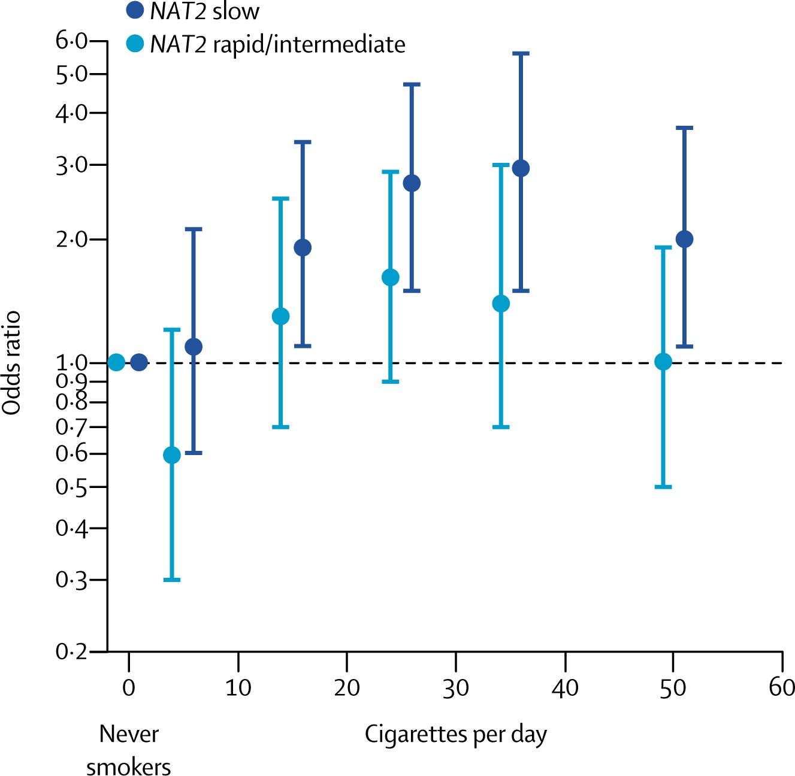

## Announcements

- Test corrections due **Friday** at 11:59 pm


## Announcements

- Final Exam is **Tuesday, May 5, 8am-11am**
  - Will be in this room **and** McGavern 2301. 

- Final Exam will be similar length to previous exams

- No formulas needed and so no formula sheet provided

- Focus on material since Exam 02

## Course evaluation

- Please fill out course evaluations

- Evaluations are due **April 28 at 11:59pm**.

- If at least 85% of students fill out the course evaluations, everyone in the class will receive an extra 1/2 point on the final exam score. 

## When to choose what method? {.smaller}

| Predictor Type      | Outcome Type           | Common Tests / Topics                             | 
|----------------------|------------------------|---------------------------------------------------|
| Categorical          | Categorical            | Fisher’s exact test, $\chi^2$ test                      |
| Categorical          | Continuous             | t-tests, ANOVA, nonparametric alternatives        |
| Continuous           | Continuous             | Correlation                   |
| Continuous **or** Categorical           | Continuous             | Regression                          |
| Continuous **or** Categorical           | Categorical            | Logistic regression              | 
| Other / Complex      | Various (e.g. survival, counts) | Advanced or “exotic” methods               |

## Quick review

::: {.callout-tip}

## Review

1. Which R function do we use to run a linear regression? How about for a logistic regression?

2. What additional piece of information do you need to specify when running a logistic regression, compared to a linear regression?

3. Suppose you have an outcome variable $Y$ that takes on one of two values, 0 or 1. What distribution does $Y_i$ have (one observation)? How about $Y_1, \ldots, Y_n$ ($n$ observations)?

4. What is the logit function? (describe in words & symbols)

5. (Fill in the blank:) Negative logits correspond to probabilities less than ______.

:::

## Computational setup

```{r}
#| echo: true
#| message: false
#| warning: false
library(tidyverse)
library(tidymodels)
library(kableExtra)
library(randomForestSRC) # for pbc data
data(pbc, package = "randomForestSRC")
```

## Logistic regression from last time

Recall the cirrhosis dataset from last class. 

Researchers are interested in predicting whether a patient died (`status`) based on the following variables:

-   `ascites`: whether the patient had ascites (abnormal fluid buildup in the abdomen) (1 = yes, 0 = no)

-   `bili`: serum bilirubin in mg/dL (higher values may indicate liver damage/disease)

-   `stage`: histologic stage of disease (ordinal categorical variable with stages 1, 2, 3, and 4)


## Logistic regression model {.smaller}

```{r}
#| echo: true
fit2 <- glm(status ~ ascites + bili + as.factor(stage), 
            data = pbc, 
            family = "binomial")
tidy(fit2) |>
  kable(digits = 3)
```

## Hypothesis tests in logistic regression

Generally, we wish to know whether the OR = 1 or equivalently, whether the logit of $p$ (a $\beta$ coefficient) = 0. To test

$$H_0: \beta_k = 0$$

$$H_1: \beta_k \neq 0$$

we can compare the ratio of a parameter estimate to its standard error using the standard normal distribution (reason we use Z instead of t is a bit technical).

## Logistic regression model {.smaller}

```{r}
#| echo: true
fit2 <- glm(status ~ ascites + bili + as.factor(stage), 
            data = pbc, 
            family = "binomial")
# Gets estimates for log odds scale
tidy(fit2) |>
  kable(digits = 3)
```

## Interpretation

$\hat\beta_{\text{bili}}$: Each one mg/dL increase in bilirubin is associated with the odds of death being multiplied by exp(.315) = 1.37, holding ascites presence and ascites presence constant.

**Another Equivalent Interpretation**: A one mg/dL increase in bilirubin is associated with 37% higher odds of death, holding ascites presence and status constant.

Interpretation includes **estimates of magnitude, the units and since we are using multivariable model specifies we are holding all other varibles constant**

## In R {.smaller}

\footnotesize

```{r}
#| echo: true
fit2 <- glm(status ~ ascites + bili + as.factor(stage), 
            data = pbc, 
            family = "binomial")
# Get odds ratios 
# Note std.error values are **not** not exponentiated
tidy(fit2, exponentiate = TRUE) |>
  kable(digits = 3)
```

## Confidence intervals

CIs for associations on the **logit scale** are given by

::: poll
$$\hat \beta_j \pm z^*_{1-\alpha/2} \times \widehat {SE} (\hat\beta_j)$$
:::

These are typically translated into confidence intervals in **odds scale** by exponentiating the lower and upper limits.

$$[\text{exp}(\hat \beta_j - z^*_{1-\alpha/2} \times \widehat {SE} (\hat\beta_j)), \text{exp}(\hat \beta_j + z^*_{1-\alpha/2} \times \widehat {SE} (\hat\beta_j))]$$

## Confidence intervals

- For the variable ascites [patient had ascites (1 = yes, 0 = no)]
  - $\hat{\beta}_{ascites}$ = 2.868
  - Standard error of $\hat{\beta}_{ascites}$ = 1.067

- We are 95% confident that the true difference in the log‑odds of the outcome comparing patients with ascites to those without ascites lies within the following interval, holding the other variables in the model constant: $$\hat \beta_j \pm z^*_{1-\alpha/2} \times \widehat {SE} (\hat\beta_j)$$

## In R {.smaller}

\footnotesize

```{r}
#| echo: true
# Get odds ratios and 95% CIs
tidy(fit2, conf.int = TRUE) |>
  kable(digits = 3)
```

## Confidence intervals

- For the variable ascites [patient had ascites (1 = yes, 0 = no)]
  - $\hat{\beta}_{ascites}$ = 2.868
  - Standard error of $\hat{\beta}_{ascites}$ = 1.067
  
- We are 95% confident that the true odds ratio comparing patients with ascites to those without ascites lies within the following interval, holding the other variables in the model constant: $$[\text{exp}(\hat \beta_j - z^*_{1-\alpha/2} \times \widehat {SE} (\hat\beta_j)), \text{exp}(\hat \beta_j + z^*_{1-\alpha/2} \times \widehat {SE} (\hat\beta_j))]$$

## In R {.smaller}

\footnotesize

```{r}
#| echo: true
# Get odds ratios and 95% CIs
tidy(fit2, exponentiate = TRUE, conf.int = TRUE) |>
  kable(digits = 3)
```

## Predicted probabilities {.smaller}

-   There is a one-to-one-relationship between $p$ and $logit(p)$. So, if we predict the log-odds, we can back-transform to get back to a predicted probability.

-   For instance, suppose a patient does not have ascites, has a bilirubin level of 5 mg/dL, and is a stage 2 patient. Their predicted **log-odds** are:

$$−3.14+0.31×5+1.25=−0.34$$

Thus, their predicted **probability** of dying is

$$\frac{\text{exp}(-0.34)}{1+\text{exp}(-0.34)} = 0.42$$


## In R

\footnotesize

```{r}
#| echo: true
# Example patient:
new_patient <- data.frame(
  ascites = 0,
  bili = 5,
  stage = 2
)

# Get predicted log-odds (type = "link")
pred_logodds <- predict(fit2, 
                        newdata = new_patient, 
                        type = "link")

# Convert log-odds to odds
pred_odds <- exp(pred_logodds)

# Convert odds to probability
pred_prob <- pred_odds / (1 + pred_odds)
```

## In R

- Type = link tells R to estimate the outcome variable in terms of a function of the linear predictor (in the case of logistic regression this returns the log-odds (logit) of the outcome)

- Since generalized linear models do not model the outcome directly in the `glm` function we need to specify the distribution via the family argument 

- Since generalized linear models do not model the outcome directly in the `predict` function we need to specify the scale on which predictions are returned (e.g. log‑odds vs. probabilities)

## Output

```{r}
#| echo: true
pred_logodds
pred_prob
```

## Alternatively...

- We can also calculate the predicted probability directly using `predict` by setting the `type` to be `"response"`. 

```{r}
#| echo: true
# Get predicted probability (type = "response")
pred_prob2 <- predict(fit2, 
                        newdata = new_patient, 
                        type = "response")
pred_prob2
```

## Logistic regression model {.smaller}

- We can also include interaction terms in logistic regression models 

- This allows to test whether the association between a predictor and the outcome variable depends on the value of another variable

- Let's take for example this [study](https://pubmed.ncbi.nlm.nih.gov/16112301/) looking at gene by environment interaction with risk of bladder cancer 

```{r}
#| echo: false
set.seed(123)

n <- 6000

# NAT2 genotype
NAT2 <- factor(
  sample(c("rapid_intermediate", "slow"), n, replace = TRUE),
  levels = c("rapid_intermediate", "slow")
)

# Cigarettes per day categories
cigs <- factor(
  sample(c("0", "1-9", "10-19", "20-29", "30-39", "40+"),
         n, replace = TRUE,
         prob = c(0.25, 0.15, 0.20, 0.15, 0.15, 0.10)),
  levels = c("0", "1-9", "10-19", "20-29", "30-39", "40+")
)

# Numeric values used internally
cigs_num <- c(0, 5, 15, 25, 35, 50)[cigs]

# Linear predictor (log-odds)
lp <-
  -4.5 +
  0.02 * cigs_num +                     # baseline smoking effect
  0.6  * (NAT2 == "slow") +               # small main effect of NAT2
  0.03 * cigs_num * (NAT2 == "slow")      # interaction

p <- plogis(lp)

# Binary outcome
bladder_ca <- rbinom(n, 1, p)

dat <- data.frame(
  bladder_ca = bladder_ca,
  cigs = cigs,
  NAT2 = NAT2
)
```

## Without interaction {.smaller}

```{r}
#| echo: false
fit3 <- glm(bladder_ca ~  NAT2 + cigs, 
            data = dat,
            family = "binomial")

# Gets estimates for log odds scale
tidy(fit3) |>
  kable(digits = 3)
```
Individuals smoking 20-29 cigarettes per day have exp$(\hat \beta_{cigs20-29})$=exp(1.15) times the odds of having bladder cancer compared to individuals smoking 0 cigarettes per day, **holding NAT2 constant**

## Interaction terms {.smaller}

```{r}
#| echo: false
fit3 <- glm(bladder_ca ~  NAT2 + cigs + NAT2 * cigs, 
            data = dat,
            family = "binomial")

# Gets estimates for log odds scale
tidy(fit3) |>
  kable(digits = 3)
```

## Interaction term

- With the interaction term in the model: 

Individuals smoking 20-29 cigarettes per day have exp$(\hat \beta_{cigs20-29})$=exp(1.15) times the odds of having bladder cancer compared to individuals smoking 0 cigarettes per day, **when the other predictor (NAT2) is 0**

## Interaction terms 



## Application Exercise

::: callout-tip

Head to Canvas and download the template for Application Exercise 06. AE 06 will be due **this Sunday at 11:59pm**.

Selected groups should put their answers (screenshots of code, interpretations) on [these google slides](https://docs.google.com/presentation/d/1BkdGxGVgf6htUw8a0s4PvuMwasf6G0kL4nnRsNZNaH0/edit?usp=sharing). Pick a representative to present your slide.

:::

## More practice

::: {.callout-tip appearance="simple"}

```{r}
tidy(fit2) |>
  kable(digits = 3)
```

By hand, write out the following. Leave in terms of values given:

1. What is the **model** we are using?

2. What is the **predicted log odds** of dying for a patient with ascites, a bilirubin level of 3 mg/dL, and stage 3?

3. Given this value, what is the **predicted probability**?

:::

## Recap

- Logistic regression review

- Interpreting continuous and categorical coefficients in a logistic regression model

- Predicting probabilities using a logistic regression model object

## Next class

- Last day of class is this **Thursday** (Class wrap-up, Exam info)
