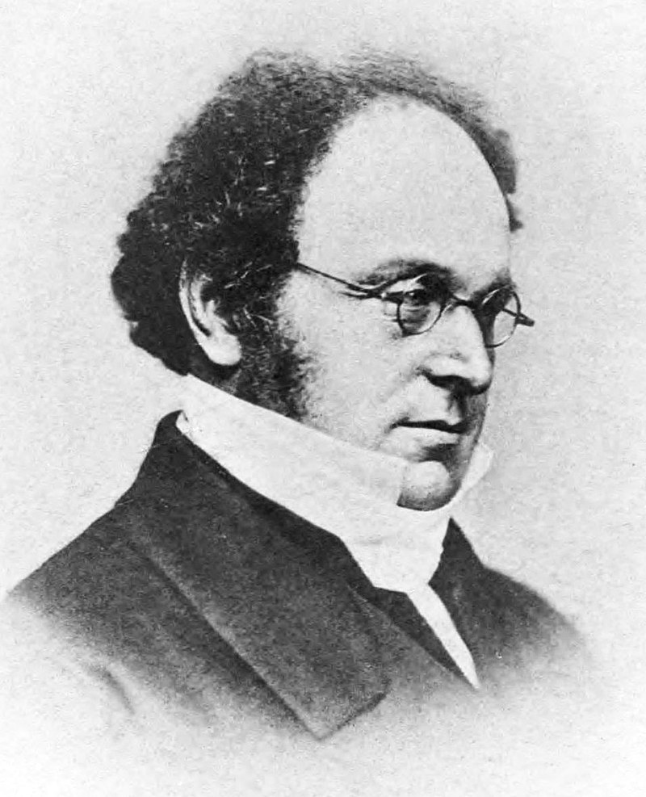

## Reading

- [OpenIntro Statistics](https://www.openintro.org/go/?id=os4_for_screen_readers&referrer=/book/os/index.php): Section 3.1.1-3.1.6

## Announcements

- Lab 2 session Today at 3:30pm, due Friday at 11:59pm

- HW 1 Due Tuesday, Jan 27 at 11:59pm

- Office Hours have shifted
  - Dr. Howard office hours (on canvas) - Fridays 1-2 pm
  - Tutoring available - **bio600tutor@unc.edu**

# Last Week

- **Skewed** distributions can be right or left skewed depending on which side the "tail" is on.

- Example of right skew (tail is on the right)

```{r}
set.seed(123)

# Simulate data from a normal distribution
normal_data <- rnorm(400, mean = 0, sd = 1)

# Transform the data to make it right-skewed
right_skewed_data <- exp(normal_data)

# Create a histogram
hist(right_skewed_data, breaks = 30,
     col = "darkgoldenrod3", main = " ", 
     xlab = "Value")
```

# Last Week

- Data has Mean of 12, Median of 10 

```{r}
set.seed(123)

# Many typical values
x <- rnorm(100, mean = 10, sd = 1)

# One extreme outlier
x_with_outlier <- c(x, 200)

hist(x_with_outlier, breaks = 30, col = "gray",
     main = "Servings of Fruits and Vegetables",
     ylab= "# of Participants",
     xlab = "# of Servings")

abline(v = mean(x_with_outlier), col = "red", lwd = 2)
abline(v = median(x_with_outlier), col = "blue", lwd = 2)

legend("topright",
       legend = c("Mean", "Median"),
       col = c("red", "blue"),
       lwd = 2)
```
# Last Week

- Mean is higher than the median but data is not skewed

```{r}
# Many typical values
hist(x, breaks = 30, col = "gray",
     main = "Servings of Fruits and Vegetables",
     ylab= "# of Participants",
     xlab = "# of Servings")

abline(v = mean(x_with_outlier), col = "red", lwd = 2)
abline(v = median(x_with_outlier), col = "blue", lwd = 2)

legend("topright",
       legend = c("Mean", "Median"),
       col = c("red", "blue"),
       lwd = 2)
```

# Last Week

- Categorical Data
  - Nominal - includes binary or dictotomous
  - Ordinal
- Continuous Data
  - Count or rank data
  - Continuous data
    - Can be discrete (having gaps)

# Probability basics

## What's the use of probability?

-   Last time: how to **visualize** data, how descriptive statistics are used to **describe** data
-   Goal: Make **inferences** about a population based on a sample
    -   Inference: making conclusions about a population based on a sample of data drawn from that population
-   To do this, we need a solid foundation of probability theory

## Probabilities come up all the time

-   There is a moderate chance of drought in North Carolina during the next year
-   The surgery has a 50-50 probability of success
-   The ten-year survival probability of invasive breast cancer among US women is 83%.

How do we come up with these probabilities?

Before we answer that question, a little bit of history...


## Probabilities

-   **Frequentist** (classical) and **Bayesian** schools of thought

- Historical analogy: Imagine a medieval coin maker who wants to prove that his coin is fair. He flips the coin thousands of times. If it lands on heads about half the time, he concludes it's a fair coin. 

- This approach reflects **long-run frequencies**—the probability is defined by the frequency of an event (heads) occurring in many repeated trials.

## Historical analogy (continued)

- Now, consider a knight deciding whether to trust the coin maker's fairness. Even after seeing just a few flips, the knight forms a **degree of belief** about the coin's fairness, adjusting this belief with more evidence. 

- This reflects the **Bayesian interpretation**—probability as a measure of **belief** or certainty about an event, *updated* as new information becomes available.

## Which approach is more useful?

- Each one is useful, just depends on context

- **Frequentist**: Most helpful when you have **large sample sizes** and **repeated trials**. Typically used in settings where you rely on long-run frequencies, such as in hypothesis testing and confidence intervals (more on these later).

- **Bayesian**: More useful when **prior information** or **expert opinion** is available, or when working with smaller sample sizes. Often applied in settings where you need to update probabilities as new data becomes available.

## Example: clinical trial

Setting: Consider a clinical trial for a new drug.

- In large-scale randomized controlled trials (RCTs) to test a new drug's efficacy, a **frequentist** approach is often more suitable. 

- This is because you rely on the law of large numbers (more on this in a few lectures!), where results become more reliable with repeated trials. 

- Frequentist methods like hypothesis testing and confidence intervals help establish the drug's effectiveness based purely on the data without incorporating prior beliefs.

## Example: diagnostic testing

Setting: Diagnostic testing with prior information

- When evaluating a rare disease using diagnostic tests, a **Bayesian** approach might be more useful. 

- If prior knowledge or expert opinion suggests a very low prevalence of the disease, this information can be incorporated into the analysis. 

- As new test results come in, the Bayesian method allows you to update the probability of a patient having the disease, leading to more nuanced decision-making, especially with small sample sizes or uncertain data.


## Probability spaces {.smaller}

Mathematical objects that model **random experiments**, real-world processes involving states that occur **randomly**

A **probability space** consists of three components:

1.  A **sample space**, the set of all possible outcomes

2.  Subsets of the sample space, called **events**, which comprise any number of possible outcomes (including none of them!)

3.  A function that assigns **probabilities** to events

An event **occurs** if the outcome of the random experiment is contained in that event.

## Sample spaces

Sample spaces depend on the random experiment in question

-   Tossing a single fair coin

-   Tossing two fair coins

-   Sum of rolling two fair six-sided dice

-   Survival (years) after cancer diagnosis

::: {.callout-tip}
## Exercise

- What are the sample spaces for each of the experiments above?

:::


## Events {.smaller}

**Events**: Subsets of the sample space that comprise possible outcomes. Essentially, these are all the 'plausibly reasonable' events we're interested in calculating probabilities for\*:

-   Tossing a single fair coin
    -   A head
-   Tossing two fair coins
    -   At least one head
-   Sum of rolling two fair six-sided dice
    -   An odd number
-   Survival (years) after cancer diagnosis\*
    -   More than 1 year

\*Note: there is some complicated math involved in calculating this. Don't worry about it for now!


## Probabilities {.smaller}

A number describing the likelihood of each event's occurrence. This maps events to a number between 0 and 1, inclusive:

-   Tossing a single fair coin

    -   A head \textcolor{brown}{0.5}

-   Tossing two fair coins

    -   At least one head \textcolor{brown}{0.75}

-   Sum of rolling two fair six-sided dice

    -   An odd number \textcolor{brown}{0.5}

-   Survival (years) after cancer diagnosis

    -   greater than one year \textcolor{brown}{...difficult}

## How did we come up with those answers?

-   For the first three, you would probably intuit your way through using a **discrete probability distribution** (more on this in a few lectures)

-   For the last one, by making some assumptions on the survival process, we can use similar probability tools to arrive at an answer. (But it's still complicated!)

## Events as (sub)sets

Remember, events are subsets of the entire sample space. Let's take for now the example of tossing a single fair coin and recording the outcome.

There are only two elements in the outcome space:

-   $A$: getting a head
-   $B$: getting a tail

We can define the simple events of just $A$ or $B$ occurring, but are there "other" events we can define?

## Set operations {.smaller}

Sets can be related to each other in different ways. For two sets (or events) $A$ and $B$, the most common relationships are:

-   **Intersection** ($A \cap B$): $A$ and $B$ both occur
-   **Union** ($A \cup B$): $A$ or $B$ occur (including when both occur)
-   **Complement** ($A^C$): $A$ does not occur
-   **Difference** ($A \backslash B$): $A$ occurs, but $B$ does not occur; equivalent to ($A \cap B^C$) (why?)

Two sets $A$ and $B$ are said to be **disjoint** if $A \cap B = \emptyset$

## Those "other" events

What are the intersection, union, complement, and difference of events $A$ (getting a head) and $B$ (a tail) as applied to our coin-toss example? Are the two events $A$ and $B$ disjoint?

What are the probabilities assigned to those events:

-   $P(A \cap B)=$?
-   $P(A \cup B)=$?
-   ...etc.

## How do probabilities "work"?

Komolgorov axioms

1.  The probability of any event in the sample space is a non-negative real number (could be zero!)

2.  The probability of the entire sample space is 1

3.  If $A$ and $B$ are **disjoint** events (**mutually exclusive**), then the probability of $A$ or $B$ occurring is the sum of the individual probabilities that they occur

## How to probabilities "work"?

For two events $A$ and $B$ with probabilities $P(A)$ and $P(B)$ of occurring, the Kolmogorov axioms give us two important rules:

-   **Complement Rule**: $P(A^C) = 1- P(A)$
-   **Inclusion-Exclusion**: $P(A \cup B) = P(A) + P(B) - P(A \cap B)$

::: {.callout-tip}

## Question
How do we extend inclusion-exclusion to more than two events?

:::

## DeMorgan's laws

{width="100"}

-   **Complement of union**: $(A\cup B)^C = A^C \cap B^C$
-   **Complement of intersection**: $(A\cap B)^C = A^C \cup B^C$

::: {.callout-tip}
## Questions
How do we interpret these in plain English?

:::

## Gunter et al. study (2017) {.smaller}

{width="300"}

| Coffee drinking | Died? Yes | Died? No | Total |
|-----------------|:---------:|:--------:|:-----:|
| None            |   1039    |   5438   | 6477  |
| Med-Low         |   4440    |  29712   | 29809 |
| High            |   3601    |  24934   | 28535 |
| Total           |   9080    |  60084   | 64821 |

What was the probability that a randomly selected person in the trial..

-   ... did not drink coffee?

-   ... died during the study or did not drink coffee?

-   ...did not die during the study and was a high coffee drinker?


## Recap

- Probabilities come up all the time!
- Bayesian vs. frequentist approaches
- Probability spaces, sample spaces, events
- Set operations
- How do probabilities work? (Set operations, DeMorgan's Laws)

