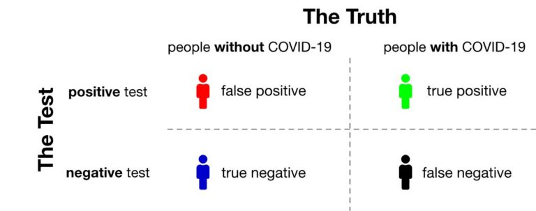
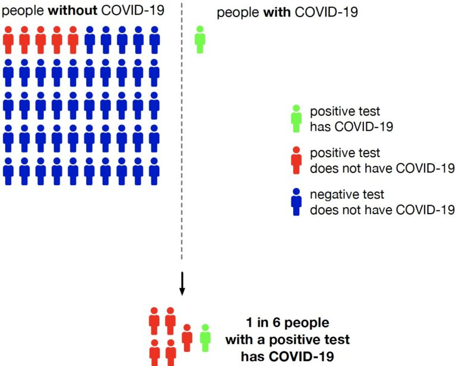
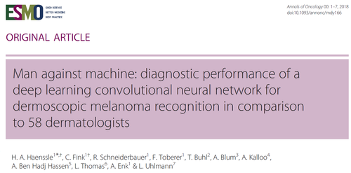

## Announcements

- **Lab 1** posted, will be the focus of lab tomorrow!

- Not due until next Monday, Jun 29 at 11:59 pm

- Please take advantage of office hours
   
## Reading

-   Pagano and Gavreau: Section 6.4

-   [OpenIntro Statistics](https://www.openintro.org/go/?id=os4_for_screen_readers&referrer=/book/os/index.php): No corresponding section

## Overview

- How conditional probabilities relate to sensitivity, specificity, & more!

- Example with Bayes' theorem 
 
- ROC Curves

## The law of total probability

-   Suppose we partition $B$ into mutually disjoint events $B_1, B_2, \ldots B_k$ that comprise the entire sample space.
-   Then the **law of total probability** states that the probability of event $A$ is

$$
P(A) = P(A \cap B_1) + P(A \cap B_2) + \cdots + P(A \cap B_k)
$$

- [Drawing]

## Rewriting...

- We can rewrite these probabilities using the multiplicative rule as follows:

$$
\begin{aligned}
P(A) &= P(A \cap B_1) + P(A \cap B_2) + \cdots + P(A \cap B_k) \\
     &= P(A|B_1) P(B_1) + P(A|B_2)P(B_2) + \cdots + P(A | B_k)P(B_k)
\end{aligned}
$$

- Why rewrite? Sometimes $P(A|B_1)$, $P(B_1)$ are easier to find than $P(A \cap B_1)$, etc. We'll find out WHY (i.e. what these probabilities represent) in our next lecture.

## The law of total probability in action {.smaller}

| Coffee drinking | Died? Yes | Died? No | Total |
|-----------------|:---------:|:--------:|:-----:|
| None            |   1039    |   5438   | 6477  |
| Med-Low         |   4440    |  29712   | 29809 |
| High            |   3601    |  24934   | 28535 |
| **Total**       |   9080    |  60084   | 64821 |

What was the probability a randomly selected person died? Let's find this using the law of total probability.

## The law of total probability in action

-   In an introductory statistics course, 50% of students were undergrads, 40% were master's students, and 10% were PhD students.

-   80% of the undergrads didn't get enough sleep, 40% of the master's students didn't get enough sleep, and 10% of the PhD students didn't get enough sleep.

-   What is the probability that a randomly selected student in this class didn't get enough sleep? Are sufficient sleep status and year independent?

**Let's solve this using the Law of Total Probability...**

## Solution

What is the probability that a randomly selected student in this class didn't get enough sleep?

\begin{align}
P(A) &= P(A \cup B_U) + P(A \cup B_M) + P(A \cup B_P)\\
&= P(A|B_U)P(B_U)+P(A|B_M)P(B_M)+P(A|B_P)P(B_P)\\
&= 0.8 \times 0.5 + 0.4 \times 0.4 + 0.1 \times 0.1\\
&= 0.64 + 0.16 + 0.01\\
&= 0.81
\end{align}

Are sleep status and year independent? 

No, since $0.81 = P(A) \neq P(A|B_P) = 0.1$!


## Order matters!

What is the probability that a random person...

| Coffee drinking | Died? Yes | Died? No | Total |
|-----------------|:---------:|:--------:|:-----:|
| None            |   1039    |   5438   | 6477  |
| Med-Low         |   4440    |  29712   | 29809 |
| High            |   3601    |  24934   | 28535 |
| **Total**       |   9080    |  60084   | 64821 |

-   ...was a high coffee drinker, given that they died?

-   ...died, given that they were a high coffee drinker?

Are these two probabilities the same?

## Bayes' rule


-   We can use **Bayes' rule** to "reverse" the order of conditioning.

-   By definition:

$$P(A | B) = \frac{P(A \cap B)}{P(B)} = \frac{P(B | A) P(A)}{P(B)}$$


## Bayes' rule

-   Using the definition of conditional probability, the law of total probability, and the multiplicative rule, we have


\begin{align}
P(A | B) = \frac{P(A \cap B)}{P(B)} &= \frac{P(B | A) P(A)}{P(B)} \\
 &= \frac{P(B | A) P(A) }{P(B | A) P(A) + P(B | A^C) P(A^C)}
\end{align}


## What if $A$ is partitioned into mutually disjoint events?

If instead $A$ is partitioned into $k$ mutually disjoint events that together comprise the entire sample space, Bayes' rule gives:


\begin{align}
P(A | B) &= \frac{P(B | A) P(A)}{P(B)} \\
 &= \frac{P(B | A) P(A) }{P(B | A_1) P(A_1) + P(B | A_2) P(A_2) + \cdots P(B | A^k) P(A^k)}
\end{align}


## Bayes' rule Example {.smaller}

What is the probability that a random person in the coffee study...

| Coffee drinking | Died? Yes | Died? No | Total |
|-----------------|:---------:|:--------:|:-----:|
| None            |   1039    |   5438   | 6477  |
| Med-Low         |   4440    |  29712   | 29809 |
| High            |   3601    |  24934   | 28535 |
| **Total**       |   9080    |  60084   | 64821 |

-   ...was a high coffee drinker, given that he died?
-   ...died, given that he was a high coffee drinker?

Let's verify our results using Bayes' rule.

## Solution

Probability that a person was a high coffee drinker, given that he died?

\begin{align}
P(A_H|B) &= \frac{P(B|A_H)P(A_H)}{P(B|A_H)P(A_H)+P(B|A_M)P(A_M)+P(B|A_N)P(A_N)}\\
&= \frac{\frac{3601}{28535}\times\frac{28535}{64821}}{\frac{3601}{28535}
\times\frac{28535}{64821}+\frac{1039}{6477}\times\frac{6477}{64821}+\frac{4440}{29809}\times\frac{29809}{64821}}\\
&= \frac{\frac{3601}{64821}}{\frac{9080}{64821}}\\ 
&\approx 0.397
\end{align}

Probability that a person died, given that he was a high coffee drinker?

\begin{align}
P(B|A_H) &= \frac{P(A_H|B)P(B)}{P(A_H|B)P(B)+P(A_H|B^C)P(B^C)}\\
&= \frac{\frac{3601}{9080}\times\frac{9080}{64821}}{\frac{3601}{9080}
\times\frac{9080}{64821}+\frac{25934}{60084}\times\frac{60084}{64821}}\\
&= \frac{\frac{3601}{64821}}{\frac{28535}{64821}}\\ 
&\approx 0.126
\end{align}


## Why do we need Bayes' rule?

-   If we have the row and column totals, we can directly calculate these conditional probabilities from a table.

-   So, why would we even need Bayes' rule?

-   There are many cases where you would not have row/column totals.

## Example: Medical diagnosis with missing data {.smaller}

-   Imagine a scenario where a rare disease is being studied.

-   You may have detailed information about patients who tested positive for the disease (including their symptoms and demographics), but you might lack comprehensive data on the entire population's symptom distribution or total number of people tested.

-   In this case, you wouldn’t have the full row or column totals, making it necessary to use Bayes' Theorem to infer probabilities based on the available conditional probabilities and the prevalence of the disease.

-   This is common in situations where data is incomplete, either due to privacy concerns, lack of resources, or when dealing with emerging diseases.

## Conditional probabilities {.smaller}

Suppose we care about the probability that someone has HIV, denoted by $P(HIV+)$.

-   What if they have a positive HIV test?

$P(HIV + | Test +)$

-   What if they have a negative HIV test?

$P(HIV + | Test -)$

Knowing the result of the HIV test changes our estimate of their HIV proability.

::: {.callout-tip appearance="simple"}
## Question


Which of the three probabilities would we expect to be the highest? The lowest?


:::

## Medical diagnostics {.smaller}

Suppose we're interested in the performance of a diagnostic test. Let $A$ be the event that someone has a condition of interest, and let $B$ be the event that a test for that condition is positive.

-   **Prevalence**: $P(A)$

-   **Sensitivity**: $P(B|A)$, or the true positive rate

    -   probability that the test is positive given the condition is present

-   **Specificity**: $P(B^C | A^C)$, or 1 minus the false positive rate

    -   Probability that the test is negative given the condition is **not** present

## Medical diagnostics (continued)

-   **Positive Predictive Value (PPV)**: $P(A|B)$

    - probability that the condition is present, given a positive test

-   **Negative Predictive Value (NPV)**: $P(A^C | B^C)$


    - probability that the condition is not present, given a negative test
    

## Popularization of medical diagnostics 

During COVID-19, diagnostic testing has become mainstream.

{width="300" fig-alt="A two-by-two table with the top of the table labelled The Truth, with columns for people without COVID-19 and for people with COVID-19. The left side of the table is labelled The Test, with the top row for positive test and the bottom row for negative test. The top-left square has a red figure with the words false positive; the top-right square has a green figure with the words true positive; the bottom-left has a blue figure with the words true negative; and the bottom-right has a black figure with the words false negative."}


-   Testing for COVID-19 is not perfect. It may come back positive in some people who are not infected with SARS-CoV-2 and negative in some people who are.

-   Diagnostic tests are developed with both sensitivity and specificity in mind.

## Sensitivity and specificity

-   The greater the sensitivity, the **less likely it will miss real cases**.

    - Recall: sensitivity is the probability of a positive test, given the condition is present. 

-   The greater the specificity, the more likely uninfected individuals will be **correctly deemed negative**.

    - Recall: Specificity is the probability of a negative test, given the condition is not present. 

## A test's performance can be surprisingly counterintuitive {.smaller}

-   Consider a scenario with COVID-19 testing in an asymptomatic or mild population with 1 in 51 people infected.

-   Assume the test is always positive in individuals with the disease (i.e., 100% sensitivity) but falsely positive 10% of the time (i.e., 90% specificity).

-   As shown in the figure (next slide), the chance that someone with a positive test result is actually infected is under 20% (1 in 6)


## Illustration

{fig-alt="A diagram split down the middle by a dotted line.The legend specifies that a green figure indicates positive test and has COVID-19, a red figure indicates positive test but does not have COVID-19, and a blue figure indicates negative test and does not have COVID-19. On the left is labeled people without COVID-19, with 5 red figures and 45 blue figures. On the right is labeled people with COVID-19, with 1 green figure. Below the dotted line is an arrow pointing to five red figures and one green figure, with the sentence 1 in 6 people with a positive test has COVID-19."}

## Takeaway

- What's the takeaway here?

- Even if a test never misses true cases (perfect sensitivity), a modest false positive rate can mess up the results, **especially** when the disease is rare. 

    - Consequence: Most people who test positive may not actually be infected. 
    
- This demonstrates why specificity and disease prevalence are important as well in diagnostic testing. 


## Rapid self-administered HIV tests

From the FDA package insert for the OraQuick ADVANCE Rapid HIV-1/2 Antibody test,

-   Sensitivity, $P(Test+|HIV+)$: 99.3%

-   Specificity, $P(Test - | HIV -)$: 99.8%

From CDC statistics for 2016, 14.3/100,000 Americans aged $\geq$ 13 are HIV+.

## Rapid self-administered HIV tests

Suppose a randomly selected American aged $\geq$ 13 has a positive test on this test. What do you think is the probability they are HIV+?

## Steps to solve using Bayes' Rule

1. Define two events of interest as $A$ and $B$. 

2. Write the quantity of interest in terms of Bayes' Rule.

3. Expand denominator in terms of law of total probability.

4. Identify quantities of interest. 

5. Plug in quantities from step 4 and solve. 

## Bayes' rule {.smaller}

Recall Bayes' rule below. 

$$
\begin{aligned}
P(A | B) = \frac{P(A \cap B)}{P(B)} &= \frac{P(B | A) P(A)}{P(B)} 
\end{aligned}
$$

## Law of Total Probability {.smaller}

Recall we can expand our denominator using Law of Total Probability. 

$$
\begin{aligned}
P(A | B) &= \frac{P(B | A) P(A)}{P(B)} \\
 &= \frac{P(B | A) P(A) }{P(B | A) P(A) + P(B | A^C) P(A^C)}
\end{aligned}
$$

## Let's solve!

**Step 1**: Define events as $A$ and $B$. 

Let $A$ be the event of being HIV+ and $B$ be testing positive.

**Step 2**: Write out the quantity of interest using Bayes' Rule.

$$P(HIV + | Test +) = \frac{P(Test + | HIV +)P(HIV +)}{P(Test +)}$$

## Let's Solve! (continued) {.smaller}

**Step 3**: Expand the denominator using Law of Total Probability.
$$
=\frac{P(Test + | HIV +)P(HIV +)}{P(Test + | HIV +) P(HIV +) + P(Test + | HIV - ) P(HIV -)}
$$


**Step 4**: Identify quantities of interest. 

- $P(Test + | HIV +)$ = True positive rate = sensitivity = .993

- $P(HIV +)$ = prevalence = .000143

- $P(Test + | HIV - )$ = False positive rate = 1 - specificity = 1-.998

- $P(HIV - )$ = 1 - prevalence = 1-.000143

## Let's solve! (continued) {.smaller}

**Step 5:** Plug in quantities from step 4 and solve. 

$$P(HIV + | Test +)$$

$$=\frac{(.993)(.000143)}{(.993)(.000143) + (1-.998)(1-.000143)}$$

$$ = 0.066 = 6.6\%$$
Is this result surprising? Why?

## Interpretation of Result: Oraquick test

-   This calculation is surprising. We would hope that the PPV would be higher.
-   What is going on?
-   Before we answer that: what if a randomly selected adult in Botswana tested positive (HIV prevalence $\approx$ 25%)?

- To calculate this, we can use our same setup as above, but just swap out a new value for prevalence, $P(HIV +)$.

## PPV for Botswana

$$P(HIV + | Test +)$$

$$=\frac{(.993)(.25)}{(.993)(.25) + (1-.998)(1-.25)}$$

$$ = .99 = 99\%$$

## What's going on here?

- The PPV is only 6.6% for US while it's 99% in Botswana. 

- US has low prevalence of HIV while Botswana has relatively higher prevalence. 

- There will likely be a **higher number of false positives relative to true positives in the place with low prevalence**, causing the positive predictive value (PPV) to drop.

  - This is simply due to the nature of the test, i.e. having some nonzero false positive rate, in our case .002.

-   This is something to look out for! Specificity (i.e. FPR) is important to consider.

## Takeaway

- In the US, small prevalence + modest false positive rate is causing the PPV to be much lower than we'd want. 

- In Botswana, higher prevalence "corrects" this issue, leading to PPV being much higher (meaning more people who test positive actually have the condition.) 

- With a modest false positive rate, a higher prevalence can help our PPV be higher, yielding a **more useful diagnostic test** for that setting. With lower prevalence, you need to be careful with the conclusions made by a diagnostic test as it could be misleading. 


## Discrimination thresholds

Oral HIV tests give positive or negative results depending on levels of HIV antibodies detected in saliva.

-   If antibody levels are above a certain threshold, it is classified as a positive test.

-   Varying the threshold for a positive vs. negative test will result in a test in different characteristics.

-   At each threshold value, there is a tradeoff between sensitivity and specificity.

## Example

- American Heart Assocation has CVD risk calculator [PREVENT calculator](https://professional.heart.org/en/guidelines-and-statements/prevent-calculator) that provides estimates of probabilities of having a CVD event within the next 10-years
- BP guidelines recommend using this calculator to identify individuals at increased risk of CVD and to guide initiation of antihypertensive therapy
- **Current guidance**: Individuals at 10-year risk of total CVD ≥ 7.5% are recommended to initiate anti-hypertensive therapy

## Example {.smaller}

- **Current guidance: 10-Year Risk ≥ 7.5%** 
  - Some people with 2% risk will have an event (false negative) 
  - Some with 20% risk don't have an event (false positive)
  
- **Lower Threshold: 10-Year Risk ≥ 2%** - Classifies more people at elevated risk of CVD
  - More likely to correctly classify individual with an event (**higher sensitivity**)
  - Less likely to correctly classify individuals without an event (**lower specificity**)
  
- **Higher Threshold: 10-Year Risk ≥ 80%** - Classifies less people at elevated risk of CVD
  - Less likely to correctly classify individual with an event (**lower sensitivity**)
  - More likely to correctly classify individuals without an event (**higher specificity**)
  
## ROC curves

Receiver Operating Characteristic curves show how specificity and sensitivity change as the discrimination threshold changes.

-   The ROC curve was first developed by electrical and radar engineers during World War II for detecting enemy objects in battlefields, starting in 1941.

{width="400" fig-alt="Woman wearing a headset seated in front of a screen displayed radar information."}

## Haenssle et. al (2018)

{fig-alt= "Article from Annals of Oncology with the title Man against machine: diagnostic performance of a deep learning convolutional neural network for dermoscopic melanoma recognition in comparison to 58 dermatologists."}

[paper link here](https://www.sciencedirect.com/science/article/pii/S0923753419341055?via%3Dihub)

- Machine learning algorithm outperformed doctors in many cases!

## From Haenssle et al. (2018)

{width="400" fig-alt="A graph with x-axis titled 1-Specificity and y-axis title Sensitivity, with both axes going from 0 to 1. There is a red ROC curve that has a steep slope for x between 0 and 0.1, then a slight slope for all higher x-values. There are green diamonds superimposed over the red curve. The AUC is 0.953."}

ROC curves show, for each false positive rate, what the true positive rate is corresponding to that threshold value.

## Example ROC Curves 

```{r}
#| echo: false
#| message: false
#| warning: false
#| fig-width: 6
#| fig-height: 5
#| fig-alt: "A graph with title ROC Curves. The x-axis is titled False Positive Rate (1-Specificity) and the y-axis is titled True Positive Rate (Sensitivity). Both axes go from 0 to 1. There are three curves on the graph; the red one is a straight line from (0,0) to (1,1); the green one has higher y-values that the red for all x-values; and the blue one has higher y-values than either the red or green for all x-values."

library(ggplot2)

aucs <- c(0.5, 0.7, 0.9)
kvals <- (1 / aucs) - 1   # so AUC = 1/(k+1)

fpr <- seq(0, 1, length.out = 501)

roc_df <- do.call(
  rbind,
  lapply(seq_along(aucs), function(i) {
    data.frame(
      FPR = fpr,
      TPR = fpr ^ kvals[i],
      AUC = factor(paste0("AUC = ", aucs[i]))
    )
  })
)

ggplot(roc_df, aes(x = FPR, y = TPR, color = AUC)) +
  geom_line(linewidth = 1.2) +
  geom_abline(intercept = 0, slope = 1, linetype = "dashed") +
  coord_equal() +
  labs(
    title = "ROC Curves",
    x = "False Positive Rate (1 − Specificity)",
    y = "True Positive Rate (Sensitivity)"
  ) +
  theme_minimal(base_size = 16) +
  theme(legend.position = "none")
```

## Why ROC Curves? {.smaller}

- By moving the threshold, we can:

  - Catch more true cases (↑ sensitivity),
  
  - But risk more false alarms (↑ false positive rate).
  
- The ROC curve shows **all possible tradeoffs** at once.

- The **diagonal line** = random guessing.

- A “good” test’s ROC curve bows toward the **upper-left corner** (high sensitivity, low false positives).


**ROC curves help us evaluate how well a test separates groups across all possible thresholds.**

## Recap

- How conditional probabilities relate to sensitivity, specificity, & more!

- Examples, how small sample size affects diagnostic tests

- Thresholds & how they affect diagnostic tests

- ROC Curves: show tradeoff between sensitivity and specificity

## Next class

- Discrete distributions

## Participation

How is lab going?

Answer the 1-question survey on Canvas by tomorrow at 11:59pm. Your feedback is extremely helpful!