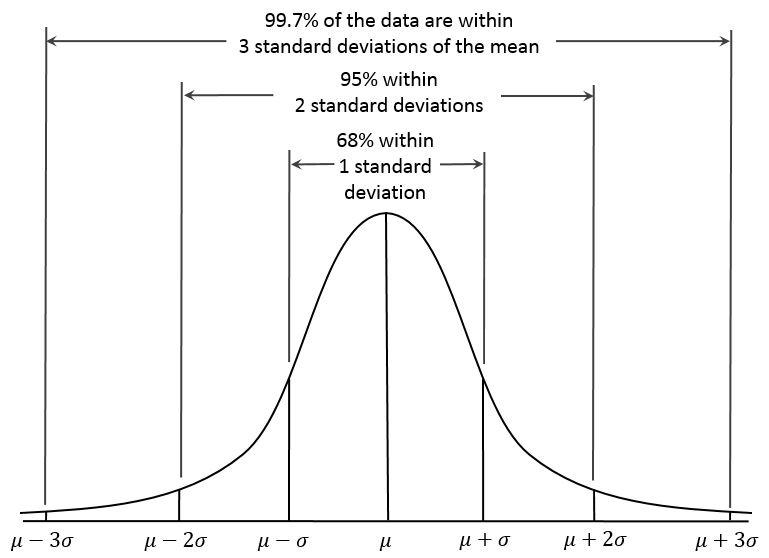

## Announcements

- HW 5 and AE 1 due tonight at 11:59pm

- HW 6 due tomorrow at 11:59pm.

- Today's lecture marks the end of the content for Exam 01! (Today's lecture is included in Exam 01 content.) 

- Information, topics list and formula sheet have been added on Canvas.

## Announcements

- Tomorrow's class will be entirely review for exam


- Continue to post on Ed Discussion about any questions you have! I am happy to answer any questions, no matter how small. 

## Overview

- Review discrete probability distributions

- Continuous distributions and examples

- A little more with dplyr and the tidyverse!

## Supplemental Reading

-   Pagano and Gavreau: Section 7.4
-   [OpenIntro Statistics](https://www.openintro.org/go/?id=os4_for_screen_readers&referrer=/book/os/index.php): 3.5, 4.1


## Review: What is a random variable?

A **random variable** is a quantity whose value depends on the outcome of a random event.

-   Traditionally, we use capital letters $X$, $Y$, $Z$ to denote random variables.

-   The values that random variables take are lowercase $x$, $y$, $z$

-   So, the probability that random variable $X$ has the value $x$ is denoted by $P(X = x)$

Random variables encountered in this class will be either discrete or continuous.

## Review: Discrete random variables{.smaller}

-   **Discrete** random variables are those that can take on a countable number of potential values (could be countably infinite!), each associated with a probability of occurring.

- **Bernoulli** random variable - A dichotomous (two-level) random variable $X$ (e.g. dead or alive) with a probability of "success" denoted by $p$.

- **Binomial** random variable - A random variable $Z$ denotes getting a certain number of $k$ "successes" from a sequence of $n$ independent Bernoulli trials, with probability $p$ of "success"

- **Poisson** random variable - A random variable $X$ that takes on non-zero integer values, used for count data

# Continuous distributions

## Can we be more precise? {.smaller}

Letting $X$ be the random variable that corresponds to how long a baby's gestation was, we could imagine subdividing further and further:

::: columns
::: {.column width="50%"}
| Event              | Probability |
|--------------------|-------------|
| $X$ \< 20 wk.      | $P(X < 20)$ |
| $X$ = 20 to 21 wk. | etc.        |
| $X$ = 21 to 22 wk. | etc.        |
| $X$ = 22 to 23 wk. | etc.        |
| $\vdots$           | $\vdots$    |
:::

::: {.column width="50%"}
| Event                  | Probability |
|------------------------|-------------|
| $X$ \< 20 wk.          | $P(X < 20)$ |
| $X$ = 20 to 20.1 wk.   | etc.        |
| $X$ = 20.1 to 20.2 wk. | etc.        |
| $X$ = 20.2 to 20.3 wk. | etc.        |
| $\vdots$               | $\vdots$    |
:::
:::

## Can we be more precise?

-   Now let gestational age $X$ be a **continuous** random variable, which can take on *any* value, say from 0 to $\infty$.

-   How might we define a continuous probability distribution that corresponds to $X$?

## Continuous probability distributions

-   The probability that a continuous variable equals any specific value is 0

-   No use tabulating - there is an *uncountably* infinite number of possible values they can be, all with $P(X = x) = 0$

-   The distribution is given by a **probability density function**, helps us describe probabilities for *ranges* of values.

## Density functions {.smaller}

Probability density functions may be given graphically, satisfying the following two rules:

-   The density must be non-negative everywhere $(f(x) \geq 0$ for all $x$ from $-\infty$ to $\infty$)

-   The total area under the density must be 1

```{r}
#| fig-height: 3
#| fig-width: 8
#| fig-alt: "Three graphs side-by-side. The one on the left is titled Normal Distribution, with a bell-shaped curve. The one in the middle is titled Uniform Distribution, with a straight line for a curve. The one on the right is titled Exponential Distribution, with a curve that starts at 1 near zero and steeply declines as the x-value increases."

# Set up the plotting area to have 1 row and 3 columns
par(mfrow = c(1, 3))

# Set up the x-axis values for the normal distribution
x_normal <- seq(-4, 4, length = 1000)
y_normal <- dnorm(x_normal, mean = 0, sd = 1)

# Plot the density of the standard normal distribution
plot(x_normal, y_normal, type = "l", lwd = 2, main = "Normal Distribution",
     xlab = "Value", ylab = "Density", col = "black")

# Set up the x-axis values for the uniform distribution
x_uniform <- seq(0, 1, length = 1000)
y_uniform <- dunif(x_uniform, min = 0, max = 1)

# Plot the density of the uniform distribution
plot(x_uniform, y_uniform, type = "l", lwd = 2, main = "Uniform Distribution",
     xlab = "Value", ylab = "Density", col = "black")

# Set up the x-axis values for the exponential distribution
x_exponential <- seq(0, 6, length = 1000)
y_exponential <- dexp(x_exponential, rate = 1)

# Plot the density of the exponential distribution
plot(x_exponential, y_exponential, type = "l", lwd = 2, main = "Exponential Distribution",
     xlab = "Value", ylab = "Density", col = "black")

# Reset plotting layout
par(mfrow = c(1, 1))

```


## With density functions, we work with areas under the curve

```{r}
#| fig-height: 5
#| fig-alt: "A graph titled Standard Normal Distribution with a bell-shaped curve centered at x=0; there is a shaded area under the curve from about x = 0.5 to x=1.5."

# Set up the x-axis values
x <- seq(-4, 4, length = 1000)

# Compute the density of the standard normal distribution
y <- dnorm(x, mean = 0, sd = 1)

# Plot the standard normal distribution
plot(x, y, type = "l", lwd = 2, main = "Standard Normal Distribution",
     xlab = "Value", ylab = "Density")

# Shade the area above x = 2.5
x_shade <- seq(0.5, 1.5, length = 1000)
y_shade <- dnorm(x_shade, mean = 0, sd = 1)
polygon(c(0.5, x_shade, 1.5), c(0, y_shade, 0), col = "darkgoldenrod3", border = NA)

```

## The normal (Gaussian) distribution {.smaller}

::: columns
::: {.column width="70%"}

For the **normal distribution**,

$$
f(x) = \frac{1}{\sqrt{2\pi \sigma^2}} \textrm{exp}\Bigl\{-\frac{1}{2} \frac{(x - \mu)^2}{\sigma^2}\Bigr\}
$$

where $\mu$ is the mean and $\sigma^2$ is the variance.

- We often write $N(\mu, \sigma^2)$.

You do NOT need to know this formula for the exam.

:::

::: {.column width="30%"}
{fig-alt="A painting of the mathematician Guass in a dark coat and hat."}
:::
:::


## 68-95-99.7

{fig-alt="A bell-shaped curve designed to show how standard deviation works for normal distribution. States that 99.7% of the data are within 3 standard deviations of the mean; 95% within 2 standard deviations; and 68% within one standard deviation."}

## Standardization

-   The normal distribution is a family of distributions of a specific form. There are an infinite amount of possible distributions, since $\mu$ can be any real number and $\sigma^2$ can be any positive number.

-   It would be very cumbersome to have to individually think about a $N(0, 20)$ vs. $N(2.5, 2)$ vs. $N(694, 1549)$ vs. .... distribution, depending on the situation.

-   In practice, we could calculate a **standard score** or **z-score** that gives the number of standard deviations away from the mean an observation from a particular population is.


## z-scores {.smaller}

-   A **z-score** tells us how many population standard deviations an observation is away from the population mean.

-   They provide ways to compare results across many different measurement scales, since z-scores are *unitless*

::: poll
$$z=\frac{x-\mu}{\sigma}$$
:::

(note the use of population parameters $\mu$ and $\sigma$)

-   So, a z-score of 1.2 is 1.2 standard deviations above a mean; a z-score of -0.8 is 0.8 standard deviations below the mean.

## Osteoporosis {.smaller}


-   According to NHANES, the mean bone mineral density for a 65 year old white woman is 809 mg/cm$^2$, with a standard deviation of 140 mg/cm$^2$.

-   Suppose you are a 65 year old white woman whose bone density is 698 mg/cm$^2$.

::: {.callout-tip appearance="simple"}

Should you be very concerned about osteoporosis?

Let's calculate a z-score and find out!

:::

## Return to the tidyverse 

In lab, we began to learn how to use dplyr for data manipulation. There are still a few more functions that will prove quite useful in our work in this class.

Particularly, these functions can be used to create new variables in a dataset based on existing variables.

## mutate

* Suppose we have a dataset named dat, that contains measurements of mass (kg), height (m), and body temperature in fahrenheit (fahrenheit) for study participants. 
* We want to make new variables for their BMI and body temperature in celsius. We can create these variables as follows (recalling the appropriate formulas):

```{r echo = F}
library(tidyverse)
ncbikecrash <- read.csv("https://mhoch422.github.io/BIOS600_SSII/labs/data/bikecrash.csv")

```

```{r eval = F, echo = T}

dat |>
  mutate(bmi = kg/m^2)

dat |>
  mutate(celsius = (fahrenheit - 32) * 5/9)

```

## Saving the dataframe

* Most often when you define a new variable with mutate, you’ll want to use it later (for instance, in a visualization or in downstream analyses). 

* In this case, you’d want to save the resulting dataframe, often by overwriting the original one. As an example:

```{r eval = F, echo = T}
dat <- dat |>
  mutate(bmi = kg/m^2)
```

* In this case, we’ve saved over the `dat` dataframe, which now contains the new variable `bmi`.

* We could also save it as a new dataframe by using a different name.

## case_when{.smaller}

* We can also do more sophisticated data creation using `case_when`, which allows for a sequence of formulas defining new variables. 

* Let’s suppose we want to create a new variable that categorizes BMI based on CDC cut-offs. 

* Consider the following code, which utilizes the bmi variable we saved previously:

```{r eval = F, echo = T}
dat_bmi <- dat |>
  mutate(bmi_cat = case_when(
    bmi < 18 ~ "underweight",
    bmi >= 18 & bmi < 25 ~ "normal",
    bmi >= 25 & bmi < 30 ~ "oberweight",
    bmi > 30 ~ "obese"
  ))

# Be sure all parentheses are closed!
```

* We have used the `case_when` function to create a new variable. The individual cases are separated by commas, and within each case, the condition (e.g., BMI \> 30) is on the left and the outcome for the new variable (e.g., “obese”) is on the right of a tilde (\~). 

## NC Bike Crash Example{.smaller}

Let’s walk through a concrete example using the ncbikecrash data. Suppose we want to classify whether a crash occurred on a weekend or on a weekday. We will use case_when in combination with the logical operator %in% to do so (the c() function tells R that there is a list of things coming up):

```{r echo = T}
ncbikecrash <- ncbikecrash |>
  mutate(weekend = case_when(
    crash_day %in% c("Saturday", "Sunday") ~ "Weekend",
    crash_day %in% c("Monday",
                     "Tuesday",
                     "Wednesday",
                     "Thursday",
                     "Friday") ~ "Weekday"
  ))
```

## NC Bike Crash Example

Let’s check our work by counting the number of observations in each of our categories:

```{r echo = T}
ncbikecrash |>
  count(weekend)
```

It looks like 1809 crashes happened on weekends and 5658 occurred on weekdays.


## Recap

- Review discrete distributions

- Continuous distributions, density functions

- The normal (Gaussian) distribution

- z-scores

- Some more tidyverse

## Next class

- Review for Exam 1!


