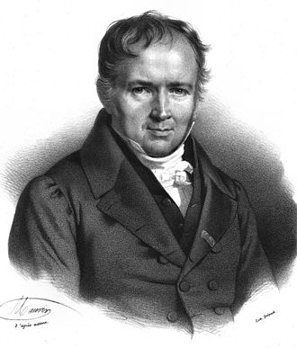

## Announcements

- Today's lab session will cover Lab 3 but also feel free to come by if you need assistance with HW 2! 

- Lab 3 due **Friday at 11:59pm**.

- HW 2 due **Thursday at 11:59pm**.

- Participation activity for today due **Wednesday at 11:59pm**.

## Supplemental reading

-   Pagano and Gavreau: Section 7.2 and 7.3
-   [OpenIntro Statistics](https://www.openintro.org/go/?id=os4_for_screen_readers&referrer=/book/os/index.php): 3.4, 4.3, and 4.5


## Review on skewness


## Overview

- What is a random variable?

- Discrete distributions, Binomial and Poisson, and applications

## What is a random variable?

A **random variable** is a quantity whose value depends on the outcome of a random event.

-   Traditionally, we use capital letters $X$, $Y$, $Z$ to denote random variables.

-   The values that random variables take are lowercase $x$, $y$, $z$

-   So, the probability that random variable $X$ has the value $x$ is denoted by $P(X = x)$

Random variables encountered in this class will be either discrete or continuous.

## Discrete random variables

-   **Discrete** random variables are those that can take on a countable number of potential values (could be countably infinite!), each associated with a probability of occurring.

    - Example: Toss a coin (H, T), Roll a die (1, 2, 3, 4, 5, 6)

-   This list of possible values and probabilities is the **probability distribution** for the discrete random variable in question.

-   Probability distributions let us investigate how likely events may be.


-   For discrete random variables, you may also see the term *probability mass function*, which is the same thing.

## Example: Probability distribution of births in the US {.smaller}


::: columns
::: {.column width="50%"}
Let $X$ be the random variable for birth status in the US. Its probability distribution may be given by
:::

::: {.column width="50%"}
| Event           | Probability |
|-----------------|-------------|
| *X = pre*       | 0.10        |
| *X = early*     | 0.27        |
| *X = full*      | 0.57        |
| *X = late/post* | 0.06        |
:::
:::

## Probability distribution of births in the US {.smaller}

::: columns
::: {.column width="50%"}
| Event           | Probability |
|-----------------|-------------|
| *X = pre*       | 0.10        |
| *X = early*     | 0.27        |
| *X = full*      | 0.57        |
| *X = late/post* | 0.06        |
:::

::: {.column width="50%"}
There are **three rules** for discrete probability distributions:

1.   Outcomes must be disjoint
2.   The probability of each outcome must be $\geq$ 0 and $\leq$ 1
3.   The sum of the outcome probabilities must add up to 1.

:::
:::

::: {.callout-tip}
## Verify the three rules

Let's verify the three rules above are satisfied with the births example. 
:::


## Bernoulli random variables

::: columns
::: {.column width="60%"}
Some "types" of random variables come up very often. Consider a dichotomous (two-level) random variable $X$:

-   Dead or alive
-   Current smoker or not

This is known as a **Bernoulli** random variable, and has a probability of "success" denoted by $p$.
:::

::: {.column width="30%"}

:::
:::

## Bernoulli random variables {.smaller}

With the notation that event $X=1$ is a "success" and $X=0$ is a "failure", $P(X=1)=p$ and $P(X=0) = 1-p$

-   Fair coin flip: Let the event X=1 denote heads.

| Event | *P*(Event) |
|-------|------------|
| $X=1$ | 0.5        |
| $X=0$ | 0.5        |

-   2018 US births: Let the event $X=1$ denote preterm birth.

| Event | *P*(Event) |
|-------|------------|
| $X=1$ | 0.1        |
| $X=0$ | 0.9        |

A "success" is not necessarily positive - if we are interested in the probability of dying, a "success" would be death.

## Bernoulli variable examples 

- Y is the event a household experiences food insecurity anytime in a year
  - Y = 1, a "success," if household experiences food insecurity

- S is event a policy violation is detected at an inspection
  - S = 1, a "success," if a policy violation is detected

- Q is the event a microbiome taxa is present in a host
  - Q = 1, a "success," if the taxa is present 
  
- For all of these there are only possible outcomes
  - $P(A) = p$
  - $P(A^C)=1-p$ 


## Extending the Bernoulli distribution {.smaller}

Suppose we randomly select two independent US births in 2018, and $Z$ is a new random variable that represents the number of preterm births among them.

$Z$ can be 0, 1, or 2:

| 1st Birth $X$ | 2nd Birth $X$ | \# Preterm Births $Z$ | Probability of Outcome |
|------------------|------------------|------------------|-------------------|
| 0             | 0             | 0                     |                        |
| 1             | 0             | 1                     |                        |
| 0             | 1             | 1                     |                        |
| 1             | 1             | 2                     |                        |

## Extending the Bernoulli distribution {.smaller}

Let $X_1$ be 1 if the first birth is preterm, and $X_2$ be 1 if the second birth is preterm, and 0 otherwise.

::: {.callout-tip title="Recall"}
If A and B are independent then 
$P(A  \cap B) = P(A) \cdot P(B)$. 
:::

Because these two births are **independent**, then

$$
\begin{aligned}
P(\textrm{both preterm}) &= P(\textrm{first preterm and 2nd preterm})\\
&= P(\textrm{first preterm} \cap  \textrm{2nd preterm})\\
&= P(\textrm{first preterm}) \cdot P(\textrm{2nd preterm})\\
&= p * p = 0.1 \times 0.1 = 0.01
\end{aligned}
$$

## Extending the Bernoulli distribution {.smaller}

Back to the table, row 1 is given by

$P(X_1 = 0 \cap X_2 = 0) = P(X_1 = 0) P(X_2 = 0) = (1-p)(1-p)$

| 1st Birth $X$ | 2nd Birth $X$ | \# Preterm Births $Z$ | Probability of Outcome                      |
|------------------|------------------|------------------|-------------------|
| 0             | 0             | 0                     | (0.9)(0.9)=0.81 |
| 1             | 0             | 1                     |                                             |
| 0             | 1             | 1                     |                                             |
| 1             | 1             | 2                     |                                             |


## Extending the Bernoulli distribution {.smaller}

Thus, the probability distribution (a.k.a. probability mass function) of the number of preterm births out of two independent births is given by

|          | $z=0$ | $z=1$ | $z=2$ |
|----------|-------|-------|-------|
| $P(Z=z)$ | 0.81  | 0.18  | 0.01  |

## Extending the Bernoulli distribution {.smaller}

Now let $Z$ be the random variable corresponding to the number of preterm births among 3 independently sampled births

| First Birth $X_1$ | Second Birth $X_2$ | Third Birth $X_3$ | Number of Preterm Births $Z$ | Probability |
|---------------|---------------|---------------|---------------|---------------|
| 0                 | 0                  | 0                 | 0                            |             |
| 1                 | 0                  | 0                 | 1                            |             |
| 0                 | 1                  | 0                 | 1                            |             |
| 0                 | 0                  | 1                 | 1                            |             |
| 1                 | 1                  | 0                 | 2                            |             |
| 1                 | 0                  | 1                 | 2                            |             |
| 0                 | 1                  | 1                 | 2                            |             |
| 1                 | 1                  | 1                 | 3                            |             |

## Extending the Bernoulli distribution {.smaller}

Row 1 is given by

$P(X_1 = 0 \cap X_2 = 0 \cap X_3 = 0) = (1-p)(1-p)(1-p)$

| First Birth $X_1$ | Second Birth $X_2$ | Third Birth $X_3$ | Number of Preterm Births $Z$ | Probability                       |
|---------------|---------------|---------------|---------------|---------------|
| 0                 | 0                  | 0                 | 0                            | [0.729]{style="color: RosyBrown"} |
| 1                 | 0                  | 0                 | 1                            |                                   |
| 0                 | 1                  | 0                 | 1                            |                                   |
| 0                 | 0                  | 1                 | 1                            |                                   |
| 1                 | 1                  | 0                 | 2                            |                                   |
| 1                 | 0                  | 1                 | 2                            |                                   |
| 0                 | 1                  | 1                 | 2                            |                                   |
| 1                 | 1                  | 1                 | 3                            |                                   |

## Extending the Bernoulli distribution {.smaller}

Row 2 is given by

$P(X_1 = 1 \cap X_2 = 0 \cap X_3 = 0) = p(1-p)(1-p)$

| First Birth $X_1$ | Second Birth $X_2$ | Third Birth $X_3$ | Number of Preterm Births $Z$ | Probability                       |
|---------------|---------------|---------------|---------------|---------------|
| 0                 | 0                  | 0                 | 0                            | 0.729                             |
| 1                 | 0                  | 0                 | 1                            | [0.081]{style="color: RosyBrown"} |
| 0                 | 1                  | 0                 | 1                            |                                   |
| 0                 | 0                  | 1                 | 1                            |                                   |
| 1                 | 1                  | 0                 | 2                            |                                   |
| 1                 | 0                  | 1                 | 2                            |                                   |
| 0                 | 1                  | 1                 | 2                            |                                   |
| 1                 | 1                  | 1                 | 3                            |                                   |

## Extending the Bernoulli distribution {.smaller}

...et cetera

| First Birth $X_1$ | Second Birth $X_2$ | Third Birth $X_3$ | Number of Preterm Births $Z$ | Probability |
|---------------|---------------|---------------|---------------|---------------|
| 0                 | 0                  | 0                 | 0                            | 0.729       |
| 1                 | 0                  | 0                 | 1                            | 0.081       |
| 0                 | 1                  | 0                 | 1                            | 0.081       |
| 0                 | 0                  | 1                 | 1                            | 0.081       |
| 1                 | 1                  | 0                 | 2                            | 0.009       |
| 1                 | 0                  | 1                 | 2                            | 0.009       |
| 0                 | 1                  | 1                 | 2                            | 0.009       |
| 1                 | 1                  | 1                 | 3                            | 0.001       |

## Extending the Bernoulli distribution {.smaller}

If we randomly sample 3 births, what is the chance 2 are preterm?

0.009 + 0.009 + 0.009 = 0.027 (why?)

| First Birth $X_1$ | Second Birth $X_2$ | Third Birth $X_3$ | Number of Preterm Births $Z$ | Probability                       |
|---------------|---------------|---------------|---------------|---------------|
| 0                 | 0                  | 0                 | 0                            | 0.729                             |
| 1                 | 0                  | 0                 | 1                            | 0.081                             |
| 0                 | 1                  | 0                 | 1                            | 0.081                             |
| 0                 | 0                  | 1                 | 1                            | 0.081                             |
| 1                 | 1                  | 0                 | 2                            | [0.009]{style="color: RosyBrown"} |
| 1                 | 0                  | 1                 | 2                            | [0.009]{style="color: RosyBrown"} |
| 0                 | 1                  | 1                 | 2                            | [0.009]{style="color: RosyBrown"} |
| 1                 | 1                  | 1                 | 3                            | 0.001                             |

## Extending the Bernoulli distribution

Thus, the probability distribution of the number of preterm births out of three independent births is given by

|          | $z=0$ | $z=1$ | $z=2$ | $z=3$ |
|----------|-------|-------|-------|-------|
| $P(Z=z)$ | 0.729 | 0.243 | 0.027 | 0.001 |

::: {.callout-caution appearance="simple"}
## Verify

Are these disjoint events, with probabilities in \[0,1\], that all sum to 1?)
:::

## Extending the Bernoulli distribution

-   If we randomly sample 4 births, what is the probability distribution for the number of preterm births?

-   To build a similar table would start to become egregious.

-   Luckily, there is a **formula** for this probability distribution! 

## The binomial distribution

The **binomial distribution** gives the probability of $k$ "successes" from a sequence of $n$ independent Bernoulli trials. There are three assumptions:

1.  There is a fixed number of trials $n$, each of which is a Bernoulli random variable.

2.  The outcomes of the $n$ trials are independent.

3.  The probability of success, $p$, is the same of each of these trials.

## The binomial distribution {.smaller}

If $X$ has a binomial distribution, then

$$P(X=k) = {n \choose k}p^k (1-p)^{n-k}$$


What do these components mean?

  - $n$ = # of bernoulli trials 
  - $k$ = # of successes
  - $p$ = probability of success
  - $n-k$ = # of failures

::: callout-note
This expression will always be provided to you if needed.
:::


## N choose K

- Let's go to our example of preterm births, $P(Z=2)$
- If I have 3 trials, then there would be a few different ways I could say for example choose 2 of them to be successes

$${n \choose k} = {3 \choose 2} = \frac{3!}{2!(3-2)!} = 3$$

- For 2 births that could happen several different ways
  - $X_1 = 1, X_2=1, X_3=0$
  - $X_1 = 0, X_2=1, X_3=1$
  - $X_1 = 1, X_2=1, X_3=0$
  
- **Note**: ${n \choose 1} = n, {n \choose 0} = 1$


## The binomial distribution {.smaller}

If we randomly sample 3 births, what is the chance 2 are preterm?

1.  There is a fixed number of trials, each of which is a Bernoulli random variable

2.  The outcomes of the trials are independent

3.  The probability of success is the same for each of these trials

Thus, $Z \sim Binom(3, 0.1)$.

$$
\begin{aligned}
P(Z=2) &= {3 \choose 2} 0.1^2 (1-0.1)^{3-2} \\
&= \frac{3!}{2!(3-2)!} \times 0.1^2 \times 0.9 ^1 = 0.027
\end{aligned}
$$

## Bernoulli variable examples 

- Let's go back to our other examples:

- Y - household experiences food insecurity
  - What if we look at 100 households across the US?
  
- S - policy violation is detected 
  - What if we inspect 20 different companies? 

- Q - microbiome taxa is present in a host
  - What if we sample 3000 different taxa?

## In R

We can calculate these probabilities in R with the `dbinom()` function:

```{r}
#| echo: true
dbinom(2, size = 3, prob = 0.1)
```

## Participation

::: {.callout-tip}
## Application Exercise in R

- For today's participation, you'll practice some of the functions we learn today using R. 

- In Canvas, download the Quarto template for the Application Exercise for today. Save the file with a sensible name (`ae-01.qmd`) in your project folder.

- Begin by working on Exercises 1 and 2.
:::

## The Poisson distribution

::: columns
::: {.column width="50%"}
-   Discrete distribution taking on possible values 0, 1, 2, $\ldots$, $\infty$

-   Often used to model counts or rare events

-   Much like the binomial distribution, requires a few assumptions
:::

::: {.column width="50%"}

:::
:::

## The Poisson distribution

The **Poisson distribution** gives the probability that $k$ events occur in a **given "interval"**. There are four assumptions:

1.  Within any interval, $k$ may take on values 0, 1, 2, 3, $\ldots$, $\infty$

2.  Each event occurs independently, both within the same interval, and between intervals

3.  The average rate at which events occur in an interval, $\lambda$, is constant

4.  Two events cannot occur simultaneously

*What is an "interval"?*

## The Poisson distribution

If $X$ has a Poisson distribution, then

$$P(X=k) = \frac{\lambda^k e^{-\lambda}}{k!}$$

What do these components mean?

::: callout-note
This expression will always be provided to you if needed.
:::

## The Poisson distribution {.smaller}

Suppose on average, there are 1.5 deaths due to Alzheimer's Disease in a town each year. For a one-year period in this town, what is the chance that two or more people die from Alzheimer's?

1.  Within any interval, the number of AD deaths can range from 0 to $\infty$ (*technically* not true, but close enough)

2.  One individual dying of Alzheimer's does not affect the chance of another person dying of Alzheimer's

3.  The AD death rate is constant in this town

4.  Two AD deaths cannot occur at the same time (we can always subdivide time intervals such that only one person experiences this event in a given sub-interval)

## The Poisson distribution

Thus $Z \sim Pois(1.5)$, and $P(Z=0)$, $P(Z=1)$, and $P(Z\geq 2)$ are disjoint events. So, $P(Z \geq 2) = 1- [P(Z = 0) + P(Z = 1)]$, where

$$
\begin{aligned}
P(Z=0) &= \frac{1.5^0 \times e^{-1.5}}{0!}\approx 0.223 \\
P(Z=1) &= \frac{1.5^1 \times e^{-1.5}}{1!}\approx 0.335
\end{aligned}
$$

And so $P(Z \geq 2) \approx 1-0.223-0.335 = 0.442$.

## In R

We can calculate these values in R using the `dpois()` function:

```{r}
#| echo: true
dpois(x = 0, lambda = 1.5)
```

```{r}
#| echo: true
dpois(x = 1, lambda = 1.5)
```

```{r}
#| echo: true
1- (dpois(x = 0, lambda = 1.5) + 
      dpois(x = 1, lambda = 1.5))
```

Note: Each parentheses needs a buddy! Common source of Quarto files not rendering...

## In R

If we wanted to abbreviate our typing (and reduce possibility of typos), we can save our first two probabilities as objects `p0` and `p1` to use them later.

```{r}
#| echo: true
p0 <- dpois(x = 0, lambda = 1.5)
p0
```

```{r}
#| echo: true
p1 <- dpois(x = 1, lambda = 1.5)
p1
```

```{r}
#| echo: true
1- (p0 + p1)
```

## What about other interval lengths?

Suppose we have a count random variable that follows a Poisson distribution:

-   Since each event is independent of others and the rate $\lambda$ is constant, **the probability that an event occurs within an interval is proportional to the length of that interval**.

-   E.g., we would expect twice the number of events to occur in an interval of twice the length; we would expect 1/9 times the number of events to occur in an interval 9 times as small; and so on.

## What about other interval lengths? {.smaller}

Suppose on average, there are 1.5 deaths due to Alzheimer's disease in a town each year.

::: {.callout-tip appearance="simple"}
## Example:

1.  What is the average one-**month** rate of deaths due to Alzheimer's disease in this town?

2.  For any given one-**month** period in this town, what is the probability that exactly one person dies from Alzheimer's? (Just the expression is fine)

For $X \sim Pois(\lambda)$,

$$P(X=k) = \frac{\lambda^k e^{-\lambda}}{k!}$$
:::

## ## What about other interval lengths? 

## Participation

::: {.callout-tip}
## Practice in R

In today's participation, continue with Exercise 3.

When you've completed the exercises, render, save to PDF, and submit on Canvas> Assignments. Due Wednesday at 11:59pm.
:::


## Expectation and variance

Now that we've defined random variables and explored a few distributions, we might be interested in some other aspects of their distributions.

Suppose we are interested in the probability distribution corresponding to the number of preterm births in a random sample of five independent US births.

-   How many preterm births should we expect?

-   How "spread out" would this distribution be?

## Expected value

The **expected value** of a discrete random variable $X$ is a weighted average of the possible outcomes:

$$E(X) = \sum_{\textrm{all } x} x \cdot P(X = x)$$

This is a property of the **distribution** of $X$, not of the random variable itself.

## Properties of Bernoulli and binomial random variables

-   For $Z \sim Bern(p)$, $E(Z) = p$ and $Var(Z) = p(1-p)$

**Example**: Let Z be a coin toss. $Z \sim Bern(.5)$. $E(Z) = .5$ and $Var(Z) = 0.5 \cdot (0.5) = 0.25$.

-   For $Z \sim Binom(n, p)$, $E(Z) = np$ and $Var(Z) = np(1-p)$

-   For $Z \sim Pois(\lambda)$, $E(Z) = Var(Z) = \lambda$

## Properties of Bernoulli and binomial random variables

-   For $Z \sim Bern(p)$, $E(Z) = p$ and I expect across many trials, the average rate of success would be $p$

-   For $Z \sim Binom(n, p)$, $E(Z) = np$ and I expect across n trials, I would have $np$ successes

-   For $Z \sim Pois(\lambda)$, $E(Z) = \lambda$ and I expect for this given interval there would be a total of $\lambda$ events

## Recap

- Discrete random variables

- Binomial, Poisson random variables and applications

- Expected values and variances

## Next class

- Continuous distributions