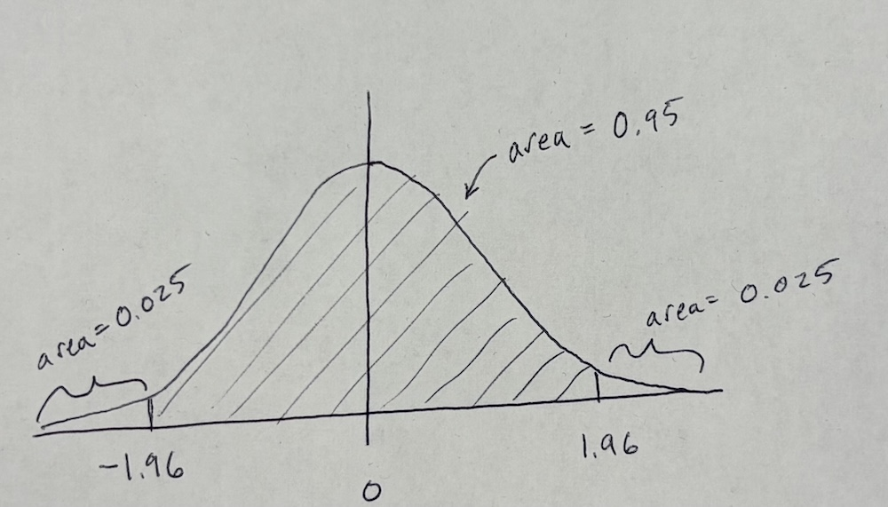

## Announcements

- No assignment due today!

- HW 7 due tomorrow, July 7 at 11:59 PM

## Overview

- Central Limit Theorem 

- Application Exercise

- Why is the Central Limit Theorem important?

- Confidence intervals: what are they, and how do we interpret them?

- `qnorm()` and `pnorm()`

## Reading

-   Pagano and Gavreau: Sections 8.1-8.4, Chapter 9
-   [OpenIntro Statistics](https://www.openintro.org/go/?id=os4_for_screen_readers&referrer=/book/os/index.php): Section 5.1

## A roadmap ahead

-   In just a few more lectures, we'll have learned enough tools to perform a pretty wide range of analyses and answer associated questions.

-   In the latter half of this course, we'll emphasize specific scientific questions of interest, statistical methods for testing such questions, and translating those results to real-world conclusions.

## A roadmap for today

-   Today's topic is fundamental to making sound statistical inferences and conclusions.

-   The basic idea is called the **central limit theorem**, which states that for **any** distribution with a well-defined mean and variance, the distribution of the means computed from samples of size *n* will be approximately Gaussian (normally distributed).

## Recall: What is statistical inference?

-   Statistical inference is the act of generalizing from a **sample** in order to make conclusions regarding a **population** while quantifying the degree of certainty we have.

-   We are interested in population **parameters**, the "truth," which we do not observe.

-   Instead, we must calculate **statistics** from our sample in order to learn about the parameters.

## The sampling distribution of the mean {.smaller}

Suppose we're interested in the resting heart rate of students in BIOS 600, and are able to do the following:

1.  Take a random sample of size *n* from this population

-   Calculate the mean resting heart rate *in this sample*, $\bar x_1$

::: columns
::: {.column width="50%"}

```{r}
#| fig-alt: "A histogram with the title Histogram of Resting Heart Rate (bpm) for Random Sample of 20 people, with bins spread out from 45 to 85"

library(tidyverse)
set.seed(123)
#Generate random normal
n <- 20
x <- rnorm(n, mean = 65, sd = 10)

h <- hist(
  x,
  breaks = 30,
  main = "Histogram of Resting Heart Rate (bpm) for Random Sample of 20 people",
  xlab = "Resting Heart Rate (BPM)",
  ylab = "Count"
)
```

:::
::: {.column width="50%"}

```{r}
#| fig-alt: "A scatterplot titled Sampling Distribution of the Mean resting Heart Rate (BPM) which has one point at 65"

# Blank scatter plot
plot(
  NA, NA,
  xlim = c(55, 80),
  ylim = c(1, 10),
  xlab = "Average Resting Heart Rate (BPM)",
  ylab = "Count",
  main = "Sampling Distribution of the Mean Resting Heart Rate (BPM)"
)

# Add custom y-axis ticks at 1–5
axis(side = 2, at = 1:10, labels = 1:10)
# Add one dot at (65, 1)
points(65, 1, pch = 19, cex = 1.5)
```

:::
:::


## The sampling distribution of the mean {.smaller}

2.  Put the sample back, take a second random sample of size *n*

-   Calculate the mean resting heart rate from this new sample, $\bar x_2$

3.  Put the sample back, take a third random sample of size *n*

-   Calculate the mean resting heart rate from this sample, too...

... and so on

## The sampling distribution of the mean 

```{r}
#| fig-alt: "A scatterplot titled Sampling Distribution of the Mean Resting Heart Rate (BPM) with three points, a blue one at 60, a pink one at 62, and a black one at 65."

# Blank scatter plot
plot(
  NA, NA,
  xlim = c(55, 80),
  ylim = c(1, 10),
  xlab = "Average Resting Heart Rate (BPM)",
  ylab = "Count",
  main = "Sampling Distribution of the Mean Resting Heart Rate (BPM)"
)

# Add custom y-axis ticks at 1–5
axis(side = 2, at = 1:10, labels = 1:10)

# Add one dot at (65, 1)
points(65, 1, pch = 19, cex = 1.5, col="black")
points(60, 1, pch= 19, cex=1.5, col= "blue")
points(62, 1, pch = 19, cex = 1.5, col="hotpink")
```


## The sampling distribution of the mean 

After repeating this many times, we have a dataset that has the sample averages from the population: $\{\bar x_1, \bar x_2, \ldots \}$

-   Can we say anything about the distribution of these sample means?


## The sampling distribution of the mean

```{r}

#| fig-alt: "A scatterplot with the title Sampling Distribution of the Mean Resting Heart Rate (BPM) - 300 sample means, n = 20 with many blue dots between 58 and 72, appearing almost like a normal distribution curve"

# --- Population parameters ---
N_pop <- 1000
mu <- 65
sigma <- 10

# Create the population
population <- rnorm(N_pop, mean = mu, sd = sigma)

# --- Sampling parameters ---
n <- 20          # sample size
n_samples <- 300 # number of repeated samples

# Generate sample means
sample_means <- replicate(
  n_samples,
  mean(sample(population, size = n, replace = TRUE))
)

# --- Stack dots into bins ---
breaks <- seq(55, 90, by = 0.5)
bins <- cut(sample_means, breaks = breaks, include.lowest = TRUE)
counts <- table(bins)

# --- Plot ---
plot(
  NA, NA,
  xlim = c(55, 80),
  ylim = c(1, max(counts) + 1),
  xlab = "Sample Mean Resting Heart Rate (BPM)",
  ylab = "Number of Samples",
  main = "Sampling Distribution of the Mean Resting Heart Rate (BPM) - 300 sample means, n = 20"
)

axis(2, at = pretty(0:max(counts)))

# Draw stacked dots
for (i in seq_along(counts)) {
  if (counts[i] > 0) {
    x_center <- mean(breaks[i:(i + 1)])
    points(rep(x_center, counts[i]), 1:counts[i],
           pch = 19, cex = 1.1, col = "steelblue")
  }
}
```
## The central limit theorem 

The **central limit theorem** states that for a population with mean $\mu$ and standard deviation $\sigma$, these three properties hold for the distribution of sample averages $\bar X$:

1.  The mean of the sampling distribution is identical to the population mean $\mu$

2.  The standard deviation of the distribution of the sample averages is $\sigma / \sqrt{n}$, or the **standard error** (SE) of the mean

3.  For *n* large enough (in the limit, as $n \rightarrow \infty$), the shape of the sampling distribution of means is approximately normal

## What is this really saying? 

-   The central limit theorem tells us that **sample averages** are normally distributed, if we have enough data.

-   This is true **even if** our original variables are not normally distributed.

## The sampling distribution of the mean (Smaller n)

```{r}
#| fig-alt: "A scatterplot with the title Sampling Distribution of the Mean Resting Heart Rate (BPM) - 300 sample means, n = 5 with many blue dots between 55 and 78, appearing almost like a normal distribution curve"

# --- Population parameters ---
N_pop <- 1000
mu <- 65
sigma <- 10

# Create the population
population <- rnorm(N_pop, mean = mu, sd = sigma)

# --- Sampling parameters ---
n <- 5          # sample size
n_samples <- 300 # number of repeated samples

# Generate sample means
sample_means <- replicate(
  n_samples,
  mean(sample(population, size = n, replace = TRUE))
)

# --- Stack dots into bins ---
breaks <- seq(55, 90, by = 0.5)
bins <- cut(sample_means, breaks = breaks, include.lowest = TRUE)
counts <- table(bins)

# --- Plot ---
plot(
  NA, NA,
  xlim = c(55, 80),
  ylim = c(1, max(counts) + 1),
  xlab = "Sample Mean Resting Heart Rate (BPM)",
  ylab = "Number of Samples",
  main = "Sampling Distribution of the Mean Resting Heart Rate (BPM) - 300 sample means, n = 5"
)

axis(2, at = pretty(0:max(counts)))

# Draw stacked dots
for (i in seq_along(counts)) {
  if (counts[i] > 0) {
    x_center <- mean(breaks[i:(i + 1)])
    points(rep(x_center, counts[i]), 1:counts[i],
           pch = 19, cex = 1.1, col = "steelblue")
  }
}
```

## The sampling distribution of the mean (Larger n)

```{r}

#| fig-alt: "A scatterplot with the title Sampling Distribution of the Mean Resting Heart Rate (BPM) - 300 sample means, n = 100 with many blue dots between 62 and 68, appearing almost like a normal distribution curve"

# --- Population parameters ---
N_pop <- 1000
mu <- 65
sigma <- 10

# Create the population
population <- rnorm(N_pop, mean = mu, sd = sigma)

# --- Sampling parameters ---
n <- 100          # sample size
n_samples <- 300 # number of repeated samples

# Generate sample means
sample_means <- replicate(
  n_samples,
  mean(sample(population, size = n, replace = TRUE))
)

# --- Stack dots into bins ---
breaks <- seq(55, 90, by = 0.5)
bins <- cut(sample_means, breaks = breaks, include.lowest = TRUE)
counts <- table(bins)

# --- Plot ---
plot(
  NA, NA,
  xlim = c(55, 80),
  ylim = c(1, max(counts) + 1),
  xlab = "Sample Mean Resting Heart Rate (BPM)",
  ylab = "Number of Samples",
  main = "Sampling Distribution of the Mean Resting Heart Rate (BPM) - 300 sample means, n = 100"
)

axis(2, at = pretty(0:max(counts)))

# Draw stacked dots
for (i in seq_along(counts)) {
  if (counts[i] > 0) {
    x_center <- mean(breaks[i:(i + 1)])
    points(rep(x_center, counts[i]), 1:counts[i],
           pch = 19, cex = 1.1, col = "steelblue")
  }
}
```
## Application Exercise

::: {.callout-tip}
## Application Exercise

For today's participation, go to Canvas and find instructions and template for AE 02.

AE 02 is due on Canvas on no later than **Friday 2/20 at 11:59pm**

:::


## Why the CLT matters {.smaller}

- **Gives us Normality (for free!)**  
  - Even if the population distribution is not normal,  
    the sample mean is approximately normal when sample size is large enough.  

- **Foundation for Inference**  
  - Lets us use normal-based methods for **confidence intervals** and **hypothesis tests**.  
  - Justifies the use of t-tests, z-tests, ANOVAs, regression, etc.  

- **Works Across Many Situations**  
  - Whether data are binary (yes/no), counts, or skewed —  
    sample averages will still tend toward a bell curve.  

- **Practical Takeaway**  
  - We can make powerful statistical conclusions **without needing to know the exact population distribution**.  


## Example: IQ tests

-   IQ tests are designed to have a probability distribution with $\mu$ = 100 and $\sigma$ = 15.

-   Suppose we draw samples of size $n$ = 20 from this population.

-   From the central limit theorem, the distribution of the sample averages will be approximately normal with mean 100 and standard deviation $15/\sqrt{20}$

## IQ tests

-   If the population distribution is normal to begin with, then the distribution of the sample averages will also be exactly normal.

-   If the population distribution is not normal, then the rule of thumb is that we need at least $n = 30$ for the central limit theorem to kick in for approximate normality.

## Example

-   Suppose I give a random sample of $n = 30$ BIOS 600 students an IQ test\*, and the sample average score is 120.

-   Does this mean that BIOS 600 students are smarter than average?

-   I know there are many problems with IQ and IQ testing...bear with me here!

## Example {.smaller}

-   The central limit theorem tells us that the distribution of means of samples of size 30 from this population is also normal, with mean $\mu = 100$ and $SE = \sigma/ \sqrt{n} = 15 \sqrt{30} \approx 2.7$.

-   $Z = \frac{\bar{X} - \mu}{SE}$ is a standard normal random variable, and here $Z \approx 7.3$.

-   The probability of a z-score greater than this is extremely small.

-   What does this mean? (p-values coming soon...)

-   What are the upper and lower limits that enclose 95% of the means for samples of size $n$ drawn from the population? (Confidence intervals coming soon... like, the next slide)

## What is a confidence interval, anyway?

-   A **confidence interval** gives a range of values that is intended to cover the parameter of interest to a certain degree of "confidence"

-   Confidence interval = **point estimate** $\pm$ **margin of error**

## How do you interpret a confidence interval? {.smaller}

{fig-alt="A table with the title Primary Endpoint Annual asthma exacerbation rate over 48 weeks that states the number of patients analyzed is 267, and the rate estimate is 1.33 with a 95% confidence interval of 1.12 to 1.58"}

-   Researchers conducted a clinical trial of a drug intended for severe asthma patients. Their primary endpoint was evaluating whether the **mean rate** of asthma exacerbation over 48 weeks was different between placebo and treatment arms.

-   Above is the 95% confidence interval for the mean rate among the placebo patients.

-   How do you interpret this interval? (more on this very soon!)

## Two-sided confidence intervals

-   For now, let's assume that we know $\sigma$, the population standard deviation (this rarely ever happens)

-   Recall from last lecture: Given a random variable $X$ with mean $\mu$ and standard deviation $\sigma$, the CLT tells us that

$$Z = \frac{\bar X - \mu}{\sigma / \sqrt{n}}$$

where $Z$ has a standard normal distribution if $X$ is normal, and $Z$ is approximately normal if $X$ is not normal, but $n$ is large enough.

-   Recall: rule of thumb?

## Deriving the two-sided interval

-   For a standard normal random variable, 95% of the observations lie between -1.96 and 1.96 for $Z \sim N(0,1)$, so

$$0.95 = P(-1.96 \leq Z \leq 1.96)$$

{fig-alt="A standard normal distribution curve, with the area under the curve shaded from x = -1.96 to x= 1.96. The shaded area is labeled area = 0.95 and the two non-shaded tails are each labeled area = 0.025."}


## Deriving the two-sided interval

-   So, a 95% CI is given by

$$(\bar X - 1.96 \frac{\sigma}{\sqrt n}, \bar X + 1.96 \frac{\sigma}{\sqrt n})$$


Generic form of confidence interval:

Point estimate $\pm$ **confidence multiplier** $\times$ standard error

-   The confidence multiplier $\times$ standard error is known as the **margin of error**

## Finding confidence multiplier in R {.smaller}

Example: Suppose we specify $\alpha = 0.05$, or a 5% significance level. 

- Since 95% of the area under the curve is contained within [-1.96, 1.96], we have 2.5% of the area to the right of 1.96 and 2.5% of the area to the left of -1.96. **Remember normal distribution is symmetrical**

- If we are interested in a 95% CI, and we split that 5% across both tails, we are interested in the 1-$\alpha/2 = 97.5$ percentile. 

- We can find the 97.5 percentile of the standard normal distribution in R with the `qnorm()` function:

```{r}
#| echo: true
qnorm(.975, mean = 0, sd = 1)
```


## What is `qnorm` doing in words? {.smaller}

- In words: `qnorm(p, mean, sd)` is finding the quantile of the normal distribution distribution corresponding to $(p \times 100)\%$ of the area under the curve falling to the left of this value, assuming a normal distribution with `mean` and `sd`. 

::: callout-tip

## Example

What quantile of the normal distribution corresponds to 50% of the area under the curve?

```{r}
#| echo: true
qnorm(.5, mean = 0, sd = 1)
```

Answer: 0
:::

## Alternatively in R

- Note that we can also pre-define $\alpha$ in R (helpful for reproducibility!)

```{r}
#| echo: true
alpha <- 0.05
qnorm(1-(alpha/2), mean = 0, sd = 1)
```
## Other coverage probabilities {.smaller}


$$\textrm{Point estimate} \pm \underbrace{\textrm{confidence multiplier} \times \textrm{standard error}}_{\text{Margin of error}}$$


-   Although 95% CIs are the most common, we can easily generate intervals with other coverage probabilities by adjusting the confidence multiplier

## Other coverage probabilities

-   The **confidence multiplier**, $z^*_{1-\alpha/2}$, is the z-score that cuts off the upper 100% $\times \alpha/2$ of the distribution (the $1-\alpha/2$ percentile)

## Other coverage probabilities

-   Suppose we want a 10% significance level. Then $\alpha$ = 0.1.

- Then we have a $1-\alpha/2 = 0.95$.

- So, $z^*$ is the 95$^\text{th}$ quantile of the standard normal distribution (calculated using software packages)

```{r}
#| echo: true
qnorm(.95, mean = 0, sd = 1)
```

## Other coverage probabilities

- So if I want a 10% significance level

$$(\bar X - 1.64 \frac{\sigma}{\sqrt n}, \bar X + 1.64 \frac{\sigma}{\sqrt n})$$

## Another useful R function

- The function `pnorm(p, mean, sd)` gives the probability underneath the curve, to the left of the value `p`. 

- Examples:

```{r}
#| echo: true
pnorm(1.96, mean = 0, sd = 1)
```

```{r}
#| echo: true
pnorm(3, mean = 0, sd = 1)
```


## Your turn

::: callout-tip

## Question

What will the following code return?

```{r}
#| echo: true
#| eval: false
pnorm(0, mean = 0, sd = 1)
```

:::


-   Compromising on confidence level to obtain narrower CIs is... highly frowned upon

## Other coverage probabilities

- If I collect PM2.5 concentration across 100 cities, and get an average PM2.5 across these cities of 11.8 $\mu g/m^3$ and I know $\sigma=3.5$ $\mu g/m^3$ 

- A 95% CI: 
$$(11.8 - 1.96 \frac{3.5}{\sqrt{100}}, 11.8 + 1.96 \frac{3.5}{\sqrt{100}})=(11.11, 12.49)$$
- A 90% CI: 
$$(11.8 - 1.64 \frac{3.5}{\sqrt{100}}, 11.8 + 1.64 \frac{3.5}{\sqrt{100}})=(11.23, 12.37)$$


## Remember the help function

- Type in `?qnorm` in your console to find out more info about these functions! 

## CI interpretation {.smaller}

- So, how do we interpret a 95% confidence interval?

::: poll
$$(\bar X - 1.96 \frac{\sigma}{\sqrt n}, \bar X + 1.96 \frac{\sigma}{\sqrt n})$$
:::

-   Suppose we select $M$ different random samples from the population of size $n$, and use them to calculate $M$ different 95% CIs in the same way as above.

-   Approximately 95% of these intervals would cover the true $\mu$ and 5% do not

-   **Correct Interpretation**: "If we were to repeat the study many times, constructing a 95% confidence interval each time in the same way, then about 95% of those intervals would contain the true population parameter."

- [Interactive CI Applet](https://www.stapplet.com/confint.html)

## CI interpretation

- **Another correct (more succinct) interpretation**: We are 95% confident that the true mean lies within $(\bar X - 1.96 \frac{\sigma}{\sqrt n}, \bar X + 1.96 \frac{\sigma}{\sqrt n})$.

- Note there is a big difference between "95% confident" and "95% probability". 

## Your turn

::: {.callout-tip}

Pick a partner. 

Click on the applet from 2 slides ago.

Each person should pick a number of confidence intervals to generate (over 50), then explain to their partner 1) how many of of their CIs generated contained the true parameter, and 2) how this relates to the idea of confidence.

:::


## How do you interpret a confidence interval? {.smaller}

{fig-alt="A table with the title Primary Endpoint Annual asthma exacerbation rate over 48 weeks that states the number of patients analyzed is 267, and the rate estimate is 1.33 with a 95% confidence interval of 1.12 to 1.58"}

::: {.callout-tip}
How would you interpret this confidence interval?
:::


## Recap {.smaller}

-   The central limit theorem is the foundation of statistical inference.

-   The Central Limit Theorem tells us that when you take the average of a large enough sample, that average will follow a normal distribution, even if the original data don’t.

-   This is important because many statistical methods, like confidence intervals and hypothesis tests, rely on normal distributions.

-   Thanks to the CLT, we can apply these methods to real-world data, even if the data itself isn't normally distributed, as long as the sample size is large enough.

- Confidence intervals: what are they, and how do we interpret them?

- `qnorm()` and `pnorm()`

## Next class

- Finish confidence intervals and start talking about hypothesis testing!